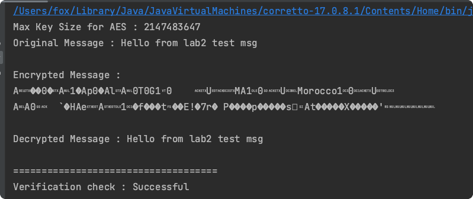

# Лабораторная № 2

> Мэн Цзянин 5140904/30202

[toc]

## Цель

**Создание демонстрационной программы и тестовых сценариев по шифрованию данных стандартной библиотекой BouncyCastle**

Необходимо написать программу, которая использует BouncyCastle для шифрования и дешифрования данных. Также необходимо осуществить подпись данных сертификатом и последующую верификацию этих данных.

1. Продемонстрировать шифрование и последующее дешифрование данных.
2. Продемонстрировать подпись и верификацию данных.

## Результат

