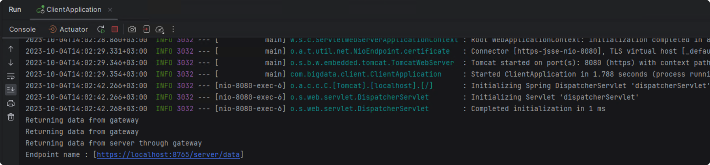
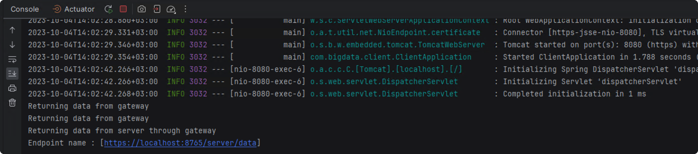
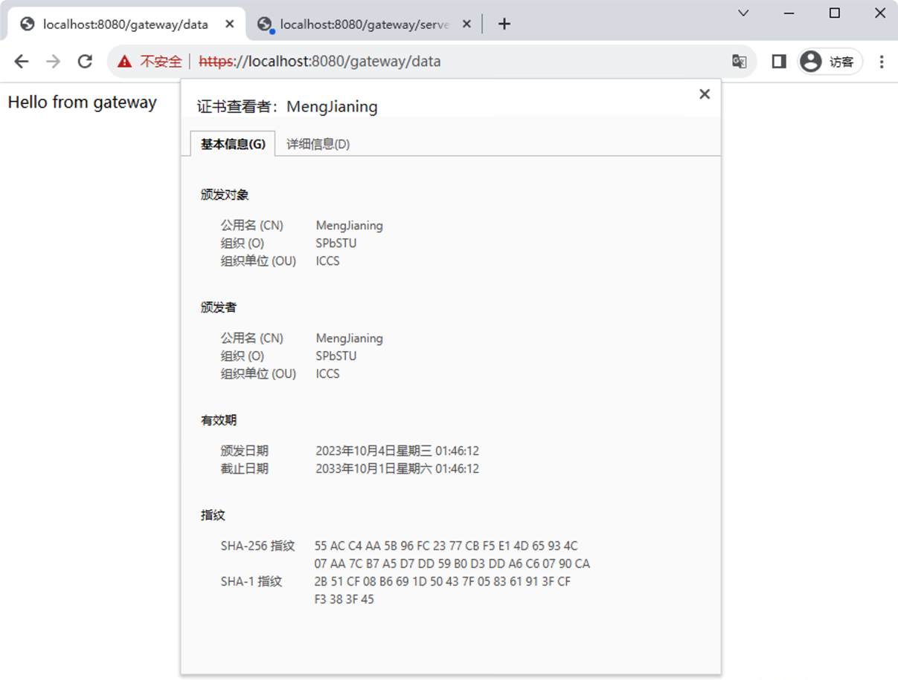
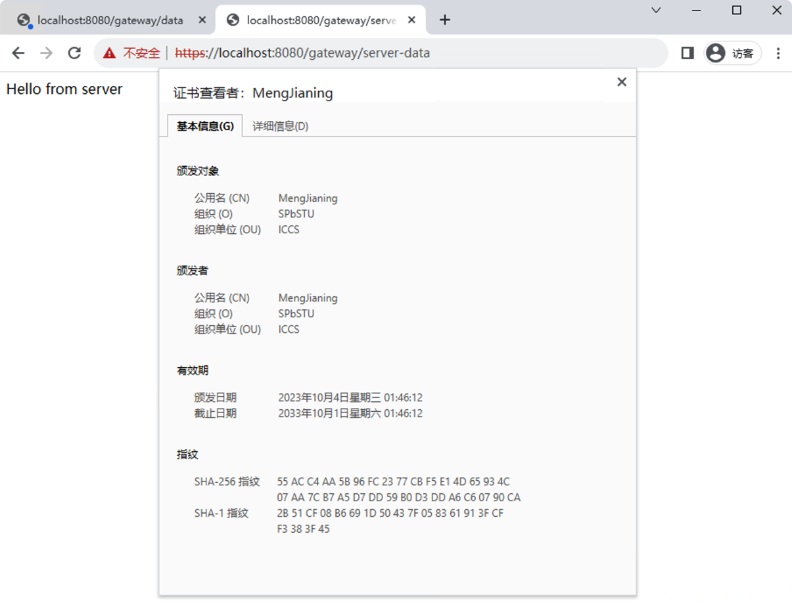

# Лабораторная № 3

> Мэн Цзянин 5140904/30202

[toc]

## Цель

Проектирование и реализация клиент-серверного приложения, взаимодействующего по HTTPS протоколу с использованием ключей шифрования для SSL/TLS (Two- way TLS)

Необходимо написать две программы (клиент и сервер) с использованием библиотеки Spring Boot, которые взаимодействуют по HTTPS протоколу с использованием ключей шифрования для SSL/TLS.

## Результат

### Ключи и сертификаты

### Распечатка сервера

### Распечатка клиента

### Доступ через браузер

Успешные запросы к шлюзу и серверу

