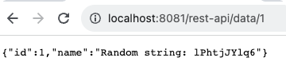
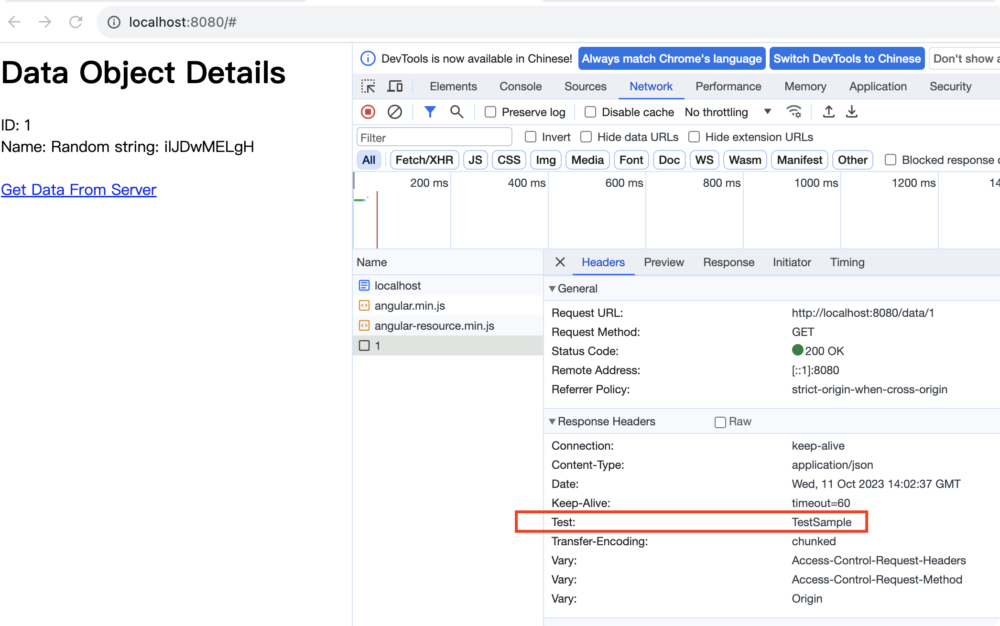
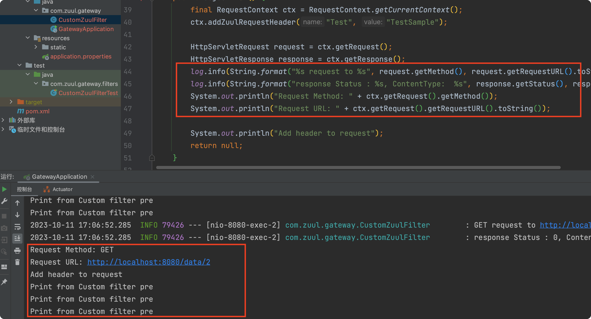

# Лабораторная № 4

> Мэн Цзянин 5140904/30202

[toc]

## Цель

Необходимо написать две программы (клиент и сервер) с использованием библиотеки Spring Boot. Клиент должен вызывать API сервера, используя прокси Zuul. Также в рамках лабораторной работы необходимо написать пользовательский фильтр Zuul.

## Результат

### Прямой доступ к серверу

### Заголовок от фильтра в запросе

