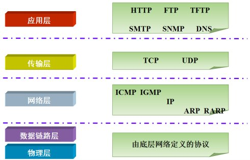
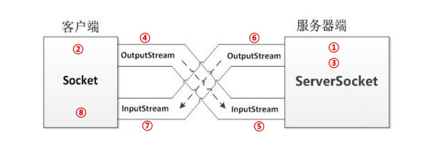
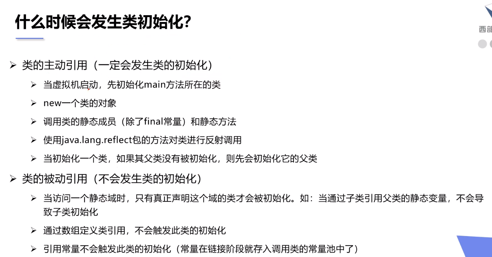

# Java

[toc]

# IDEA 快捷键

`Alt + Enter` 选中变量后可迅速更名，或者在报红线代码上自动补全未覆盖的方法

`Alt + Insert` 快速生成成员方法

`数字/集合.fori` 快速生成for循环

`Ctrl + Alt + L` 将代码格式化

`Shift + F6` 快速重命名文件

`Ctrl + Alt + Ins` 增加新文件

`Ctrl + Alt + /` 块注释

`Ctrl + /` 行注释

`Shift + Tab` 减少缩进

## Debug 快捷键

    Debug调试程序:
        可以让代码逐行执行,查看代码执行的过程,调试程序中出现的bug
    使用方式:
        在行号的右边,鼠标左键单击,添加断点(每个方法的第一行,哪里有bug添加到哪里)
        右键,选择Debug执行程序
        程序就会停留在添加的第一个断点处
    执行程序:
        f8:逐行执行程序
        f7:进入到方法中
        shift+f8:跳出方法
        f9:跳到下一个断点,如果没有下一个断点,那么就结束程序
        ctrl+f2:退出debug模式,停止程序
        Console:切换到控制台
# 关键字

### extends

- 译为：延伸、推广、（在Python作为列表的拓展使用）

- 在继承的时候使用

  ```java
  public class Teacher extends Employee {
      
  }
  ```

### super

- super关键字的用法有三种：
  1. 在子类的成员方法中，访问父类的成员变量。
  2. 在子类的成员方法中，访问父类的成员方法。
  3. 在子类的构造方法中，访问父类的构造方法。

  ```java
  public class Son extends Father {
  
      int num = 20;
  
      public Son() {
          super();
      }
  
      public void methodZi() {
          System.out.println(super.num); // 父类中的num
      }
  
      public void method() {
          super.method(); // 访问父类中的method
          System.out.println("子类方法");
      }
  }
  ```

### abstract

- 译为：抽象

- 用于抽象一个**类**或者**类方法**

- 抽象方法：就是加上 `abstract` 关键字，然后去掉大括号，直接分号结束。
  抽象类：抽象方法所在的类，必须是抽象类才行。在 `class` 之前写上 `abstract` 即可。

  如何使用抽象类和抽象方法：
         1. 不能直接创建new抽象类对象。
         2. 必须用一个子类来继承抽象父类。
         3. 子类必须覆盖重写抽象父类当中所有的抽象方法。
             覆盖重写（实现）：子类去掉抽象方法的abstract关键字，然后补上方法体大括号。
         4. 创建子类对象进行使用。

  ```java
  public abstract class Animal {
  
      public Animal() {
          System.out.println("Animal 的构造函数执行了");
      }
  
      // 这是一个抽象方法，代表吃东西，但是具体吃什么（大括号的内容）不确定。
      public abstract void eat();
  
      // 这是普通的成员方法
  //    public void normalMethod() {
  //
  //    }
  
  }
  ```

### Override

- 译为：重载

- 对于**接口类**或者**抽象类**的方法实现前最好加上 `@Override` 关键字

  ```java
  public class MyInterfaceDefaultA implements MyInterfaceDefault{
      @Override
      public void methodAbs() {
          System.out.println("实现了抽象方法AAA");
      }
  }
  ```

### interface & implements

- `interface` 译为：接口，交互界面

- `implements` 译为：执行履行，**在对接口进行实现时使用**

- 接口就是多个类的公共规范。
  接口是一种引用数据类型，最重要的内容就是其中的：抽象方法。

  **如何定义一个接口的格式：**

  ```java
  public interface 接口名称 {
      // 接口内容
  }
  ```

  备注：换成了关键字 `interface` 之后，编译生成的字节码文件仍然是：.java --> .class。

  如果是Java 7，那么接口中可以包含的内容有：
      1. 常量
          2. 抽象方法

  如果是Java 8，还可以额外包含有：
      3. 默认方法
          4. 静态方法

  如果是Java 9，还可以额外包含有：
  
    5. 私有方法
  
  接口使用步骤：
      1. **接口不能直接使用，必须有一个“实现类”来“实现”该接口。**
        格式：
  
     ```java
  public class 实现类名称 implements 接口名称 {
      // ...
  }
     ```
  
  ```java
      /*
      在任何版本的Java中，接口都能定义抽象方法。
      格式：
      public abstract 返回值类型 方法名称(参数列表);
  
      注意事项：
        1. 接口当中的抽象方法，修饰符必须是两个固定的关键字：public abstract
          2. 这两个关键字修饰符，可以选择性地省略。（今天刚学，所以不推荐。）
          3. 方法的三要素，可以随意定义。
      */
  public interface MyInterfaceAbstract {
      // 这是一个抽象方法
      public abstract void methodAbs();
  
      // 这也是
          abstract void methodAbs2();
  
      // 这也是
          void methodAbs3();
  }
  ```
  
        2. **接口的实现类必须覆盖重写（实现）接口中所有的抽象方法。**
         实现：去掉 `abstract` 关键字，加上方法体大括号。
        3. 创建实现类的对象，进行使用。
  
  
  
  注意事项：
  **如果实现类并没有覆盖重写接口中所有的抽象方法，那么这个实现类自己就必须是抽象类。**
  
  1. 接口的默认方法，可以通过接口实现类对象，直接调用。
  2. 接口的默认方法，也可以被接口实现类进行覆盖重写。

- 小建议：在**实现**接口的类文件后面加上 **`Impl`**

  ---

  【简单地定义及使用】代码示例：

  ```java
  》》》》》 定义的类：
  public interface MyInterfaceAbstract {
      // 这是一个抽象方法
      public abstract void methodAbs();
  
      // 这也是
             abstract void methodAbs2();
  
      // 这也是
                      void methodAbs3();
  }
  
  
  》》》》》 实现的类
  public class MyInterfaceAbstractImpl implements MyInterfaceAbstract {
      @Override
      public void methodAbs() {
          System.out.println("NO.1 method");
      }
  
      @Override
      public void methodAbs2() {
          System.out.println("NO.2 method");
  
      }
  
      @Override
      public void methodAbs3() {
          System.out.println("NO.3 method");
      }
  }
  
  
  》》》》》 调用
  public interface Demo140Interface {
      public static void main(String[] args) {
          // 错误写法！不能直接new接口对象使用。
  //        MyInterfaceAbstract inter = new MyInterfaceAbstract();
  
          // 创建实现类的对象使用
          MyInterfaceAbstractImpl impl = new MyInterfaceAbstractImpl();
          impl.methodAbs();
          impl.methodAbs2();
      }
  }
  ```

---

### default - 接口中的默认方法

【接口中包含**默认**方法】代码示例：

```java
》》》》》 接口定义：
/*
从Java 8开始，接口里允许定义默认方法。
格式：
public default 返回值类型 方法名称(参数列表) {
    方法体
}

备注：接口当中的默认方法，可以解决接口升级的问题。
 */
public interface MyInterfaceDefault {

    // 抽象方法
    public abstract void methodAbs();

    // 新添加的方法，改成默认方法
    public default void methodDefault() {
        System.out.println("这是新添加的默认方法");
    }

}


》》》》》 接口实现：
public class MyInterfaceDefaultB implements MyInterfaceDefault{
    @Override
    public void methodAbs() {
        System.out.println("实现了抽象方法BBB");
    }

    // 注意：这里可以重写接口中的默认方法，也可以不重写
    // 如果没有重写，在调用时就会向上（接口默认）寻找
    @Override
    public void methodDefault() {
        System.out.println("在B中重写了 methodDefault");
    }
}

```

---

---

### static 接口中的静态方法

【接口中包含**静态**方法】代码示例：

```java
》》》》》 接口定义：
/*
    从Java 8开始，接口当中允许定义静态方法。
    格式：
        public static 返回值类型 方法名称(参数列表) {
            方法体
        }
    提示：就是将abstract或者default换成static即可，带上方法体。
 */

public interface MyInterfaceStatic {
    public static void help() {
        System.out.println("这是一条帮助信息");
    }
}

》》》》》 接口实现：
public class MyInterfaceStaticImpl implements MyInterfaceStatic {
	
}

》》》》》 使用：
        /*
            注意事项：不能通过接口实现类的对象来调用接口当中的静态方法。
            正确用法：通过接口名称，直接调用其中的静态方法。
            格式：
            	接口名称.静态方法名(参数);
         */
        System.out.println("===========");
        // 错误写法！
//        MyInterfaceStaticImpl s = new MyInterfaceStaticImpl();
//        s.help();

        // 直接通过接口名称调用静态方法
        MyInterfaceStatic.help();
```

### private

- 译为：私有的

- **实例：接口中的私有方法定义：**

  ```java
  /*
  问题描述：
  我们需要抽取一个共有方法，用来解决两个默认方法之间重复代码的问题。
  但是这个共有方法不应该让实现类使用，应该是私有化的。
  
  解决方案：
  从Java 9开始，接口当中允许定义私有方法。
      1. 普通私有方法，解决多个默认方法之间重复代码问题
          格式：
          private 返回值类型 方法名称(参数列表) {
              方法体
          }
  
      2. 静态私有方法，解决多个静态方法之间重复代码问题
          格式：
          private static 返回值类型 方法名称(参数列表) {
              方法体
  }
   */
  public interface MyInterfacePrivate {
      public default void methodDefaultA() {
          System.out.println("默认方法A");
          methodDefaultCommand();
      }
  
      public default void methodDefaultB() {
          System.out.println("默认方法B");
          methodDefaultCommand();
      }
  
      private void methodDefaultCommand() {
          System.out.println("AAA");
          System.out.println("BBB");
          System.out.println("CCC");
      }
  }
  ```

### final

- final关键字代表最终、不可改变的。

  常见四种用法：
         1. 可以用来修饰一个类
         2. 可以用来修饰一个方法
         3. 还可以用来修饰一个局部变量
         4. 还可以用来修饰一个成员变量

- 【重点】
  对于基本类型来说，不可变说的是变量当中的数据不可改变
  对于引用类型来说，不可变说的是变量当中的地址值不可改变

- 使用：用于**描述常量**

- 格式：**`public static final 数据类型 常量名称 = 数值;`**

- 使用示例：

  ```java
  // 143 - OOP_接口中的常量
  
  /*
  接口当中也可以定义“成员变量”，但是必须使用public static final三个关键字进行修饰。
  从效果上看，这其实就是接口的【常量】。
  
  格式：
      public static final 数据类型 常量名称 = 数据值;
  备注：
      一旦使用final关键字进行修饰，说明不可改变。
  
  注意事项：
      1. 接口当中的常量，可以省略public static final，注意：不写也照样是这样。
      2. 接口当中的常量，必须进行赋值；不能不赋值。
      3. 接口中常量的名称，使用完全大写的字母，用下划线进行分隔。（推荐命名规则）
      4. 使用的时候直接通过接口名称点出来
   */
  
  public interface Demo143InterfaceConst {
      // 这其实就是一个常量，一旦赋值，不可以修改
      public static final int NUM_OF_INTERFACE = 10;
  }
  ```

### instanceof

- 译为：运算符

- 使用：判断一个变量的类型

- ```java
  // 160 - OOP_多态_使用instanceof进行类型判断
  
  /*
  如何才能知道一个父类引用的对象，本来是什么子类？
  格式：
  对象 instanceof 类名称
  这将会得到一个boolean值结果，也就是判断前面的对象能不能当做后面类型的实例。
   */
  public class Demo160Instanceof {
      public static void main(String[] args) {
          Animal animal = new Dog();
          animal.eat(); // eat fish
  
          // 如果希望掉用子类特有方法，需要向下转型
          // 判断一下父类引用animal本来是不是Dog
          if (animal instanceof Dog) {
              Dog dog = (Dog)animal;
              dog.method();
          } else if (animal instanceof Cat) {
              Cat cat = (Cat)animal;
              cat.method();
          }
  
          giveMePet(new Dog());
  
      }
  
      public static void giveMePet(Animal animal) {
          if (animal instanceof Dog) {
              Dog dog = (Dog)animal;
              dog.method();
          } else if (animal instanceof Cat) {
              Cat cat = (Cat)animal;
              cat.method();
          }
      }
  }
  ```

### Synchronized

- 译为：已同步的

- 使用：在线程同步时使用

- ```java
  /*
      卖票案例出现了线程安全问题
      卖出了不存在的票和重复的票
  
      解决线程安全问题的一种方案:使用同步代码块
      格式:
          synchronized(锁对象){
              可能会出现线程安全问题的代码(访问了共享数据的代码)
          }
  
      注意:
          1.通过代码块中的锁对象,可以使用任意的对象
          2.但是必须保证多个线程使用的锁对象是同一个
          3.锁对象作用:
              把同步代码块锁住,只让一个线程在同步代码块中执行
   */
  public class RunnableImpl implements Runnable {
      private int ticket = 100;
  
      // 在外部创建一个锁对象
      Object lockObj = new Object();
  
      @Override
      public void run() {
          while (true) {
  
              // 同步代码快
              synchronized (lockObj) {
                  if (ticket > 0) {
                      try {
                          Thread.sleep(10);
                      } catch (InterruptedException e) {
                          e.printStackTrace();
                      }
                      System.out.println(Thread.currentThread().getName() + " 正在卖第 " + ticket-- + " 张票");
                  }
              }
          }
      }
  }
  ```

### transient

- 译为：瞬态关键字

- 使用：被transient修饰成员变量,不能被序列化；（参考ObjectInputStream）

- ```java
  transient关键字:瞬态关键字
      被transient修饰成员变量,不能被序列化
      private transient int age;
      oos.writeObject(new Person("小美女",18));
      Object o = ois.readObject();
      Person{name='小美女', age=0}
  ```

# 变量

- 如果是`float` ，后面要加一个 `F` 。比如：`double num  =3.14F`
- 如果是`long` ，后面要加一个 `L` 。比如：`float num  =314L`
- 以上两个式子中包含有隐式类型转换

## 类型转换：

```
自动数据类型的转换(隐式)
    1. 特点：代码不需要进行特殊处理，自动完成
    2. 规则：数据范围从小到大，但是字节数不一定相关
```

```
对于byte/short/char三种类型来说，如果右侧赋值的数值没有超过范围，
那么javac编译器将会自动隐含地为我们补上一个(byte)(short)(char)。

    1. 如果没有超过左侧的范围，编译器补上强转。
    2. 如果右侧超过了左侧范围，那么直接编译器报错。

    在给变量进行赋值的时候，如果右侧的表达式当中全都是常量，没有任何变量，
    那么编译器javac将会直接将若干个常量表达式计算得到结果。
    short result = 5 + 8; // 等号右边全都是常量，没有任何变量参与运算
    编译之后，得到的.class字节码文件当中相当于【直接就是】：
    short result = 13;
    右侧的常量结果数值，没有超过左侧范围，所以正确。

    这称为“编译器的常量优化”。

    但是注意：一旦表达式当中有变量参与，那么就不能进行这种优化了。
```

# 数组

```
格式：数据类型[] 数组名称 = new 数据类型[数组长度];
```

## 动态初始化

比如：传建一个存放300个 `int` 类型的数组 `int[] arr1 = new int[300];`

## 静态初始化

直接创建一个数组，里面装的全都是 `int` 数字 

- `int[] arr1 = new int[]{1, 2, 3, 4};`

- `int[] arrayA = { 10, 20, 30 };`

- 静态初始化的标准格式，可以拆分成为两个步骤

  ```java
  int[] arr;
  arr = new int[]{1, 2, 3, 4};
  ```

- ```java
  int[] arr2;
  arr2 = new int[5];
  ```

- **不能这么写！！！**

  ```java
  //    int[] arrayD;
  //    arrayD = { 10, 20, 30 };
  ```

  ```java
  //        int[] arr2;
  //        arr2 = new int[2]{1, 2};
  ```


# 接口小结

在Java 9+版本中，接口的内容可以有：

1. 成员变量其实是常量，格式：
[public] [static] [final] 数据类型 常量名称 = 数据值;
注意：
	常量必须进行赋值，而且一旦赋值不能改变。
	常量名称完全大写，用下划线进行分隔。

2. 接口中最重要的就是抽象方法，格式：
[public] [abstract] 返回值类型 方法名称(参数列表);
注意：实现类必须覆盖重写接口所有的抽象方法，除非实现类是抽象类。

3. 从Java 8开始，接口里允许定义默认方法，格式：
[public] default 返回值类型 方法名称(参数列表) { 方法体 }
注意：默认方法也可以被覆盖重写

4. 从Java 8开始，接口里允许定义静态方法，格式：
[public] static 返回值类型 方法名称(参数列表) { 方法体 }
注意：应该通过接口名称进行调用，不能通过实现类对象调用接口静态方法

5. 从Java 9开始，接口里允许定义私有方法，格式：
    普通私有方法：private 返回值类型 方法名称(参数列表) { 方法体 }
    静态私有方法：private static 返回值类型 方法名称(参数列表) { 方法体 }
    注意：private的方法只有接口自己才能调用，不能被实现类或别人使用。

6. **接口中不能有静态代码块！**

  ```java
      // 接口中不能有静态代码块！
  //    static {
  //
  //    }
  ```

7. **接口中不能有构造方法！**

   ```java
       // 接口中不能有构造方法、
   //    public MyInterface() {
   //
   //    }
   ```

8. 其他：

   ```java
   使用接口的时候，需要注意：
   
       1. 接口是没有静态代码块或者构造方法的。
       2. 一个类的直接父类是唯一的，但是一个类可以同时实现多个接口。
       格式：
           public class MyInterfaceImpl implements MyInterfaceA, MyInterfaceB {
               // 覆盖重写所有抽象方法
           }
       3. 如果实现类所实现的多个接口当中，存在重复的抽象方法，那么只需要覆盖重写一次即可。
       4. 如果实现类没有覆盖重写所有接口当中的所有抽象方法，那么实现类就必须是一个抽象类。
       5. 如果实现类锁实现的多个接口当中，存在重复的默认方法，那么实现类一定要对冲突的默认方法进行覆盖重写。
       6. 一个类如果直接父类当中的方法，和接口当中的默认方法产生了冲突，优先用父类当中的方法。
       	public class Zi extends Fu implements MyInterfaceC{
   		} // 145 - OOP_接口中的注意事项
   ```

9. **可以通过一个类对多个接口进行实现：**

   ```java
   public class MyInterfaceImpl /*extends Object*/ implements MyInterfaceA, MyInterfaceB{
       @Override
       public void method() {
           System.out.println("覆盖重写了AB接口都有的抽象方法");
       }
   
       @Override
       public void methodA() {
           System.out.println("Rewrite A");
       }
   
       @Override
       public void methodB() {
           System.out.println("Rewrite A");
       }
   
       @Override
       public void methodSameDefaultAB() {
           System.out.println("对AB相同的默认方法进行了重写");
       }
   }
   ```

## 接口当中的多继承

```java
public interface MyInterface extends MyInterfaceA, MyInterfaceB {
    public abstract void method();

    // 多个父接口当中的默认方法如果重复，那么子接口必须进行默认方法的覆盖重写，【而且带着default关键字】。
    @Override
    public default void methodDefault() {

    }
}
```

# 多态

代码当中体现多态性，其实就是一句话：**父类引用指向子类对象**

格式：
	**父类名称 对象名 = new 子类名称();**
或者：
	**接口名称 对象名 = new 实现类名称();**

在多态的代码当中，成员【方法】的访问规则是：
    看new的是谁，就优先用谁，没有则向上找。
口诀：编译看左边，运行看右边。

访问成员变量的两种方式：
成员变量不能覆盖重写【重点】
1. 直接通过对象名称访问成员变量：看等号左边是谁，优先用谁，没有则向上找。
2. 间接通过成员方法访问成员变量：看该方法属于谁，优先用谁，没有则向上找。

对比一下：【重点】
**成员变量：编译看左边，运行还看左边。**
**成员方法：编译看左边，运行看右边。**


# 四种权限修饰符

Java中有四种权限修饰符：
	public  >   protected   >   (default)   >   private

| 同一个类（我自己）     | YES  | YES  | YES  | YES  |
| ---------------------- | ---- | ---- | ---- | ---- |
| 同一个包（我邻居）     | YES  | YES  | YES  | NO   |
| 不同包子类（我儿子）   | YES  | YES  | NO   | NO   |
| 不同包非子类（陌生人） | YES  | NO   | NO   | NO   |

注意事项：(default) 并不是关键字 `default`，而是根本不写。

- ```
  定义一个类的时候，权限修饰符规则：
      1. 外部类：public / (default)
      2. 成员内部类：public / protected / (default) / private
      3. 局部内部类：什么都不能写
  ```


# 内部类

## 局部内部类

```java
/*
局部内部类，如果希望访问所在方法的局部变量，那么这个局部变量必须是【有效final的】。

备注：从Java 8+开始，只要局部变量事实不变，那么final关键字可以省略。

原因：
    1. new出来的对象在堆内存当中。
    2. 局部变量是跟着方法走的，在栈内存当中。
    3. 方法运行结束之后，立刻出栈，局部变量就会立刻消失。
    4. 但是new出来的对象会在堆当中持续存在，直到垃圾回收消失。
 */

public class MyOuter {

    public void methodOuter() {
        final int num = 10; // 所在方法的局部变量
        // num = 20;
        class Inner {
            public void methodInner () {
                System.out.println(num);
            }
        }

    }

}
```

## 匿名内部类

如果接口的实现类（或者是父类的子类）只需要使用唯一的一次，
那么这种情况下就可以省略掉该类的定义，而改为使用【匿名内部类】。

匿名内部类的定义格式：

```java
接口名称 对象名 = new 接口名称() {
    // 覆盖重写所有抽象方法
};
```

对格式“new 接口名称() {...}”进行解析：
       1. new代表创建对象的动作
       2. 接口名称就是匿名内部类需要实现哪个接口
       3. {...}这才是匿名内部类的内容

另外还要注意几点问题：
    1. 匿名内部类，在【创建对象】的时候，只能使用唯一一次。
        如果希望多次创建对象，而且类的内容一样的话，那么就需要使用单独定义的实现类了。
       2. 如果希望同一个对象，调用多次方法，那么必须给对象起个名字。
       3. 匿名内部类是省略了【实现类/子类名称】，但是匿名对象是省略了【对象名称】
                  强调：匿名内部类和匿名对象不是一回事！！！
       4. 匿名对象，在【调用方法】的时候，只能调用唯一一次。

# Object类、常用API

## 主要内容

* Object类
* Date类
* DateFormat类
* Calendar类
* System类
* StringBuilder类
* 包装类

## 教学目标

-[ ] 能够说出Object类的特点
-[ ] 能够重写Object类的toString方法
-[ ] 能够重写Object类的equals方法
-[ ] 能够使用日期类输出当前日期
-[ ] 能够使用将日期格式化为字符串的方法
-[ ] 能够使用将字符串转换成日期的方法
-[ ] 能够使用System类的数组复制方法
-[ ] 能够使用System类获取当前毫秒时刻值
-[ ] 能够说出使用StringBuilder类可以解决的问题
-[ ] 能够使用StringBuilder进行字符串拼接操作
-[ ] 能够说出8种基本类型对应的包装类名称
-[ ] 能够说出自动装箱、自动拆箱的概念
-[ ] 能够将字符串转换为对应的基本类型
-[ ] 能够将基本类型转换为对应的字符串

# 第一章 Object类

## 1.1 概述

`java.lang.Object`类是Java语言中的根类，即所有类的父类。它中描述的所有方法子类都可以使用。在对象实例化的时候，最终找的父类就是Object。

如果一个类没有特别指定父类，	那么默认则继承自Object类。例如：

```java
public class MyClass /*extends Object*/ {
  	// ...
}
```

根据JDK源代码及Object类的API文档，Object类当中包含的方法有11个。今天我们主要学习其中的2个：

* `public String toString()`：返回该对象的字符串表示。
* `public boolean equals(Object obj)`：指示其他某个对象是否与此对象“相等”。

## 1.2 toString方法

### 方法摘要

* `public String toString()`：返回该对象的字符串表示。

toString方法返回该对象的字符串表示，其实该字符串内容就是对象的类型+@+内存地址值。

由于toString方法返回的结果是内存地址，而在开发中，经常需要按照对象的属性得到相应的字符串表现形式，因此也需要重写它。

### 覆盖重写

如果不希望使用toString方法的默认行为，则可以对它进行覆盖重写。例如自定义的Person类：

```java
public class Person {  
    private String name;
    private int age;

    @Override
    public String toString() {
        return "Person{" + "name='" + name + '\'' + ", age=" + age + '}';
    }

    // 省略构造器与Getter Setter
}
```

在IntelliJ IDEA中，可以点击`Code`菜单中的`Generate...`，也可以使用快捷键`alt+insert`，点击`toString()`选项。选择需要包含的成员变量并确定。如下图所示：


> 小贴士： 在我们直接使用输出语句输出对象名的时候,其实通过该对象调用了其toString()方法。

## 1.3 equals方法

### 方法摘要

* `public boolean equals(Object obj)`：指示其他某个对象是否与此对象“相等”。

调用成员方法equals并指定参数为另一个对象，则可以判断这两个对象是否是相同的。这里的“相同”有默认和自定义两种方式。

### 默认地址比较

如果没有覆盖重写equals方法，那么Object类中默认进行`==`运算符的对象地址比较，只要不是同一个对象，结果必然为false。

### 对象内容比较

如果希望进行对象的内容比较，即所有或指定的部分成员变量相同就判定两个对象相同，则可以覆盖重写equals方法。例如：

```java
import java.util.Objects;

public class Person {	
	private String name;
	private int age;
	
    @Override
    public boolean equals(Object o) {
        // 如果对象地址一样，则认为相同
        if (this == o)
            return true;
        // 如果参数为空，或者类型信息不一样，则认为不同
        if (o == null || getClass() != o.getClass())
            return false;
        // 转换为当前类型
        Person person = (Person) o;
        // 要求基本类型相等，并且将引用类型交给java.util.Objects类的equals静态方法取用结果
        return age == person.age && Objects.equals(name, person.name);
    }
}
```

这段代码充分考虑了对象为空、类型一致等问题，但方法内容并不唯一。大多数IDE都可以自动生成equals方法的代码内容。在IntelliJ IDEA中，可以使用`Code`菜单中的`Generate…`选项，也可以使用快捷键`alt+insert`，并选择`equals() and hashCode()`进行自动代码生成。如下图所示：


> tips：Object类当中的hashCode等其他方法，今后学习。

## 1.4 Objects类

在刚才IDEA自动重写equals代码中，使用到了`java.util.Objects`类，那么这个类是什么呢？

在**JDK7**添加了一个Objects工具类，它提供了一些方法来操作对象，它由一些静态的实用方法组成，这些方法是null-save（空指针安全的）或null-tolerant（容忍空指针的），用于计算对象的hashcode、返回对象的字符串表示形式、比较两个对象。

在比较两个对象的时候，Object的equals方法容易抛出空指针异常，而Objects类中的equals方法就优化了这个问题。方法如下：

* `public static boolean equals(Object a, Object b)`:判断两个对象是否相等。

我们可以查看一下源码，学习一下：

~~~java
public static boolean equals(Object a, Object b) {  
    return (a == b) || (a != null && a.equals(b));  
}
~~~

# 第二章 日期时间类

## 2.1 Date类

### 概述

` java.util.Date`类 表示特定的瞬间，精确到毫秒。

继续查阅Date类的描述，发现Date拥有多个构造函数，只是部分已经过时，但是其中有未过时的构造函数可以把毫秒值转成日期对象。

- `public Date()`：分配Date对象并初始化此对象，以表示分配它的时间（精确到毫秒）。
- `public Date(long date)`：分配Date对象并初始化此对象，以表示自从标准基准时间（称为“历元（epoch）”，即1970年1月1日00:00:00 GMT）以来的指定毫秒数。

> tips: 由于我们处于东八区，所以我们的基准时间为1970年1月1日8时0分0秒。

简单来说：使用无参构造，可以自动设置当前系统时间的毫秒时刻；指定long类型的构造参数，可以自定义毫秒时刻。例如：

```java
import java.util.Date;

public class Demo01Date {
    public static void main(String[] args) {
        // 创建日期对象，把当前的时间
        System.out.println(new Date()); // Tue Jan 16 14:37:35 CST 2018
        // 创建日期对象，把当前的毫秒值转成日期对象
        System.out.println(new Date(0L)); // Thu Jan 01 08:00:00 CST 1970
    }
}
```

> tips:在使用println方法时，会自动调用Date类中的toString方法。Date类对Object类中的toString方法进行了覆盖重写，所以结果为指定格式的字符串。

### 常用方法

Date类中的多数方法已经过时，常用的方法有：

* `public long getTime()` 把日期对象转换成对应的时间毫秒值。

## 2.2 DateFormat类

`java.text.DateFormat` 是日期/时间格式化子类的抽象类，我们通过这个类可以帮我们完成日期和文本之间的转换,也就是可以在Date对象与String对象之间进行来回转换。

* **格式化**：按照指定的格式，从Date对象转换为String对象。
* **解析**：按照指定的格式，从String对象转换为Date对象。

### 构造方法

由于DateFormat为抽象类，不能直接使用，所以需要常用的子类`java.text.SimpleDateFormat`。这个类需要一个模式（格式）来指定格式化或解析的标准。构造方法为：

* `public SimpleDateFormat(String pattern)`：用给定的模式和默认语言环境的日期格式符号构造SimpleDateFormat。

参数pattern是一个字符串，代表日期时间的自定义格式。

### 格式规则

常用的格式规则为：

| 标识字母（区分大小写） | 含义 |
| ---------------------- | ---- |
| y                      | 年   |
| M                      | 月   |
| d                      | 日   |
| H                      | 时   |
| m                      | 分   |
| s                      | 秒   |

> 备注：更详细的格式规则，可以参考SimpleDateFormat类的API文档0。

创建SimpleDateFormat对象的代码如：

```java
import java.text.DateFormat;
import java.text.SimpleDateFormat;

public class Demo02SimpleDateFormat {
    public static void main(String[] args) {
        // 对应的日期格式如：2018-01-16 15:06:38
        DateFormat format = new SimpleDateFormat("yyyy-MM-dd HH:mm:ss");
    }    
}
```

### 常用方法

DateFormat类的常用方法有：

- `public String format(Date date)`：将Date对象格式化为字符串。
- `public Date parse(String source)`：将字符串解析为Date对象。

#### format方法

使用format方法的代码为：

```java
import java.text.DateFormat;
import java.text.SimpleDateFormat;
import java.util.Date;
/*
 把Date对象转换成String
*/
public class Demo03DateFormatMethod {
    public static void main(String[] args) {
        Date date = new Date();
        // 创建日期格式化对象,在获取格式化对象时可以指定风格
        DateFormat df = new SimpleDateFormat("yyyy年MM月dd日");
        String str = df.format(date);
        System.out.println(str); // 2008年1月23日
    }
}
```

#### parse方法

使用parse方法的代码为：

```java
import java.text.DateFormat;
import java.text.ParseException;
import java.text.SimpleDateFormat;
import java.util.Date;
/*
 把String转换成Date对象
*/
public class Demo04DateFormatMethod {
    public static void main(String[] args) throws ParseException {
        DateFormat df = new SimpleDateFormat("yyyy年MM月dd日");
        String str = "2018年12月11日";
        Date date = df.parse(str);
        System.out.println(date); // Tue Dec 11 00:00:00 CST 2018
    }
}
```

## 2.3 练习

请使用日期时间相关的API，计算出一个人已经出生了多少天。

**思路：**

1.获取当前时间对应的毫秒值

2.获取自己出生日期对应的毫秒值

3.两个时间相减（当前时间– 出生日期）

**代码实现：**

```java
public static void function() throws Exception {
	System.out.println("请输入出生日期 格式 YYYY-MM-dd");
	// 获取出生日期,键盘输入
	String birthdayString = new Scanner(System.in).next();
	// 将字符串日期,转成Date对象
	// 创建SimpleDateFormat对象,写日期模式
	SimpleDateFormat sdf = new SimpleDateFormat("yyyy-MM-dd");
	// 调用方法parse,字符串转成日期对象
	Date birthdayDate = sdf.parse(birthdayString);	
	// 获取今天的日期对象
	Date todayDate = new Date();	
	// 将两个日期转成毫秒值,Date类的方法getTime
	long birthdaySecond = birthdayDate.getTime();
	long todaySecond = todayDate.getTime();
	long secone = todaySecond-birthdaySecond;	
	if (secone < 0){
		System.out.println("还没出生呢");
	} else {
		System.out.println(secone/1000/60/60/24);
	}
}
```

## 2.4 Calendar类

###  概念

日历我们都见过


`java.util.Calendar`是日历类，在Date后出现，替换掉了许多Date的方法。该类将所有可能用到的时间信息封装为静态成员变量，方便获取。日历类就是方便获取各个时间属性的。

### 获取方式

Calendar为抽象类，由于语言敏感性，Calendar类在创建对象时并非直接创建，而是通过静态方法创建，返回子类对象，如下：

Calendar静态方法

* `public static Calendar getInstance()`：使用默认时区和语言环境获得一个日历

例如：

```java
import java.util.Calendar;

public class Demo06CalendarInit {
    public static void main(String[] args) {
        Calendar cal = Calendar.getInstance();
    }    
}
```

### 常用方法

根据Calendar类的API文档，常用方法有：

- `public int get(int field)`：返回给定日历字段的值。
- `public void set(int field, int value)`：将给定的日历字段设置为给定值。
- `public abstract void add(int field, int amount)`：根据日历的规则，为给定的日历字段添加或减去指定的时间量。
- `public Date getTime()`：返回一个表示此Calendar时间值（从历元到现在的毫秒偏移量）的Date对象。

Calendar类中提供很多成员常量，代表给定的日历字段：

| 字段值       | 含义                                  |
| ------------ | ------------------------------------- |
| YEAR         | 年                                    |
| MONTH        | 月（从0开始，可以+1使用）             |
| DAY_OF_MONTH | 月中的天（几号）                      |
| HOUR         | 时（12小时制）                        |
| HOUR_OF_DAY  | 时（24小时制）                        |
| MINUTE       | 分                                    |
| SECOND       | 秒                                    |
| DAY_OF_WEEK  | 周中的天（周几，周日为1，可以-1使用） |

#### get/set方法

get方法用来获取指定字段的值，set方法用来设置指定字段的值，代码使用演示：

```java
import java.util.Calendar;

public class CalendarUtil {
    public static void main(String[] args) {
        // 创建Calendar对象
        Calendar cal = Calendar.getInstance();
        // 设置年 
        int year = cal.get(Calendar.YEAR);
        // 设置月
        int month = cal.get(Calendar.MONTH) + 1;
        // 设置日
        int dayOfMonth = cal.get(Calendar.DAY_OF_MONTH);
        System.out.print(year + "年" + month + "月" + dayOfMonth + "日");
    }    
}
```

```java
import java.util.Calendar;

public class Demo07CalendarMethod {
    public static void main(String[] args) {
        Calendar cal = Calendar.getInstance();
        cal.set(Calendar.YEAR, 2020);
        System.out.print(year + "年" + month + "月" + dayOfMonth + "日"); // 2020年1月17日
    }
}
```

#### add方法

add方法可以对指定日历字段的值进行加减操作，如果第二个参数为正数则加上偏移量，如果为负数则减去偏移量。代码如：

```java
import java.util.Calendar;

public class Demo08CalendarMethod {
    public static void main(String[] args) {
        Calendar cal = Calendar.getInstance();
        System.out.print(year + "年" + month + "月" + dayOfMonth + "日"); // 2018年1月17日
        // 使用add方法
        cal.add(Calendar.DAY_OF_MONTH, 2); // 加2天
        cal.add(Calendar.YEAR, -3); // 减3年
        System.out.print(year + "年" + month + "月" + dayOfMonth + "日"); // 2015年1月18日; 
    }
}
```

#### getTime方法

Calendar中的getTime方法并不是获取毫秒时刻，而是拿到对应的Date对象。

```java
import java.util.Calendar;
import java.util.Date;

public class Demo09CalendarMethod {
    public static void main(String[] args) {
        Calendar cal = Calendar.getInstance();
        Date date = cal.getTime();
        System.out.println(date); // Tue Jan 16 16:03:09 CST 2018
    }
}
```

> 小贴士：
>
> ​     西方星期的开始为周日，中国为周一。
>
> ​     在Calendar类中，月份的表示是以0-11代表1-12月。
>
> ​     日期是有大小关系的，时间靠后，时间越大。

# 第三章 System类

`java.lang.System`类中提供了大量的静态方法，可以获取与系统相关的信息或系统级操作，在System类的API文档中，常用的方法有：

- `public static long currentTimeMillis()`：返回以毫秒为单位的当前时间。
- `public static void arraycopy(Object src, int srcPos, Object dest, int destPos, int length)`：将数组中指定的数据拷贝到另一个数组中。

## 3.1 currentTimeMillis方法

实际上，currentTimeMillis方法就是 获取当前系统时间与1970年01月01日00:00点之间的毫秒差值

```java
import java.util.Date;

public class SystemDemo {
    public static void main(String[] args) {
       	//获取当前时间毫秒值
        System.out.println(System.currentTimeMillis()); // 1516090531144
    }
}
```

### 练习

验证for循环打印数字1-9999所需要使用的时间（毫秒）

~~~java
public class SystemTest1 {
    public static void main(String[] args) {
        long start = System.currentTimeMillis();
        for (int i = 0; i < 10000; i++) {
            System.out.println(i);
        }
        long end = System.currentTimeMillis();
        System.out.println("共耗时毫秒：" + (end - start));
    }
}
~~~

## 3.2 arraycopy方法

* `public static void arraycopy(Object src, int srcPos, Object dest, int destPos, int length)`：将数组中指定的数据拷贝到另一个数组中。

数组的拷贝动作是系统级的，性能很高。System.arraycopy方法具有5个参数，含义分别为：

| 参数序号 | 参数名称 | 参数类型 | 参数含义             |
| -------- | -------- | -------- | -------------------- |
| 1        | src      | Object   | 源数组               |
| 2        | srcPos   | int      | 源数组索引起始位置   |
| 3        | dest     | Object   | 目标数组             |
| 4        | destPos  | int      | 目标数组索引起始位置 |
| 5        | length   | int      | 复制元素个数         |

### 练习

将src数组中前3个元素，复制到dest数组的前3个位置上复制元素前：src数组元素[1,2,3,4,5]，dest数组元素[6,7,8,9,10]复制元素后：src数组元素[1,2,3,4,5]，dest数组元素[1,2,3,9,10]

```java
import java.util.Arrays;

public class Demo11SystemArrayCopy {
    public static void main(String[] args) {
        int[] src = new int[]{1,2,3,4,5};
        int[] dest = new int[]{6,7,8,9,10};
        System.arraycopy( src, 0, dest, 0, 3);
        /*代码运行后：两个数组中的元素发生了变化
         src数组元素[1,2,3,4,5]
         dest数组元素[1,2,3,9,10]
        */
    }
}
```

# 第四章 StringBuilder类

## 4.1 字符串拼接问题

由于String类的对象内容不可改变，所以每当进行字符串拼接时，总是会在内存中创建一个新的对象。例如：

~~~java
public class StringDemo {
    public static void main(String[] args) {
        String s = "Hello";
        s += "World";
        System.out.println(s);
    }
}
~~~

在API中对String类有这样的描述：字符串是常量，它们的值在创建后不能被更改。

根据这句话分析我们的代码，其实总共产生了三个字符串，即`"Hello"`、`"World"`和`"HelloWorld"`。引用变量s首先指向`Hello`对象，最终指向拼接出来的新字符串对象，即`HelloWord` 。


由此可知，如果对字符串进行拼接操作，每次拼接，都会构建一个新的String对象，既耗时，又浪费空间。为了解决这一问题，可以使用`java.lang.StringBuilder`类。

## 4.2 StringBuilder概述

查阅`java.lang.StringBuilder`的API，StringBuilder又称为可变字符序列，它是一个类似于 String 的字符串缓冲区，通过某些方法调用可以改变该序列的长度和内容。

原来StringBuilder是个字符串的缓冲区，即它是一个容器，容器中可以装很多字符串。并且能够对其中的字符串进行各种操作。

它的内部拥有一个数组用来存放字符串内容，进行字符串拼接时，直接在数组中加入新内容。StringBuilder会自动维护数组的扩容。原理如下图所示：(默认16字符空间，超过自动扩充)


## 4.3 构造方法

根据StringBuilder的API文档，常用构造方法有2个：

- `public StringBuilder()`：构造一个空的StringBuilder容器。
- `public StringBuilder(String str)`：构造一个StringBuilder容器，并将字符串添加进去。

```java
public class StringBuilderDemo {
    public static void main(String[] args) {
        StringBuilder sb1 = new StringBuilder();
        System.out.println(sb1); // (空白)
        // 使用带参构造
        StringBuilder sb2 = new StringBuilder("itcast");
        System.out.println(sb2); // itcast
    }
}
```

## 4.4 常用方法

StringBuilder常用的方法有2个：

- `public StringBuilder append(...)`：添加任意类型数据的字符串形式，并返回当前对象自身。
- `public String toString()`：将当前StringBuilder对象转换为String对象。

### append方法

append方法具有多种重载形式，可以接收任意类型的参数。任何数据作为参数都会将对应的字符串内容添加到StringBuilder中。例如：

```java
public class Demo02StringBuilder {
	public static void main(String[] args) {
		//创建对象
		StringBuilder builder = new StringBuilder();
		//public StringBuilder append(任意类型)
		StringBuilder builder2 = builder.append("hello");
		//对比一下
		System.out.println("builder:"+builder);
		System.out.println("builder2:"+builder2);
		System.out.println(builder == builder2); //true
	    // 可以添加 任何类型
		builder.append("hello");
		builder.append("world");
		builder.append(true);
		builder.append(100);
		// 在我们开发中，会遇到调用一个方法后，返回一个对象的情况。然后使用返回的对象继续调用方法。
        // 这种时候，我们就可以把代码现在一起，如append方法一样，代码如下
		//链式编程
		builder.append("hello").append("world").append(true).append(100);
		System.out.println("builder:"+builder);
	}
}
```

> 备注：StringBuilder已经覆盖重写了Object当中的toString方法。

### toString方法

通过toString方法，StringBuilder对象将会转换为不可变的String对象。如：

```java
public class Demo16StringBuilder {
    public static void main(String[] args) {
        // 链式创建
        StringBuilder sb = new StringBuilder("Hello").append("World").append("Java");
        // 调用方法
        String str = sb.toString();
        System.out.println(str); // HelloWorldJava
    }
}
```

# 第五章 包装类

## 5.1 概述

Java提供了两个类型系统，基本类型与引用类型，使用基本类型在于效率，然而很多情况，会创建对象使用，因为对象可以做更多的功能，如果想要我们的基本类型像对象一样操作，就可以使用基本类型对应的包装类，如下：

| 基本类型 | 对应的包装类（位于java.lang包中） |
| -------- | --------------------------------- |
| byte     | Byte                              |
| short    | Short                             |
| int      | **Integer**                       |
| long     | Long                              |
| float    | Float                             |
| double   | Double                            |
| char     | **Character**                     |
| boolean  | Boolean                           |

## 5.2 装箱与拆箱

基本类型与对应的包装类对象之间，来回转换的过程称为”装箱“与”拆箱“：

* **装箱**：从基本类型转换为对应的包装类对象。

* **拆箱**：从包装类对象转换为对应的基本类型。

用Integer与 int为例：（看懂代码即可）

基本数值---->包装对象

~~~java
Integer i = new Integer(4);//使用构造函数函数
Integer iii = Integer.valueOf(4);//使用包装类中的valueOf方法
~~~

包装对象---->基本数值

~~~java
int num = i.intValue();
~~~

## 5.3自动装箱与自动拆箱

由于我们经常要做基本类型与包装类之间的转换，从Java 5（JDK 1.5）开始，基本类型与包装类的装箱、拆箱动作可以自动完成。例如：

```java
Integer i = 4;//自动装箱。相当于Integer i = Integer.valueOf(4);
i = i + 5;//等号右边：将i对象转成基本数值(自动拆箱) i.intValue() + 5;
//加法运算完成后，再次装箱，把基本数值转成对象。
```

## 5.3 基本类型与字符串之间的转换

### 基本类型转换为String

   基本类型转换String总共有三种方式，查看课后资料可以得知，这里只讲最简单的一种方式： 

~~~
基本类型直接与””相连接即可；如：34+""
~~~

String转换成对应的基本类型 

除了Character类之外，其他所有包装类都具有parseXxx静态方法可以将字符串参数转换为对应的基本类型：

- `public static byte parseByte(String s)`：将字符串参数转换为对应的byte基本类型。
- `public static short parseShort(String s)`：将字符串参数转换为对应的short基本类型。
- `public static int parseInt(String s)`：将字符串参数转换为对应的int基本类型。
- `public static long parseLong(String s)`：将字符串参数转换为对应的long基本类型。
- `public static float parseFloat(String s)`：将字符串参数转换为对应的float基本类型。
- `public static double parseDouble(String s)`：将字符串参数转换为对应的double基本类型。
- `public static boolean parseBoolean(String s)`：将字符串参数转换为对应的boolean基本类型。

代码使用（仅以Integer类的静态方法parseXxx为例）如：

```java
public class Demo18WrapperParse {
    public static void main(String[] args) {
        int num = Integer.parseInt("100");
    }
}
```

> 注意:如果字符串参数的内容无法正确转换为对应的基本类型，则会抛出`java.lang.NumberFormatException`异常。

# day02【Collection、泛型】

## 主要内容

- Collection集合
- 迭代器
- 增强for
- 泛型

## 教学目标

- [ ] 能够说出集合与数组的区别
- [ ] 说出Collection集合的常用功能
- [ ] 能够使用迭代器对集合进行取元素
- [ ] 能够说出集合的使用细节
- [ ] 能够使用集合存储自定义类型
- [ ] 能够使用foreach循环遍历集合
- [ ] 能够使用泛型定义集合对象
- [ ] 能够理解泛型上下限
- [ ] 能够阐述泛型通配符的作用


# 第一章 Collection集合

## 1.1 集合概述

在前面基础班我们已经学习过并使用过集合ArrayList<E> ,那么集合到底是什么呢?

* **集合**：集合是java中提供的一种容器，可以用来存储多个数据。

集合和数组既然都是容器，它们有啥区别呢？

* 数组的长度是固定的。集合的长度是可变的。
* 数组中存储的是同一类型的元素，可以存储基本数据类型值。集合存储的都是对象。而且对象的类型可以不一致。在开发中一般当对象多的时候，使用集合进行存储。

## 1.2  集合框架

JAVASE提供了满足各种需求的API，在使用这些API前，先了解其继承与接口操作架构，才能了解何时采用哪个类，以及类之间如何彼此合作，从而达到灵活应用。

集合按照其存储结构可以分为两大类，分别是单列集合`java.util.Collection`和双列集合`java.util.Map`，今天我们主要学习`Collection`集合，在day04时讲解`Map`集合。

* **Collection**：单列集合类的根接口，用于存储一系列符合某种规则的元素，它有两个重要的子接口，分别是`java.util.List`和`java.util.Set`。其中，`List`的特点是元素有序、元素可重复。`Set`的特点是元素无序，而且不可重复。`List`接口的主要实现类有`java.util.ArrayList`和`java.util.LinkedList`，`Set`接口的主要实现类有`java.util.HashSet`和`java.util.TreeSet`。

从上面的描述可以看出JDK中提供了丰富的集合类库，为了便于初学者进行系统地学习，接下来通过一张图来描述整个集合类的继承体系。


其中，橙色框里填写的都是接口类型，而蓝色框里填写的都是具体的实现类。这几天将针对图中所列举的集合类进行逐一地讲解。

集合本身是一个工具，它存放在java.util包中。在`Collection`接口定义着单列集合框架中最最共性的内容。

## 1.3 Collection 常用功能

Collection是所有单列集合的父接口，因此在Collection中定义了单列集合(List和Set)通用的一些方法，这些方法可用于操作所有的单列集合。方法如下：

* `public boolean add(E e)`：  把给定的对象添加到当前集合中 。
* `public void clear()` :清空集合中所有的元素。
* `public boolean remove(E e)`: 把给定的对象在当前集合中删除。
* `public boolean contains(E e)`: 判断当前集合中是否包含给定的对象。
* `public boolean isEmpty()`: 判断当前集合是否为空。
* `public int size()`: 返回集合中元素的个数。
* `public Object[] toArray()`: 把集合中的元素，存储到数组中。

方法演示：

~~~java
import java.util.ArrayList;
import java.util.Collection;

public class Demo1Collection {
    public static void main(String[] args) {
		// 创建集合对象 
    	// 使用多态形式
    	Collection<String> coll = new ArrayList<String>();
    	// 使用方法
    	// 添加功能  boolean  add(String s)
    	coll.add("小李广");
    	coll.add("扫地僧");
    	coll.add("石破天");
    	System.out.println(coll);

    	// boolean contains(E e) 判断o是否在集合中存在
    	System.out.println("判断  扫地僧 是否在集合中"+coll.contains("扫地僧"));

    	//boolean remove(E e) 删除在集合中的o元素
    	System.out.println("删除石破天："+coll.remove("石破天"));
    	System.out.println("操作之后集合中元素:"+coll);
    	
    	// size() 集合中有几个元素
		System.out.println("集合中有"+coll.size()+"个元素");

		// Object[] toArray()转换成一个Object数组
    	Object[] objects = coll.toArray();
    	// 遍历数组
    	for (int i = 0; i < objects.length; i++) {
			System.out.println(objects[i]);
		}

		// void  clear() 清空集合
		coll.clear();
		System.out.println("集合中内容为："+coll);
		// boolean  isEmpty()  判断是否为空
		System.out.println(coll.isEmpty());  	
	}
}
~~~

> tips: 有关Collection中的方法可不止上面这些，其他方法可以自行查看API学习。

## 第二章 Iterator迭代器

## 2.1 Iterator接口

在程序开发中，经常需要遍历集合中的所有元素。针对这种需求，JDK专门提供了一个接口`java.util.Iterator`。`Iterator`接口也是Java集合中的一员，但它与`Collection`、`Map`接口有所不同，`Collection`接口与`Map`接口主要用于存储元素，而`Iterator`主要用于迭代访问（即遍历）`Collection`中的元素，因此`Iterator`对象也被称为迭代器。

想要遍历Collection集合，那么就要获取该集合迭代器完成迭代操作，下面介绍一下获取迭代器的方法：

* `public Iterator iterator()`: 获取集合对应的迭代器，用来遍历集合中的元素的。

下面介绍一下迭代的概念：

* **迭代**：即Collection集合元素的通用获取方式。在取元素之前先要判断集合中有没有元素，如果有，就把这个元素取出来，继续在判断，如果还有就再取出出来。一直把集合中的所有元素全部取出。这种取出方式专业术语称为迭代。

Iterator接口的常用方法如下：

* `public E next()`:返回迭代的下一个元素。
* `public boolean hasNext()`:如果仍有元素可以迭代，则返回 true。

接下来我们通过案例学习如何使用Iterator迭代集合中元素：

~~~java
public class IteratorDemo {
  	public static void main(String[] args) {
        // 使用多态方式 创建对象
        Collection<String> coll = new ArrayList<String>();

        // 添加元素到集合
        coll.add("串串星人");
        coll.add("吐槽星人");
        coll.add("汪星人");
        //遍历
        //使用迭代器 遍历   每个集合对象都有自己的迭代器
        Iterator<String> it = coll.iterator();
        //  泛型指的是 迭代出 元素的数据类型
        while(it.hasNext()){ //判断是否有迭代元素
            String s = it.next();//获取迭代出的元素
            System.out.println(s);
        }
  	}
}
~~~

> tips:：在进行集合元素取出时，如果集合中已经没有元素了，还继续使用迭代器的next方法，将会发生java.util.NoSuchElementException没有集合元素的错误。

## 2.2 迭代器的实现原理

我们在之前案例已经完成了Iterator遍历集合的整个过程。当遍历集合时，首先通过调用t集合的iterator()方法获得迭代器对象，然后使用hashNext()方法判断集合中是否存在下一个元素，如果存在，则调用next()方法将元素取出，否则说明已到达了集合末尾，停止遍历元素。

Iterator迭代器对象在遍历集合时，内部采用指针的方式来跟踪集合中的元素，为了让初学者能更好地理解迭代器的工作原理，接下来通过一个图例来演示Iterator对象迭代元素的过程：


在调用Iterator的next方法之前，迭代器的索引位于第一个元素之前，不指向任何元素，当第一次调用迭代器的next方法后，迭代器的索引会向后移动一位，指向第一个元素并将该元素返回，当再次调用next方法时，迭代器的索引会指向第二个元素并将该元素返回，依此类推，直到hasNext方法返回false，表示到达了集合的末尾，终止对元素的遍历。

## 2.3 增强for

增强for循环(也称for each循环)是**JDK1.5**以后出来的一个高级for循环，专门用来遍历数组和集合的。它的内部原理其实是个Iterator迭代器，所以在遍历的过程中，不能对集合中的元素进行增删操作。

格式：

~~~java
for(元素的数据类型  变量 : Collection集合or数组){ 
  	//写操作代码
}
~~~

它用于遍历Collection和数组。通常只进行遍历元素，不要在遍历的过程中对集合元素进行增删操作。

#### 练习1：遍历数组

~~~java
public class NBForDemo1 {
    public static void main(String[] args) {
		int[] arr = {3,5,6,87};
       	//使用增强for遍历数组
		for(int a : arr){//a代表数组中的每个元素
			System.out.println(a);
		}
	}
}
~~~

#### 练习2:遍历集合

~~~java
public class NBFor {
    public static void main(String[] args) {        
    	Collection<String> coll = new ArrayList<String>();
    	coll.add("小河神");
    	coll.add("老河神");
    	coll.add("神婆");
    	//使用增强for遍历
    	for(String s :coll){//接收变量s代表 代表被遍历到的集合元素
    		System.out.println(s);
    	}
	}
}
~~~

> tips: 新for循环必须有被遍历的目标。目标只能是Collection或者是数组。新式for仅仅作为遍历操作出现。

# 第三章 泛型

## 3.1  泛型概述

在前面学习集合时，我们都知道集合中是可以存放任意对象的，只要把对象存储集合后，那么这时他们都会被提升成Object类型。当我们在取出每一个对象，并且进行相应的操作，这时必须采用类型转换。

大家观察下面代码：

~~~java
public class GenericDemo {
	public static void main(String[] args) {
		Collection coll = new ArrayList();
		coll.add("abc");
		coll.add("itcast");
		coll.add(5);//由于集合没有做任何限定，任何类型都可以给其中存放
		Iterator it = coll.iterator();
		while(it.hasNext()){
			//需要打印每个字符串的长度,就要把迭代出来的对象转成String类型
			String str = (String) it.next();
			System.out.println(str.length());
		}
	}
}
~~~

程序在运行时发生了问题**java.lang.ClassCastException**。                                                                                             为什么会发生类型转换异常呢？                                                                                                                                       我们来分析下：由于集合中什么类型的元素都可以存储。导致取出时强转引发运行时 ClassCastException。                                                                                                                                                       怎么来解决这个问题呢？                                                                                                                                                           Collection虽然可以存储各种对象，但实际上通常Collection只存储同一类型对象。例如都是存储字符串对象。因此在JDK5之后，新增了**泛型**(**Generic**)语法，让你在设计API时可以指定类或方法支持泛型，这样我们使用API的时候也变得更为简洁，并得到了编译时期的语法检查。

* **泛型**：可以在类或方法中预支地使用未知的类型。

> tips:一般在创建对象时，将未知的类型确定具体的类型。当没有指定泛型时，默认类型为Object类型。

## 3.2  使用泛型的好处

上一节只是讲解了泛型的引入，那么泛型带来了哪些好处呢？

* 将运行时期的ClassCastException，转移到了编译时期变成了编译失败。
* 避免了类型强转的麻烦。

通过我们如下代码体验一下：

~~~java
public class GenericDemo2 {
	public static void main(String[] args) {
        Collection<String> list = new ArrayList<String>();
        list.add("abc");
        list.add("itcast");
        // list.add(5);//当集合明确类型后，存放类型不一致就会编译报错
        // 集合已经明确具体存放的元素类型，那么在使用迭代器的时候，迭代器也同样会知道具体遍历元素类型
        Iterator<String> it = list.iterator();
        while(it.hasNext()){
            String str = it.next();
            //当使用Iterator<String>控制元素类型后，就不需要强转了。获取到的元素直接就是String类型
            System.out.println(str.length());
        }
	}
}
~~~

> tips:泛型是数据类型的一部分，我们将类名与泛型合并一起看做数据类型。

## 3.3  泛型的定义与使用

我们在集合中会大量使用到泛型，这里来完整地学习泛型知识。

泛型，用来灵活地将数据类型应用到不同的类、方法、接口当中。将数据类型作为参数进行传递。

### 定义和使用含有泛型的类

定义格式：

~~~
修饰符 class 类名<代表泛型的变量> {  }
~~~

例如，API中的ArrayList集合：

~~~java
class ArrayList<E>{ 
    public boolean add(E e){ }

    public E get(int index){ }
   	....
}
~~~

使用泛型： 即什么时候确定泛型。

**在创建对象的时候确定泛型**

 例如，`ArrayList<String> list = new ArrayList<String>();`

此时，变量E的值就是String类型,那么我们的类型就可以理解为：

~~~java 
class ArrayList<String>{ 
     public boolean add(String e){ }

     public String get(int index){  }
     ...
}
~~~

再例如，`ArrayList<Integer> list = new ArrayList<Integer>();`

此时，变量E的值就是Integer类型,那么我们的类型就可以理解为：

~~~java
class ArrayList<Integer> { 
     public boolean add(Integer e) { }

     public Integer get(int index) {  }
     ...
}
~~~

举例自定义泛型类

~~~java
public class MyGenericClass<MVP> {
	//没有MVP类型，在这里代表 未知的一种数据类型 未来传递什么就是什么类型
	private MVP mvp;
     
    public void setMVP(MVP mvp) {
        this.mvp = mvp;
    }
     
    public MVP getMVP() {
        return mvp;
    }
}
~~~

使用:

~~~java
public class GenericClassDemo {
  	public static void main(String[] args) {		 
         // 创建一个泛型为String的类
         MyGenericClass<String> my = new MyGenericClass<String>();    	
         // 调用setMVP
         my.setMVP("大胡子登登");
         // 调用getMVP
         String mvp = my.getMVP();
         System.out.println(mvp);
         //创建一个泛型为Integer的类
         MyGenericClass<Integer> my2 = new MyGenericClass<Integer>(); 
         my2.setMVP(123);   	  
         Integer mvp2 = my2.getMVP();
    }
}
~~~

###  含有泛型的方法

定义格式：

~~~
修饰符 <代表泛型的变量> 返回值类型 方法名(参数){  }
~~~

例如，

~~~java
public class MyGenericMethod {	  
    public <MVP> void show(MVP mvp) {
    	System.out.println(mvp.getClass());
    }
    
    public <MVP> MVP show2(MVP mvp) {	
    	return mvp;
    }
}
~~~

使用格式：**调用方法时，确定泛型的类型**

~~~java
public class GenericMethodDemo {
    public static void main(String[] args) {
        // 创建对象
        MyGenericMethod mm = new MyGenericMethod();
        // 演示看方法提示
        mm.show("aaa");
        mm.show(123);
        mm.show(12.45);
    }
}
~~~

### 含有泛型的接口

定义格式：

~~~
修饰符 interface接口名<代表泛型的变量> {  }
~~~

例如，

~~~java
public interface MyGenericInterface<E>{
	public abstract void add(E e);
	
	public abstract E getE();  
}
~~~

使用格式：

**1、定义类时确定泛型的类型**

例如

~~~java
public class MyImp1 implements MyGenericInterface<String> {
	@Override
    public void add(String e) {
        // 省略...
    }

	@Override
	public String getE() {
		return null;
	}
}
~~~

此时，泛型E的值就是String类型。

 **2、始终不确定泛型的类型，直到创建对象时，确定泛型的类型**

 例如

~~~java
public class MyImp2<E> implements MyGenericInterface<E> {
	@Override
	public void add(E e) {
       	 // 省略...
	}

	@Override
	public E getE() {
		return null;
	}
}
~~~

确定泛型：

~~~java
/*
 * 使用
 */
public class GenericInterface {
    public static void main(String[] args) {
        MyImp2<String>  my = new MyImp2<String>();  
        my.add("aa");
    }
}
~~~

## 3.4  泛型通配符

当使用泛型类或者接口时，传递的数据中，泛型类型不确定，可以通过通配符<?>表示。但是一旦使用泛型的通配符后，只能使用Object类中的共性方法，集合中元素自身方法无法使用。

#### 通配符基本使用

泛型的通配符:**不知道使用什么类型来接收的时候,此时可以使用?,?表示未知通配符。**

此时只能接受数据,不能往该集合中存储数据。

举个例子大家理解使用即可：

~~~java
public static void main(String[] args) {
    Collection<Intger> list1 = new ArrayList<Integer>();
    getElement(list1);
    Collection<String> list2 = new ArrayList<String>();
    getElement(list2);
}
public static void getElement(Collection<?> coll){}
//？代表可以接收任意类型
~~~

> tips:泛型不存在继承关系 Collection<Object> list = new ArrayList<String>();这种是错误的。

#### 通配符高级使用----受限泛型

之前设置泛型的时候，实际上是可以任意设置的，只要是类就可以设置。但是在JAVA的泛型中可以指定一个泛型的**上限**和**下限**。

**泛型的上限**：

* **格式**： `类型名称 <? extends 类 > 对象名称`
* **意义**： `只能接收该类型及其子类`

**泛型的下限**：

- **格式**： `类型名称 <? super 类 > 对象名称`
- **意义**： `只能接收该类型及其父类型`

比如：现已知Object类，String 类，Number类，Integer类，其中Number是Integer的父类

~~~java
public static void main(String[] args) {
    Collection<Integer> list1 = new ArrayList<Integer>();
    Collection<String> list2 = new ArrayList<String>();
    Collection<Number> list3 = new ArrayList<Number>();
    Collection<Object> list4 = new ArrayList<Object>();
    
    getElement(list1);
    getElement(list2);//报错
    getElement(list3);
    getElement(list4);//报错
  
    getElement2(list1);//报错
    getElement2(list2);//报错
    getElement2(list3);
    getElement2(list4);
  
}
// 泛型的上限：此时的泛型?，必须是Number类型或者Number类型的子类
public static void getElement1(Collection<? extends Number> coll){}
// 泛型的下限：此时的泛型?，必须是Number类型或者Number类型的父类
public static void getElement2(Collection<? super Number> coll){}
~~~

# 第四章 集合综合案例

## 4.1 案例介绍

按照斗地主的规则，完成洗牌发牌的动作。
具体规则：

使用54张牌打乱顺序,三个玩家参与游戏，三人交替摸牌，每人17张牌，最后三张留作底牌。

## 4.2 案例分析

* 准备牌：

  牌可以设计为一个ArrayList<String>,每个字符串为一张牌。
  每张牌由花色数字两部分组成，我们可以使用花色集合与数字集合嵌套迭代完成每张牌的组装。
  牌由Collections类的shuffle方法进行随机排序。

* 发牌

  将每个人以及底牌设计为ArrayList<String>,将最后3张牌直接存放于底牌，剩余牌通过对3取模依次发牌。


* 看牌

  直接打印每个集合。

## 4.3 代码实现

~~~java
import java.util.ArrayList;
import java.util.Collections;

public class Poker {
    public static void main(String[] args) {
        /*
        * 1: 准备牌操作
        */
        //1.1 创建牌盒 将来存储牌面的 
        ArrayList<String> pokerBox = new ArrayList<String>();
        //1.2 创建花色集合
        ArrayList<String> colors = new ArrayList<String>();

        //1.3 创建数字集合
        ArrayList<String> numbers = new ArrayList<String>();

        //1.4 分别给花色 以及 数字集合添加元素
        colors.add("♥");
        colors.add("♦");
        colors.add("♠");
        colors.add("♣");

        for(int i = 2;i<=10;i++){
            numbers.add(i+"");
        }
        numbers.add("J");
        numbers.add("Q");
        numbers.add("K");
        numbers.add("A");
        //1.5 创造牌  拼接牌操作
        // 拿出每一个花色  然后跟每一个数字 进行结合  存储到牌盒中
        for (String color : colors) {
            //color每一个花色 
            //遍历数字集合
            for(String number : numbers){
                //结合
                String card = color+number;
                //存储到牌盒中
                pokerBox.add(card);
            }
        }
        //1.6大王小王
        pokerBox.add("小☺");
        pokerBox.add("大☠");	  
        // System.out.println(pokerBox);
        //洗牌 是不是就是将  牌盒中 牌的索引打乱 
        // Collections类  工具类  都是 静态方法
        // shuffer方法   
        /*
         * static void shuffle(List<?> list) 
         *     使用默认随机源对指定列表进行置换。 
         */
        //2:洗牌
        Collections.shuffle(pokerBox);
        //3 发牌
        //3.1 创建 三个 玩家集合  创建一个底牌集合
        ArrayList<String> player1 = new ArrayList<String>();
        ArrayList<String> player2 = new ArrayList<String>();
        ArrayList<String> player3 = new ArrayList<String>();
        ArrayList<String> dipai = new ArrayList<String>();	  

        //遍历 牌盒  必须知道索引   
        for(int i = 0;i<pokerBox.size();i++){
            //获取 牌面
            String card = pokerBox.get(i);
            //留出三张底牌 存到 底牌集合中
            if(i>=51){//存到底牌集合中
                dipai.add(card);
            } else {
                //玩家1   %3  ==0
                if(i%3==0){
                  	player1.add(card);
                }else if(i%3==1){//玩家2
                  	player2.add(card);
                }else{//玩家3
                  	player3.add(card);
                }
            }
        }
        //看看
        System.out.println("令狐冲："+player1);
        System.out.println("田伯光："+player2);
        System.out.println("绿竹翁："+player3);
        System.out.println("底牌："+dipai);  
	}
}
~~~

# day03 【List、Set、数据结构、Collections】

## 主要内容

- 数据结构
- List集合
- Set集合
- Collections

## 教学目标

- [ ] 能够说出List集合特点
- [ ] 能够说出常见的数据结构
- [ ] 能够说出数组结构特点
- [ ] 能够说出栈结构特点
- [ ] 能够说出队列结构特点
- [ ] 能够说出单向链表结构特点
- [ ] 能够说出Set集合的特点
- [ ] 能够说出哈希表的特点
- [ ] 使用HashSet集合存储自定义元素
- [ ] 能够说出可变参数的格式
- [ ] 能够使用集合工具类
- [ ] 能够使用Comparator比较器进行排序

# 第一章 数据结构

## 2.1 数据结构有什么用？

当你用着java里面的容器类很爽的时候，你有没有想过，怎么ArrayList就像一个无限扩充的数组，也好像链表之类的。好用吗？好用，这就是数据结构的用处，只不过你在不知不觉中使用了。

现实世界的存储，我们使用的工具和建模。每种数据结构有自己的优点和缺点，想想如果Google的数据用的是数组的存储，我们还能方便地查询到所需要的数据吗？而算法，在这么多的数据中如何做到最快的插入，查找，删除，也是在追求更快。

我们java是面向对象的语言，就好似自动档轿车，C语言好似手动档吉普。数据结构呢？是变速箱的工作原理。你完全可以不知道变速箱怎样工作，就把自动档的车子从 A点 开到 B点，而且未必就比懂得的人慢。写程序这件事，和开车一样，经验可以起到很大作用，但如果你不知道底层是怎么工作的，就永远只能开车，既不会修车，也不能造车。当然了，数据结构内容比较多，细细的学起来也是相对费功夫的，不可能达到一蹴而就。我们将常见的数据结构：堆栈、队列、数组、链表和红黑树 这几种给大家介绍一下，作为数据结构的入门，了解一下它们的特点即可。


## 2.2 常见的数据结构

数据存储的常用结构有：栈、队列、数组、链表和红黑树。我们分别来了解一下：

#### 栈

* **栈**：**stack**,又称堆栈，它是运算受限的线性表，其限制是仅允许在标的一端进行插入和删除操作，不允许在其他任何位置进行添加、查找、删除等操作。

简单的说：采用该结构的集合，对元素的存取有如下的特点

* 先进后出（即，存进去的元素，要在后它后面的元素依次取出后，才能取出该元素）。例如，子弹压进弹夹，先压进去的子弹在下面，后压进去的子弹在上面，当开枪时，先弹出上面的子弹，然后才能弹出下面的子弹。

* 栈的入口、出口的都是栈的顶端位置。

  

这里两个名词需要注意：

* **压栈**：就是存元素。即，把元素存储到栈的顶端位置，栈中已有元素依次向栈底方向移动一个位置。
* **弹栈**：就是取元素。即，把栈的顶端位置元素取出，栈中已有元素依次向栈顶方向移动一个位置。


#### 队列

* **队列**：**queue**,简称队，它同堆栈一样，也是一种运算受限的线性表，其限制是仅允许在表的一端进行插入，而在表的另一端进行删除。

简单的说，采用该结构的集合，对元素的存取有如下的特点：

* 先进先出（即，存进去的元素，要在后它前面的元素依次取出后，才能取出该元素）。例如，小火车过山洞，车头先进去，车尾后进去；车头先出来，车尾后出来。
* 队列的入口、出口各占一侧。例如，下图中的左侧为入口，右侧为出口。


#### 数组

* **数组**:**Array**,是有序的元素序列，数组是在内存中开辟一段连续的空间，并在此空间存放元素。就像是一排出租屋，有100个房间，从001到100每个房间都有固定编号，通过编号就可以快速找到租房子的人。

简单的说,采用该结构的集合，对元素的存取有如下的特点：

* 查找元素快：通过索引，可以快速访问指定位置的元素

  

* 增删元素慢

  * **指定索引位置增加元素**：需要创建一个新数组，将指定新元素存储在指定索引位置，再把原数组元素根据索引，复制到新数组对应索引的位置。如下图
  * **指定索引位置删除元素：**需要创建一个新数组，把原数组元素根据索引，复制到新数组对应索引的位置，原数组中指定索引位置元素不复制到新数组中。如下图


####  链表

* **链表**:**linked list**,由一系列结点node（链表中每一个元素称为结点）组成，结点可以在运行时i动态生成。每个结点包括两个部分：一个是存储数据元素的数据域，另一个是存储下一个结点地址的指针域。我们常说的链表结构有单向链表与双向链表，那么这里给大家介绍的是**单向链表**。

  

简单的说，采用该结构的集合，对元素的存取有如下的特点：

* 多个结点之间，通过地址进行连接。例如，多个人手拉手，每个人使用自己的右手拉住下个人的左手，依次类推，这样多个人就连在一起了。

  

* 查找元素慢：想查找某个元素，需要通过连接的节点，依次向后查找指定元素

* 增删元素快：

  * 增加元素：只需要修改连接下个元素的地址即可。

    

  * 删除元素：只需要修改连接下个元素的地址即可。

    

#### 红黑树

* **二叉树**：**binary tree** ,是每个结点不超过2的有序**树（tree）** 。

简单的理解，就是一种类似于我们生活中树的结构，只不过每个结点上都最多只能有两个子结点。

二叉树是每个节点最多有两个子树的树结构。顶上的叫根结点，两边被称作“左子树”和“右子树”。

如图：


我们要说的是二叉树的一种比较有意思的叫做**红黑树**，红黑树本身就是一颗二叉查找树，将节点插入后，该树仍然是一颗二叉查找树。也就意味着，树的键值仍然是有序的。

红黑树的约束:

1. 节点可以是红色的或者黑色的


2. 根节点是黑色的


3. 叶子节点(特指空节点)是黑色的
4. 每个红色节点的子节点都是黑色的
5. 任何一个节点到其每一个叶子节点的所有路径上黑色节点数相同

红黑树的特点:

​	速度特别快,趋近平衡树,查找叶子元素最少和最多次数不多于二倍

# 第二章 List集合

我们掌握了Collection接口的使用后，再来看看Collection接口中的子类，他们都具备那些特性呢？

接下来，我们一起学习Collection中的常用几个子类（`java.util.List`集合、`java.util.Set`集合）。

## 1.1 List接口介绍

`java.util.List`接口继承自`Collection`接口，是单列集合的一个重要分支，习惯性地会将实现了`List`接口的对象称为List集合。在List集合中允许出现重复的元素，所有的元素是以一种线性方式进行存储的，在程序中可以通过索引来访问集合中的指定元素。另外，List集合还有一个特点就是元素有序，即元素的存入顺序和取出顺序一致。

看完API，我们总结一下：

List接口特点：

1. 它是一个元素存取有序的集合。例如，存元素的顺序是11、22、33。那么集合中，元素的存储就是按照11、22、33的顺序完成的）。
2. 它是一个带有索引的集合，通过索引就可以精确的操作集合中的元素（与数组的索引是一个道理）。
3. 集合中可以有重复的元素，通过元素的equals方法，来比较是否为重复的元素。

> tips:我们在基础班的时候已经学习过List接口的子类java.util.ArrayList类，该类中的方法都是来自List中定义。

## 1.2 List接口中常用方法

List作为Collection集合的子接口，不但继承了Collection接口中的全部方法，而且还增加了一些根据元素索引来操作集合的特有方法，如下：

- `public void add(int index, E element)`: 将指定的元素，添加到该集合中的指定位置上。
- `public E get(int index)`:返回集合中指定位置的元素。
- `public E remove(int index)`: 移除列表中指定位置的元素, 返回的是被移除的元素。
- `public E set(int index, E element)`:用指定元素替换集合中指定位置的元素,返回值的更新前的元素。

List集合特有的方法都是跟索引相关，我们在基础班都学习过，那么我们再来复习一遍吧：

```java
public class ListDemo {
    public static void main(String[] args) {
		// 创建List集合对象
    	List<String> list = new ArrayList<String>();
    	
    	// 往 尾部添加 指定元素
    	list.add("图图");
    	list.add("小美");
    	list.add("不高兴");
    	
    	System.out.println(list);
    	// add(int index,String s) 往指定位置添加
    	list.add(1,"没头脑");
    	
    	System.out.println(list);
    	// String remove(int index) 删除指定位置元素  返回被删除元素
    	// 删除索引位置为2的元素 
    	System.out.println("删除索引位置为2的元素");
    	System.out.println(list.remove(2));
    	
    	System.out.println(list);
    	
    	// String set(int index,String s)
    	// 在指定位置 进行 元素替代（改） 
    	// 修改指定位置元素
    	list.set(0, "三毛");
    	System.out.println(list);
    	
    	// String get(int index)  获取指定位置元素
    	
    	// 跟size() 方法一起用  来 遍历的 
    	for(int i = 0;i<list.size();i++){
    		System.out.println(list.get(i));
    	}
    	//还可以使用增强for
    	for (String string : list) {
			System.out.println(string);
		}  	
	}
}
```

# 第三章 List的子类

## 3.1 ArrayList集合

`java.util.ArrayList`集合数据存储的结构是数组结构。元素增删慢，查找快，由于日常开发中使用最多的功能为查询数据、遍历数据，所以`ArrayList`是最常用的集合。

许多程序员开发时非常随意地使用ArrayList完成任何需求，并不严谨，这种用法是不提倡的。

## 3.2 LinkedList集合

`java.util.LinkedList`集合数据存储的结构是链表结构。方便元素添加、删除的集合。

> LinkedList是一个双向链表，那么双向链表是什么样子的呢，我们用个图了解下


实际开发中对一个集合元素的添加与删除经常涉及到首尾操作，而LinkedList提供了大量首尾操作的方法。这些方法我们作为了解即可：

* `public void addFirst(E e)`:将指定元素插入此列表的开头。
* `public void addLast(E e)`:将指定元素添加到此列表的结尾。
* `public E getFirst()`:返回此列表的第一个元素。
* `public E getLast()`:返回此列表的最后一个元素。
* `public E removeFirst()`:移除并返回此列表的第一个元素。
* `public E removeLast()`:移除并返回此列表的最后一个元素。
* `public E pop()`:从此列表所表示的堆栈处弹出一个元素。
* `public void push(E e)`:将元素推入此列表所表示的堆栈。
* `public boolean isEmpty()`：如果列表不包含元素，则返回true。

LinkedList是List的子类，List中的方法LinkedList都是可以使用，这里就不做详细介绍，我们只需要了解LinkedList的特有方法即可。在开发时，LinkedList集合也可以作为堆栈，队列的结构使用。（了解即可）

方法演示：

~~~java
public class LinkedListDemo {
    public static void main(String[] args) {
        LinkedList<String> link = new LinkedList<String>();
        //添加元素
        link.addFirst("abc1");
        link.addFirst("abc2");
        link.addFirst("abc3");
        System.out.println(link);
        // 获取元素
        System.out.println(link.getFirst());
        System.out.println(link.getLast());
        // 删除元素
        System.out.println(link.removeFirst());
        System.out.println(link.removeLast());

        while (!link.isEmpty()) { //判断集合是否为空
            System.out.println(link.pop()); //弹出集合中的栈顶元素
        }

        System.out.println(link);
    }
}
~~~

# 第四章 Set接口

`java.util.Set`接口和`java.util.List`接口一样，同样继承自`Collection`接口，它与`Collection`接口中的方法基本一致，并没有对`Collection`接口进行功能上的扩充，只是比`Collection`接口更加严格了。与`List`接口不同的是，`Set`接口中元素无序，并且都会以某种规则保证存入的元素不出现重复。

`Set`集合有多个子类，这里我们介绍其中的`java.util.HashSet`、`java.util.LinkedHashSet`这两个集合。

> tips:Set集合取出元素的方式可以采用：迭代器、增强for。

## 3.1 HashSet集合介绍

`java.util.HashSet`是`Set`接口的一个实现类，它所存储的元素是不可重复的，并且元素都是无序的(即存取顺序不一致)。`java.util.HashSet`底层的实现其实是一个`java.util.HashMap`支持，由于我们暂时还未学习，先做了解。

`HashSet`是根据对象的哈希值来确定元素在集合中的存储位置，因此具有良好的存取和查找性能。保证元素唯一性的方式依赖于：`hashCode`与`equals`方法。

我们先来使用一下Set集合存储，看下现象，再进行原理的讲解:

~~~java
public class HashSetDemo {
    public static void main(String[] args) {
        //创建 Set集合
        HashSet<String>  set = new HashSet<String>();

        //添加元素
        set.add(new String("cba"));
        set.add("abc");
        set.add("bac"); 
        set.add("cba");  
        //遍历
        for (String name : set) {
            System.out.println(name);
        }
    }
}
~~~

输出结果如下，说明集合中不能存储重复元素：

~~~
cba
abc
bac
~~~

> tips:根据结果我们发现字符串"cba"只存储了一个，也就是说重复的元素set集合不存储。

## 2.2  HashSet集合存储数据的结构（哈希表）

什么是哈希表呢？

在**JDK1.8**之前，哈希表底层采用数组+链表实现，即使用链表处理冲突，同一hash值的链表都存储在一个链表里。但是当位于一个桶中的元素较多，即hash值相等的元素较多时，通过key值依次查找的效率较低。而JDK1.8中，哈希表存储采用数组+链表+红黑树实现，当链表长度超过阈值（8）时，将链表转换为红黑树，这样大大减少了查找时间。

简单的来说，哈希表是由数组+链表+红黑树（JDK1.8增加了红黑树部分）实现的，如下图所示。

看到这张图就有人要问了，这个是怎么存储的呢？

为了方便大家的理解我们结合一个存储流程图来说明一下：


总而言之，**JDK1.8**引入红黑树大程度优化了HashMap的性能，那么对于我们来讲保证HashSet集合元素的唯一，其实就是根据对象的hashCode和equals方法来决定的。如果我们往集合中存放自定义的对象，那么保证其唯一，就必须复写hashCode和equals方法建立属于当前对象的比较方式。

## 2.3  HashSet存储自定义类型元素

给HashSet中存放自定义类型元素时，需要重写对象中的hashCode和equals方法，建立自己的比较方式，才能保证HashSet集合中的对象唯一

创建自定义Student类

~~~java
public class Student {
    private String name;
    private int age;

    public Student() {
    }

    public Student(String name, int age) {
        this.name = name;
        this.age = age;
    }

    public String getName() {
        return name;
    }

    public void setName(String name) {
        this.name = name;
    }

    public int getAge() {
        return age;
    }

    public void setAge(int age) {
        this.age = age;
    }

    @Override
    public boolean equals(Object o) {
        if (this == o)
            return true;
        if (o == null || getClass() != o.getClass())
            return false;
        Student student = (Student) o;
        return age == student.age &&
               Objects.equals(name, student.name);
    }

    @Override
    public int hashCode() {
        return Objects.hash(name, age);
    }
}
~~~

~~~java
public class HashSetDemo2 {
    public static void main(String[] args) {
        //创建集合对象   该集合中存储 Student类型对象
        HashSet<Student> stuSet = new HashSet<Student>();
        //存储 
        Student stu = new Student("于谦", 43);
        stuSet.add(stu);
        stuSet.add(new Student("郭德纲", 44));
        stuSet.add(new Student("于谦", 43));
        stuSet.add(new Student("郭麒麟", 23));
        stuSet.add(stu);

        for (Student stu2 : stuSet) {
            System.out.println(stu2);
        }
    }
}
执行结果：
Student [name=郭德纲, age=44]
Student [name=于谦, age=43]
Student [name=郭麒麟, age=23]
~~~

## 2.3 LinkedHashSet

我们知道HashSet保证元素唯一，可是元素存放进去是没有顺序的，那么我们要保证有序，怎么办呢？

在HashSet下面有一个子类`java.util.LinkedHashSet`，它是链表和哈希表组合的一个数据存储结构。

演示代码如下:

~~~java
public class LinkedHashSetDemo {
	public static void main(String[] args) {
		Set<String> set = new LinkedHashSet<String>();
		set.add("bbb");
		set.add("aaa");
		set.add("abc");
		set.add("bbc");
        Iterator<String> it = set.iterator();
		while (it.hasNext()) {
			System.out.println(it.next());
		}
	}
}
结果：
  bbb
  aaa
  abc
  bbc
~~~

## 1.9  可变参数

在**JDK1.5**之后，如果我们定义一个方法需要接受多个参数，并且多个参数类型一致，我们可以对其简化成如下格式：

```
修饰符 返回值类型 方法名(参数类型... 形参名){  }
```

其实这个书写完全等价与

```
修饰符 返回值类型 方法名(参数类型[] 形参名){  }
```

只是后面这种定义，在调用时必须传递数组，而前者可以直接传递数据即可。

**JDK1.5**以后。出现了简化操作。**...** 用在参数上，称之为可变参数。

同样是代表数组，但是在调用这个带有可变参数的方法时，不用创建数组(这就是简单之处)，直接将数组中的元素作为实际参数进行传递，其实编译成的class文件，将这些元素先封装到一个数组中，在进行传递。这些动作都在编译.class文件时，自动完成了。

代码演示：    

```java
public class ChangeArgs {
    public static void main(String[] args) {
        int[] arr = { 1, 4, 62, 431, 2 };
        int sum = getSum(arr);
        System.out.println(sum);
        //  6  7  2 12 2121
        // 求 这几个元素和 6  7  2 12 2121
        int sum2 = getSum(6, 7, 2, 12, 2121);
        System.out.println(sum2);
    }

    /*
     * 完成数组  所有元素的求和 原始写法
     
      public static int getSum(int[] arr){
        int sum = 0;
        for(int a : arr){
            sum += a;
        }
        
        return sum;
      }
    */
    //可变参数写法
    public static int getSum(int... arr) {
        int sum = 0;
        for (int a : arr) {
            sum += a;
        }
        return sum;
    }
}
```

> tips: 上述add方法在同一个类中，只能存在一个。因为会发生调用的不确定性
>
> 注意：如果在方法书写时，这个方法拥有多参数，参数中包含可变参数，可变参数一定要写在参数列表的末尾位置。


# 第五章  Collections

## 2.1 常用功能

* `java.utils.Collections`是集合工具类，用来对集合进行操作。部分方法如下：

- `public static <T> boolean addAll(Collection<T> c, T... elements)  `:往集合中添加一些元素。
- `public static void shuffle(List<?> list) 打乱顺序`:打乱集合顺序。
- `public static <T> void sort(List<T> list)`:将集合中元素按照默认规则排序。
- `public static <T> void sort(List<T> list，Comparator<? super T> )`:将集合中元素按照指定规则排序。

代码演示：

```java
public class CollectionsDemo {
    public static void main(String[] args) {
        ArrayList<Integer> list = new ArrayList<Integer>();
        //原来写法
        //list.add(12);
        //list.add(14);
        //list.add(15);
        //list.add(1000);
        //采用工具类 完成 往集合中添加元素  
        Collections.addAll(list, 5, 222, 1，2);
        System.out.println(list);
        //排序方法 
        Collections.sort(list);
        System.out.println(list);
    }
}
结果：
[5, 222, 1, 2]
[1, 2, 5, 222]
```

代码演示之后 ，发现我们的集合按照顺序进行了排列，可是这样的顺序是采用默认的顺序，如果想要指定顺序那该怎么办呢？

我们发现还有个方法没有讲，`public static <T> void sort(List<T> list，Comparator<? super T> )`:将集合中元素按照指定规则排序。接下来讲解一下指定规则的排列。

## 2.2 Comparator比较器

我们还是先研究这个方法

`public static <T> void sort(List<T> list)`:将集合中元素按照默认规则排序。

不过这次存储的是字符串类型。

```java
public class CollectionsDemo2 {
    public static void main(String[] args) {
        ArrayList<String>  list = new ArrayList<String>();
        list.add("cba");
        list.add("aba");
        list.add("sba");
        list.add("nba");
        //排序方法
        Collections.sort(list);
        System.out.println(list);
    }
}
```

结果：

```
[aba, cba, nba, sba]
```

我们使用的是默认的规则完成字符串的排序，那么默认规则是怎么定义出来的呢？

说到排序了，简单的说就是两个对象之间比较大小，那么在JAVA中提供了两种比较实现的方式，一种是比较死板的采用`java.lang.Comparable`接口去实现，一种是灵活的当我需要做排序的时候在去选择的`java.util.Comparator`接口完成。

那么我们采用的`public static <T> void sort(List<T> list)`这个方法完成的排序，实际上要求了被排序的类型需要实现Comparable接口完成比较的功能，在String类型上如下：

```java
public final class String implements java.io.Serializable, Comparable<String>, CharSequence {
```

String类实现了这个接口，并完成了比较规则的定义，但是这样就把这种规则写死了，那比如我想要字符串按照第一个字符降序排列，那么这样就要修改String的源代码，这是不可能的了，那么这个时候我们可以使用

`public static <T> void sort(List<T> list，Comparator<? super T> )`方法灵活的完成，这个里面就涉及到了Comparator这个接口，位于位于java.util包下，排序是comparator能实现的功能之一,该接口代表一个比较器，比较器具有可比性！顾名思义就是做排序的，通俗地讲需要比较两个对象谁排在前谁排在后，那么比较的方法就是：

* ` public int compare(String o1, String o2)`：比较其两个参数的顺序。

  > 两个对象比较的结果有三种：大于，等于，小于。
  >
  > 如果要按照升序排序，
  > 则o1 小于o2，返回（负数），相等返回0，01大于02返回（正数）
  > 如果要按照降序排序
  > 则o1 小于o2，返回（正数），相等返回0，01大于02返回（负数）

操作如下:

```java
public class CollectionsDemo3 {
    public static void main(String[] args) {
        ArrayList<String> list = new ArrayList<String>();
        list.add("cba");
        list.add("aba");
        list.add("sba");
        list.add("nba");
        //排序方法  按照第一个单词的降序
        Collections.sort(list, new Comparator<String>() {
            @Override
            public int compare(String o1, String o2) {
                return o2.charAt(0) - o1.charAt(0);
            }
        });
        System.out.println(list);
    }
}
```

结果如下：

```
[sba, nba, cba, aba]
```

## 2.3 简述Comparable和Comparator两个接口的区别。

**Comparable**：强行对实现它的每个类的对象进行整体排序。这种排序被称为类的自然排序，类的compareTo方法被称为它的自然比较方法。只能在类中实现compareTo()一次，不能经常修改类的代码实现自己想要的排序。实现此接口的对象列表（和数组）可以通过Collections.sort（和Arrays.sort）进行自动排序，对象可以用作有序映射中的键或有序集合中的元素，无需指定比较器。

**Comparator**强行对某个对象进行整体排序。可以将Comparator 传递给sort方法（如Collections.sort或 Arrays.sort），从而允许在排序顺序上实现精确控制。还可以使用Comparator来控制某些数据结构（如有序set或有序映射）的顺序，或者为那些没有自然顺序的对象collection提供排序。

## 2.4  练习

创建一个学生类，存储到ArrayList集合中完成指定排序操作。

Student 初始类

~~~java
public class Student{
    private String name;
    private int age;

    public Student() {
    }

    public Student(String name, int age) {
        this.name = name;
        this.age = age;
    }

    public String getName() {
        return name;
    }

    public void setName(String name) {
        this.name = name;
    }

    public int getAge() {
        return age;
    }

    public void setAge(int age) {
        this.age = age;
    }

    @Override
    public String toString() {
        return "Student{" +
               "name='" + name + '\'' +
               ", age=" + age +
               '}';
    }
}
~~~

测试类：

~~~java
public class Demo {

    public static void main(String[] args) {
        // 创建四个学生对象 存储到集合中
        ArrayList<Student> list = new ArrayList<Student>();

        list.add(new Student("rose",18));
        list.add(new Student("jack",16));
        list.add(new Student("abc",16));
        list.add(new Student("ace",17));
        list.add(new Student("mark",16));


        /*
          让学生 按照年龄排序 升序
         */
//        Collections.sort(list);//要求 该list中元素类型  必须实现比较器Comparable接口


        for (Student student : list) {
            System.out.println(student);
        }


    }
}
~~~

发现，当我们调用Collections.sort()方法的时候 程序报错了。

原因：如果想要集合中的元素完成排序，那么必须要实现比较器Comparable接口。

于是我们就完成了Student类的一个实现，如下：

~~~java
public class Student implements Comparable<Student>{
    ....
    @Override
    public int compareTo(Student o) {
        return this.age-o.age;//升序
    }
}
~~~

再次测试，代码就OK 了效果如下：

~~~java
Student{name='jack', age=16}
Student{name='abc', age=16}
Student{name='mark', age=16}
Student{name='ace', age=17}
Student{name='rose', age=18}
~~~

## 2.5 扩展

如果在使用的时候，想要独立的定义规则去使用 可以采用Collections.sort(List list,Comparetor<T> c)方式，自己定义规则：

~~~java
Collections.sort(list, new Comparator<Student>() {
    @Override
    public int compare(Student o1, Student o2) {
        return o2.getAge()-o1.getAge();//以学生的年龄降序
    }
});
~~~

效果：

~~~
Student{name='rose', age=18}
Student{name='ace', age=17}
Student{name='jack', age=16}
Student{name='abc', age=16}
Student{name='mark', age=16}
~~~


如果想要规则更多一些，可以参考下面代码：

~~~java
Collections.sort(list, new Comparator<Student>() {
            @Override
            public int compare(Student o1, Student o2) {
                // 年龄降序
                int result = o2.getAge()-o1.getAge();//年龄降序

                if(result==0){//第一个规则判断完了 下一个规则 姓名的首字母 升序
                    result = o1.getName().charAt(0)-o2.getName().charAt(0);
                }

                return result;
            }
        });
~~~

效果如下：

~~~
Student{name='rose', age=18}
Student{name='ace', age=17}
Student{name='abc', age=16}
Student{name='jack', age=16}
Student{name='mark', age=16}
~~~

# day04 【Map】

## 主要内容

-  Map集合

## 教学目标

- [ ] 能够说出Map集合特点
- [ ] 使用Map集合添加方法保存数据
- [ ] 使用”键找值”的方式遍历Map集合
- [ ] 使用”键值对”的方式遍历Map集合
- [ ] 能够使用HashMap存储自定义键值对的数据
- [ ] 能够使用HashMap编写斗地主洗牌发牌案例

# 第一章 Map集合

## 1.1 概述

现实生活中，我们常会看到这样的一种集合：IP地址与主机名，身份证号与个人，系统用户名与系统用户对象等，这种一一对应的关系，就叫做映射。Java提供了专门的集合类用来存放这种对象关系的对象，即`java.util.Map`接口。

我们通过查看`Map`接口描述，发现`Map`接口下的集合与`Collection`接口下的集合，它们存储数据的形式不同，如下图。


* `Collection`中的集合，元素是孤立存在的（理解为单身），向集合中存储元素采用一个个元素的方式存储。
* `Map`中的集合，元素是成对存在的(理解为夫妻)。每个元素由键与值两部分组成，通过键可以找对所对应的值。
* `Collection`中的集合称为单列集合，`Map`中的集合称为双列集合。
* 需要注意的是，`Map`中的集合不能包含重复的键，值可以重复；每个键只能对应一个值。

## 1.2  Map常用子类

通过查看Map接口描述，看到Map有多个子类，这里我们主要讲解常用的HashMap集合、LinkedHashMap集合。

* **HashMap<K,V>**：存储数据采用的哈希表结构，元素的存取顺序不能保证一致。由于要保证键的唯一、不重复，需要重写键的hashCode()方法、equals()方法。
* **LinkedHashMap<K,V>**：HashMap下有个子类LinkedHashMap，存储数据采用的哈希表结构+链表结构。通过链表结构可以保证元素的存取顺序一致；通过哈希表结构可以保证的键的唯一、不重复，需要重写键的hashCode()方法、equals()方法。

> tips：Map接口中的集合都有两个泛型变量<K,V>,在使用时，要为两个泛型变量赋予数据类型。两个泛型变量<K,V>的数据类型可以相同，也可以不同。

## 1.3  Map接口中的常用方法

Map接口中定义了很多方法，常用的如下：

* `public V put(K key, V value)`:  把指定的键与指定的值添加到Map集合中。
* `public V remove(Object key)`: 把指定的键 所对应的键值对元素 在Map集合中删除，返回被删除元素的值。
* `public V get(Object key)` 根据指定的键，在Map集合中获取对应的值。
* `boolean containsKey(Object key)  ` 判断集合中是否包含指定的键。
* `public Set<K> keySet()`: 获取Map集合中所有的键，存储到Set集合中。
* `public Set<Map.Entry<K,V>> entrySet()`: 获取到Map集合中所有的键值对对象的集合(Set集合)。

Map接口的方法演示

~~~java
public class MapDemo {
    public static void main(String[] args) {
        //创建 map对象
        HashMap<String, String>  map = new HashMap<String, String>();

        //添加元素到集合
        map.put("黄晓明", "杨颖");
        map.put("文章", "马伊琍");
        map.put("邓超", "孙俪");
        System.out.println(map);

        //String remove(String key)
        System.out.println(map.remove("邓超"));
        System.out.println(map);

        // 想要查看 黄晓明的媳妇 是谁
        System.out.println(map.get("黄晓明"));
        System.out.println(map.get("邓超"));    
    }
}
~~~

> tips:
>
> 使用put方法时，若指定的键(key)在集合中没有，则没有这个键对应的值，返回null，并把指定的键值添加到集合中； 
>
> 若指定的键(key)在集合中存在，则返回值为集合中键对应的值（该值为替换前的值），并把指定键所对应的值，替换成指定的新值。 

## 1.4   Map集合遍历键找值方式

键找值方式：即通过元素中的键，获取键所对应的值

分析步骤：

1. 获取Map中所有的键，由于键是唯一的，所以返回一个Set集合存储所有的键。方法提示:`keyset()`
2. 遍历键的Set集合，得到每一个键。
3. 根据键，获取键所对应的值。方法提示:`get(K key)`

代码演示：

~~~java
public class MapDemo01 {
    public static void main(String[] args) {
        //创建Map集合对象 
        HashMap<String, String> map = new HashMap<String,String>();
        //添加元素到集合 
        map.put("胡歌", "霍建华");
        map.put("郭德纲", "于谦");
        map.put("薛之谦", "大张伟");

        //获取所有的键  获取键集
        Set<String> keys = map.keySet();
        // 遍历键集 得到 每一个键
        for (String key : keys) {
          	//key  就是键
            //获取对应值
            String value = map.get(key);
            System.out.println(key+"的CP是："+value);
        }  
    }
}
~~~

遍历图解：


## 1.5  Entry键值对对象

我们已经知道，`Map`中存放的是两种对象，一种称为**key**(键)，一种称为**value**(值)，它们在在`Map`中是一一对应关系，这一对对象又称做`Map`中的一个`Entry(项)`。`Entry`将键值对的对应关系封装成了对象。即键值对对象，这样我们在遍历`Map`集合时，就可以从每一个键值对（`Entry`）对象中获取对应的键与对应的值。

 既然Entry表示了一对键和值，那么也同样提供了获取对应键和对应值得方法：

* `public K getKey()`：获取Entry对象中的键。
* `public V getValue()`：获取Entry对象中的值。

在Map集合中也提供了获取所有Entry对象的方法：

* `public Set<Map.Entry<K,V>> entrySet()`: 获取到Map集合中所有的键值对对象的集合(Set集合)。

## 1.6 Map集合遍历键值对方式

键值对方式：即通过集合中每个键值对(Entry)对象，获取键值对(Entry)对象中的键与值。

操作步骤与图解：

1.  获取Map集合中，所有的键值对(Entry)对象，以Set集合形式返回。方法提示:`entrySet()`。

2.  遍历包含键值对(Entry)对象的Set集合，得到每一个键值对(Entry)对象。
3.  通过键值对(Entry)对象，获取Entry对象中的键与值。  方法提示:`getkey() getValue()`     

~~~java
public class MapDemo02 {
    public static void main(String[] args) {
        // 创建Map集合对象 
        HashMap<String, String> map = new HashMap<String,String>();
        // 添加元素到集合 
        map.put("胡歌", "霍建华");
        map.put("郭德纲", "于谦");
        map.put("薛之谦", "大张伟");

        // 获取 所有的 entry对象  entrySet
        Set<Entry<String,String>> entrySet = map.entrySet();

        // 遍历得到每一个entry对象
        for (Entry<String, String> entry : entrySet) {
           	// 解析 
            String key = entry.getKey();
            String value = entry.getValue();  
            System.out.println(key+"的CP是:"+value);
        }
    }
}
~~~

遍历图解：


> tips：Map集合不能直接使用迭代器或者foreach进行遍历。但是转成Set之后就可以使用了。

## 1.7  HashMap存储自定义类型键值

练习：每位学生（姓名，年龄）都有自己的家庭住址。那么，既然有对应关系，则将学生对象和家庭住址存储到map集合中。学生作为键, 家庭住址作为值。

> 注意，学生姓名相同并且年龄相同视为同一名学生。

编写学生类：

~~~java
public class Student {
    private String name;
    private int age;

    public Student() {
    }

    public Student(String name, int age) {
        this.name = name;
        this.age = age;
    }

    public String getName() {
        return name;
    }

    public void setName(String name) {
        this.name = name;
    }

    public int getAge() {
        return age;
    }

    public void setAge(int age) {
        this.age = age;
    }

    @Override
    public boolean equals(Object o) {
        if (this == o)
            return true;
        if (o == null || getClass() != o.getClass())
            return false;
        Student student = (Student) o;
        return age == student.age && Objects.equals(name, student.name);
    }

    @Override
    public int hashCode() {
        return Objects.hash(name, age);
    }
}
~~~

编写测试类：

~~~java 
public class HashMapTest {
    public static void main(String[] args) {
        //1,创建Hashmap集合对象。
        Map<Student,String>map = new HashMap<Student,String>();
        //2,添加元素。
        map.put(newStudent("lisi",28), "上海");
        map.put(newStudent("wangwu",22), "北京");
        map.put(newStudent("zhaoliu",24), "成都");
        map.put(newStudent("zhouqi",25), "广州");
        map.put(newStudent("wangwu",22), "南京");
        
        //3,取出元素。键找值方式
        Set<Student>keySet = map.keySet();
        for(Student key: keySet){
            Stringvalue = map.get(key);
            System.out.println(key.toString()+"....."+value);
        }
    }
}
~~~

* 当给HashMap中存放自定义对象时，如果自定义对象作为key存在，这时要保证对象唯一，必须复写对象的hashCode和equals方法(如果忘记，请回顾HashSet存放自定义对象)。
* 如果要保证map中存放的key和取出的顺序一致，可以使用`java.util.LinkedHashMap`集合来存放。

## 1.8   LinkedHashMap

我们知道HashMap保证成对元素唯一，并且查询速度很快，可是成对元素存放进去是没有顺序的，那么我们要保证有序，还要速度快怎么办呢？

在HashMap下面有一个子类LinkedHashMap，它是链表和哈希表组合的一个数据存储结构。

~~~java
public class LinkedHashMapDemo {
    public static void main(String[] args) {
        LinkedHashMap<String, String> map = new LinkedHashMap<String, String>();
        map.put("邓超", "孙俪");
        map.put("李晨", "范冰冰");
        map.put("刘德华", "朱丽倩");
        Set<Entry<String, String>> entrySet = map.entrySet();
        for (Entry<String, String> entry : entrySet) {
            System.out.println(entry.getKey() + "  " + entry.getValue());
        }
    }
}
~~~

结果:

~~~
邓超  孙俪
李晨  范冰冰
刘德华  朱丽倩
~~~

## 1.9 Map集合练习

**需求：**

计算一个字符串中每个字符出现次数。

**分析：**

1.  获取一个字符串对象
2.  创建一个Map集合，键代表字符，值代表次数。
3.  遍历字符串得到每个字符。
4.  判断Map中是否有该键。
5.  如果没有，第一次出现，存储次数为1；如果有，则说明已经出现过，获取到对应的值进行++，再次存储。     
6.  打印最终结果

**代码：**

~~~java
public class MapTest {
public static void main(String[] args) {
        //友情提示
        System.out.println("请录入一个字符串:");
        String line = new Scanner(System.in).nextLine();
        // 定义 每个字符出现次数的方法
        findChar(line);
    }
    private static void findChar(String line) {
        //1:创建一个集合 存储  字符 以及其出现的次数
        HashMap<Character, Integer> map = new HashMap<Character, Integer>();
        //2:遍历字符串
        for (int i = 0; i < line.length(); i++) {
            char c = line.charAt(i);
            //判断 该字符 是否在键集中
            if (!map.containsKey(c)) {//说明这个字符没有出现过
                //那就是第一次
                map.put(c, 1);
            } else {
                //先获取之前的次数
                Integer count = map.get(c);
                //count++;
                //再次存入  更新
                map.put(c, ++count);
            }
        }
        System.out.println(map);
    }
}
~~~

# 第二章 补充知识点

## 2.1  JDK9对集合添加的优化

通常，我们在代码中创建一个集合（例如，List 或 Set ），并直接用一些元素填充它。 实例化集合，几个 add方法 调用，使得代码重复。

~~~java
public class Demo01 {
    public static void main(String[] args) {
        List<String> list = new ArrayList<>();
        list.add("abc");
        list.add("def");
        list.add("ghi");
        System.out.println(list);
    }
}
~~~

 Java 9，添加了几种集合工厂方法,更方便创建少量元素的集合、map实例。新的List、Set、Map的静态工厂方法可以更方便地创建集合的不可变实例。

例子：

~~~java
public class HelloJDK9 {  
    public static void main(String[] args) {  
        Set<String> str1=Set.of("a","b","c");  
        //str1.add("c");这里编译的时候不会错，但是执行的时候会报错，因为是不可变的集合  
        System.out.println(str1);  
        Map<String,Integer> str2=Map.of("a",1,"b",2);  
        System.out.println(str2);  
        List<String> str3=List.of("a","b");  
        System.out.println(str3);  
    }  
} 
~~~

需要注意以下两点：

> 1:of()方法只是Map，List，Set这三个接口的静态方法，其父类接口和子类实现并没有这类方法，比如    HashSet，ArrayList等待；
>
> 2:返回的集合是不可变的；

## 2.2 Debug追踪

**使用IDEA的断点调试功能，查看程序的运行过程**

1. 在有效代码行，点击行号右边的空白区域，设置断点，程序执行到断点将停止，我们可以手动来运行程序 	

   

2. 点击Debug运行模式                                                                                                                                                                             

3. 程序停止在断点上不再执行，而IDEA最下方打开了Debug调试窗口  

    

4. Debug调试窗口介绍

   

5. 快捷键F8，代码向下执行一行,第九行执行完毕，执行到第10行（第10行还未执行）

   

6. 切换到控制台面板，控制台显示 请录入一个字符串： 并且等待键盘录入

   

7. 快捷键F8，程序继续向后执行，执行键盘录入操作，在控制台录入数据 ababcea

   

   回车之后效果：

   调试界面效果：

8. 此时到达findChar方法，快捷键F7，进入方法findChar

   

9. 快捷键F8 接续执行，创建了map对象，变量区域显示

   

10. 快捷键F8 接续执行，进入到循环中，循环变量i为 0,F8再继续执行，就获取到变量c赋值为字符‘a’ 字节值97

    

11. 快捷键F8 接续执行，进入到判断语句中，因为该字符 不在Map集合键集中，再按F8执行，进入该判断中

    

12. 快捷键F8 接续执行，循环结束，进入下次循环，此时map中已经添加一对儿元素

    

13. 快捷键F8 接续执行，进入下次循环，再继续上面的操作，我们就可以看到代码每次是如何执行的了

    

14. 如果不想继续debug,那么可以使用快捷键F9,程序正常执行到结束，程序结果在控制台显示

    

# 第三章  模拟斗地主洗牌发牌

## 3.1 案例介绍

按照斗地主的规则，完成洗牌发牌的动作。


具体规则：

1. 组装54张扑克牌将
2. 54张牌顺序打乱
3. 三个玩家参与游戏，三人交替摸牌，每人17张牌，最后三张留作底牌。
4. 查看三人各自手中的牌（按照牌的大小排序）、底牌

> 规则：手中扑克牌从大到小的摆放顺序：大王,小王,2,A,K,Q,J,10,9,8,7,6,5,4,3

## 3.2 案例需求分析

1.  准备牌：


完成数字与纸牌的映射关系：

使用双列Map(HashMap)集合，完成一个数字与字符串纸牌的对应关系(相当于一个字典)。

2.  洗牌：

通过数字完成洗牌发牌

3.  发牌：

将每个人以及底牌设计为ArrayList<String>,将最后3张牌直接存放于底牌，剩余牌通过对3取模依次发牌。

存放的过程中要求数字大小与斗地主规则的大小对应。

将代表不同纸牌的数字分配给不同的玩家与底牌。

4.  看牌：

通过Map集合找到对应字符展示。

通过查询纸牌与数字的对应关系，由数字转成纸牌字符串再进行展示。


## 3.3  实现代码步骤

~~~java
public class Poker {
    public static void main(String[] args) {
        /*
         * 1组装54张扑克牌
         */
        // 1.1 创建Map集合存储
        HashMap<Integer, String> pokerMap = new HashMap<Integer, String>();
        // 1.2 创建 花色集合 与 数字集合
        ArrayList<String> colors = new ArrayList<String>();
        ArrayList<String> numbers = new ArrayList<String>();

        // 1.3 存储 花色 与数字
        Collections.addAll(colors, "♦", "♣", "♥", "♠");
        Collections.addAll(numbers, "2", "A", "K", "Q", "J", "10", "9", "8", "7", "6", "5", "4", "3");
        // 设置 存储编号变量
        int count = 1;
        pokerMap.put(count++, "大王");
        pokerMap.put(count++, "小王");
        // 1.4 创建牌 存储到map集合中
        for (String number : numbers) {
            for (String color : colors) {
                String card = color + number;
                pokerMap.put(count++, card);
            }
        }
        /*
         * 2 将54张牌顺序打乱
         */
        // 取出编号 集合
        Set<Integer> numberSet = pokerMap.keySet();
        // 因为要将编号打乱顺序 所以 应该先进行转换到 list集合中
        ArrayList<Integer> numberList = new ArrayList<Integer>();
        numberList.addAll(numberSet);

        // 打乱顺序
        Collections.shuffle(numberList);

        // 3 完成三个玩家交替摸牌，每人17张牌，最后三张留作底牌
        // 3.1 发牌的编号
        // 创建三个玩家编号集合 和一个 底牌编号集合
        ArrayList<Integer> noP1 = new ArrayList<Integer>();
        ArrayList<Integer> noP2 = new ArrayList<Integer>();
        ArrayList<Integer> noP3 = new ArrayList<Integer>();
        ArrayList<Integer> dipaiNo = new ArrayList<Integer>();

        // 3.2发牌的编号
        for (int i = 0; i < numberList.size(); i++) {
            // 获取该编号
            Integer no = numberList.get(i);
            // 发牌
            // 留出底牌
            if (i >= 51) {
                dipaiNo.add(no);
            } else {
                if (i % 3 == 0) {
                    noP1.add(no);
                } else if (i % 3 == 1) {
                    noP2.add(no);
                } else {
                    noP3.add(no);
                }
            }
        }

        // 4 查看三人各自手中的牌（按照牌的大小排序）、底牌
        // 4.1 对手中编号进行排序
        Collections.sort(noP1);
        Collections.sort(noP2);
        Collections.sort(noP3);
        Collections.sort(dipaiNo);

        // 4.2 进行牌面的转换
        // 创建三个玩家牌面集合 以及底牌牌面集合
        ArrayList<String> player1 = new ArrayList<String>();
        ArrayList<String> player2 = new ArrayList<String>();
        ArrayList<String> player3 = new ArrayList<String>();
        ArrayList<String> dipai = new ArrayList<String>();

        // 4.3转换
        for (Integer i : noP1) {
            // 4.4 根据编号找到 牌面 pokerMap
            String card = pokerMap.get(i);
            // 添加到对应的 牌面集合中
            player1.add(card);
        }

        for (Integer i : noP2) {
            String card = pokerMap.get(i);
            player2.add(card);
        }
        for (Integer i : noP3) {
            String card = pokerMap.get(i);
            player3.add(card);
        }
        for (Integer i : dipaiNo) {
            String card = pokerMap.get(i);
            dipai.add(card);
        }

        //4.5 查看
        System.out.println("令狐冲："+player1);
        System.out.println("石破天："+player2);
        System.out.println("鸠摩智："+player3);
        System.out.println("底牌："+dipai);
    }
}
~~~

# day05 【异常、线程】

## 主要内容

- 异常、线程

## 教学目标

- [ ] 能够辨别程序中异常和错误的区别
- [ ] 说出异常的分类
- [ ] 说出虚拟机处理异常的方式
- [ ] 列举出常见的三个运行期异常
- [ ] 能够使用try...catch关键字处理异常
- [ ] 能够使用throws关键字处理异常
- [ ] 能够自定义异常类
- [ ] 能够处理自定义异常类
- [ ] 说出进程的概念
- [ ] 说出线程的概念
- [ ] 能够理解并发与并行的区别
- [ ] 能够开启新线程

# 第一章    异常

## 1.1 异常概念

异常，就是不正常的意思。在生活中:医生说,你的身体某个部位有异常,该部位和正常相比有点不同,该部位的功能将受影响.在程序中的意思就是：

* **异常** ：指的是程序在执行过程中，出现的非正常的情况，最终会导致JVM的非正常停止。

在Java等面向对象的编程语言中，异常本身是一个类，产生异常就是创建异常对象并抛出了一个异常对象。Java处理异常的方式是中断处理。

> 异常指的并不是语法错误,语法错了,编译不通过,不会产生字节码文件,根本不能运行.

## 1.2 异常体系

异常机制其实是帮助我们**找到**程序中的问题，异常的根类是`java.lang.Throwable`，其下有两个子类：`java.lang.Error`与`java.lang.Exception`，平常所说的异常指`java.lang.Exception`。


**Throwable体系：**

* **Error**:严重错误Error，无法通过处理的错误，只能事先避免，好比绝症。
* **Exception**:表示异常，异常产生后程序员可以通过代码的方式纠正，使程序继续运行，是必须要处理的。好比感冒、阑尾炎。

**Throwable中的常用方法：**

* `public void printStackTrace()`:打印异常的详细信息。

  *包含了异常的类型,异常的原因,还包括异常出现的位置,在开发和调试阶段,都得使用printStackTrace。*

* `public String getMessage()`:获取发生异常的原因。

  *提示给用户的时候,就提示错误原因。*

* `public String toString()`:获取异常的类型和异常描述信息(不用)。

***出现异常,不要紧张,把异常的简单类名,拷贝到API中去查。***


## 1.3 异常分类

我们平常说的异常就是指Exception，因为这类异常一旦出现，我们就要对代码进行更正，修复程序。

**异常(Exception)的分类**:根据在编译时期还是运行时期去检查异常?

* **编译时期异常**:checked异常。在编译时期,就会检查,如果没有处理异常,则编译失败。(如日期格式化异常)
* **运行时期异常**:runtime异常。在运行时期,检查异常.在编译时期,运行异常不会编译器检测(不报错)。(如数学异常)

​    

## 1.4     异常的产生过程解析

先运行下面的程序，程序会产生一个数组索引越界异常ArrayIndexOfBoundsException。我们通过图解来解析下异常产生的过程。

 工具类

~~~java
public class ArrayTools {
    // 对给定的数组通过给定的角标获取元素。
    public static int getElement(int[] arr, int index) {
        int element = arr[index];
        return element;
    }
}
~~~

 测试类

~~~java
public class ExceptionDemo {
    public static void main(String[] args) {
        int[] arr = { 34, 12, 67 };
        intnum = ArrayTools.getElement(arr, 4)
        System.out.println("num=" + num);
        System.out.println("over");
    }
}
~~~

上述程序执行过程图解：

 

# 第二章 异常的处理

Java异常处理的五个关键字：**try、catch、finally、throw、throws**

## 2.1 	抛出异常throw

在编写程序时，我们必须要考虑程序出现问题的情况。比如，在定义方法时，方法需要接受参数。那么，当调用方法使用接受到的参数时，首先需要先对参数数据进行合法的判断，数据若不合法，就应该告诉调用者，传递合法的数据进来。这时需要使用抛出异常的方式来告诉调用者。

在java中，提供了一个**throw**关键字，它用来抛出一个指定的异常对象。那么，抛出一个异常具体如何操作呢？

1. 创建一个异常对象。封装一些提示信息(信息可以自己编写)。

2. 需要将这个异常对象告知给调用者。怎么告知呢？怎么将这个异常对象传递到调用者处呢？通过关键字throw就可以完成。throw 异常对象。

   throw**用在方法内**，用来抛出一个异常对象，将这个异常对象传递到调用者处，并结束当前方法的执行。

**使用格式：**

~~~
throw new 异常类名(参数);
~~~

 例如：

~~~java
throw new NullPointerException("要访问的arr数组不存在");

throw new ArrayIndexOutOfBoundsException("该索引在数组中不存在，已超出范围");
~~~

学习完抛出异常的格式后，我们通过下面程序演示下throw的使用。

~~~java
public class ThrowDemo {
    public static void main(String[] args) {
        //创建一个数组 
        int[] arr = {2,4,52,2};
        //根据索引找对应的元素 
        int index = 4;
        int element = getElement(arr, index);

        System.out.println(element);
        System.out.println("over");
    }
    /*
     * 根据 索引找到数组中对应的元素
     */
    public static int getElement(int[] arr,int index){ 
       	//判断  索引是否越界
        if(index<0 || index>arr.length-1){
             /*
             判断条件如果满足，当执行完throw抛出异常对象后，方法已经无法继续运算。
             这时就会结束当前方法的执行，并将异常告知给调用者。这时就需要通过异常来解决。 
              */
             throw new ArrayIndexOutOfBoundsException("哥们，角标越界了~~~");
        }
        int element = arr[index];
        return element;
    }
}
~~~

> 注意：如果产生了问题，我们就会throw将问题描述类即异常进行抛出，也就是将问题返回给该方法的调用者。
>
> 那么对于调用者来说，该怎么处理呢？一种是进行捕获处理，另一种就是继续讲问题声明出去，使用throws声明处理。

## 2.2 Objects非空判断

还记得我们学习过一个类Objects吗，曾经提到过它由一些静态的实用方法组成，这些方法是null-save（空指针安全的）或null-tolerant（容忍空指针的），那么在它的源码中，对对象为null的值进行了抛出异常操作。

* `public static <T> T requireNonNull(T obj)`:查看指定引用对象不是null。

查看源码发现这里对为null的进行了抛出异常操作：

~~~java
public static <T> T requireNonNull(T obj) {
    if (obj == null)
      	throw new NullPointerException();
    return obj;
}
~~~

## 2.3  声明异常throws

**声明异常**：将问题标识出来，报告给调用者。如果方法内通过throw抛出了编译时异常，而没有捕获处理（稍后讲解该方式），那么必须通过throws进行声明，让调用者去处理。

关键字**throws**运用于方法声明之上,用于表示当前方法不处理异常,而是提醒该方法的调用者来处理异常(抛出异常).

**声明异常格式：**

~~~
修饰符 返回值类型 方法名(参数) throws 异常类名1,异常类名2…{   }	
~~~

声明异常的代码演示：

~~~java
public class ThrowsDemo {
    public static void main(String[] args) throws FileNotFoundException {
        read("a.txt");
    }

    // 如果定义功能时有问题发生需要报告给调用者。可以通过在方法上使用throws关键字进行声明
    public static void read(String path) throws FileNotFoundException {
        if (!path.equals("a.txt")) {//如果不是 a.txt这个文件 
            // 我假设  如果不是 a.txt 认为 该文件不存在 是一个错误 也就是异常  throw
            throw new FileNotFoundException("文件不存在");
        }
    }
}
~~~

throws用于进行异常类的声明，若该方法可能有多种异常情况产生，那么在throws后面可以写多个异常类，用逗号隔开。

~~~java
public class ThrowsDemo2 {
    public static void main(String[] args) throws IOException {
        read("a.txt");
    }

    public static void read(String path)throws FileNotFoundException, IOException {
        if (!path.equals("a.txt")) {//如果不是 a.txt这个文件 
            // 我假设  如果不是 a.txt 认为 该文件不存在 是一个错误 也就是异常  throw
            throw new FileNotFoundException("文件不存在");
        }
        if (!path.equals("b.txt")) {
            throw new IOException();
        }
    }
}
~~~

## 2.4  捕获异常try…catch

如果异常出现的话,会立刻终止程序,所以我们得处理异常:

1. 该方法不处理,而是声明抛出,由该方法的调用者来处理(throws)。
2. 在方法中使用try-catch的语句块来处理异常。

**try-catch**的方式就是捕获异常。

* **捕获异常**：Java中对异常有针对性的语句进行捕获，可以对出现的异常进行指定方式的处理。

捕获异常语法如下：

~~~java
try{
     编写可能会出现异常的代码
}catch(异常类型  e){
     处理异常的代码
     //记录日志/打印异常信息/继续抛出异常
}
~~~

**try：**该代码块中编写可能产生异常的代码。

**catch：**用来进行某种异常的捕获，实现对捕获到的异常进行处理。

> 注意:try和catch都不能单独使用,必须连用。

演示如下：

~~~java
public class TryCatchDemo {
    public static void main(String[] args) {
        try {// 当产生异常时，必须有处理方式。要么捕获，要么声明。
            read("b.txt");
        } catch (FileNotFoundException e) {// 括号中需要定义什么呢？
          	//try中抛出的是什么异常，在括号中就定义什么异常类型
            System.out.println(e);
        }
        System.out.println("over");
    }
    /*
     *
     * 我们 当前的这个方法中 有异常  有编译期异常
     */
    public static void read(String path) throws FileNotFoundException {
        if (!path.equals("a.txt")) {//如果不是 a.txt这个文件 
            // 我假设  如果不是 a.txt 认为 该文件不存在 是一个错误 也就是异常  throw
            throw new FileNotFoundException("文件不存在");
        }
    }
}
~~~

如何获取异常信息：

Throwable类中定义了一些查看方法:

* `public String getMessage()`:获取异常的描述信息,原因(提示给用户的时候,就提示错误原因。


* `public String toString()`:获取异常的类型和异常描述信息(不用)。
* `public void printStackTrace()`:打印异常的跟踪栈信息并输出到控制台。

​            *包含了异常的类型,异常的原因,还包括异常出现的位置,在开发和调试阶段,都得使用printStackTrace。*

## 2.4 finally 代码块

**finally**：有一些特定的代码无论异常是否发生，都需要执行。另外，因为异常会引发程序跳转，导致有些语句执行不到。而finally就是解决这个问题的，在finally代码块中存放的代码都是一定会被执行的。

什么时候的代码必须最终执行？

当我们在try语句块中打开了一些物理资源(磁盘文件/网络连接/数据库连接等),我们都得在使用完之后,最终关闭打开的资源。

finally的语法:

 try...catch....finally:自身需要处理异常,最终还得关闭资源。

> 注意:finally不能单独使用。

比如在我们之后学习的IO流中，当打开了一个关联文件的资源，最后程序不管结果如何，都需要把这个资源关闭掉。

finally代码参考如下：

~~~java
public class TryCatchDemo4 {
    public static void main(String[] args) {
        try {
            read("a.txt");
        } catch (FileNotFoundException e) {
            //抓取到的是编译期异常  抛出去的是运行期 
            throw new RuntimeException(e);
        } finally {
            System.out.println("不管程序怎样，这里都将会被执行。");
        }
        System.out.println("over");
    }
    /*
     *
     * 我们 当前的这个方法中 有异常  有编译期异常
     */
    public static void read(String path) throws FileNotFoundException {
        if (!path.equals("a.txt")) {//如果不是 a.txt这个文件 
            // 我假设  如果不是 a.txt 认为 该文件不存在 是一个错误 也就是异常  throw
            throw new FileNotFoundException("文件不存在");
        }
    }
}
~~~

> 当只有在try或者catch中调用退出JVM的相关方法,此时finally才不会执行,否则finally永远会执行。


## 2.5   异常注意事项

* 多个异常使用捕获又该如何处理呢？

  1. 多个异常分别处理。
  2. 多个异常一次捕获，多次处理。
  3. 多个异常一次捕获一次处理。

  一般我们是使用一次捕获多次处理方式，格式如下：

  ```java
  try{
       编写可能会出现异常的代码
  }catch(异常类型A  e){  当try中出现A类型异常,就用该catch来捕获.
       处理异常的代码
       //记录日志/打印异常信息/继续抛出异常
  }catch(异常类型B  e){  当try中出现B类型异常,就用该catch来捕获.
       处理异常的代码
       //记录日志/打印异常信息/继续抛出异常
  }
  ```

  > 注意:这种异常处理方式，要求多个catch中的异常不能相同，并且若catch中的多个异常之间有子父类异常的关系，那么子类异常要求在上面的catch处理，父类异常在下面的catch处理。

* 运行时异常被抛出可以不处理。即不捕获也不声明抛出。

* 如果finally有return语句,永远返回finally中的结果,避免该情况. 

* 如果父类抛出了多个异常,子类重写父类方法时,抛出和父类相同的异常或者是父类异常的子类或者不抛出异常。

* 父类方法没有抛出异常，子类重写父类该方法时也不可抛出异常。此时子类产生该异常，只能捕获处理，不能声明抛出


# 第三章 自定义异常

## 3.1 概述

**为什么需要自定义异常类:**

我们说了Java中不同的异常类,分别表示着某一种具体的异常情况,那么在开发中总是有些异常情况是SUN没有定义好的,此时我们根据自己业务的异常情况来定义异常类。例如年龄负数问题,考试成绩负数问题等等。

在上述代码中，发现这些异常都是JDK内部定义好的，但是实际开发中也会出现很多异常,这些异常很可能在JDK中没有定义过,例如年龄负数问题,考试成绩负数问题.那么能不能自己定义异常呢？

**什么是自定义异常类:**

在开发中根据自己业务的异常情况来定义异常类.

自定义一个业务逻辑异常: **RegisterException**。一个注册异常类。

**异常类如何定义:**

1. 自定义一个编译期异常: 自定义类 并继承于`java.lang.Exception`。
2. 自定义一个运行时期的异常类:自定义类 并继承于`java.lang.RuntimeException`。

## 3.2 自定义异常的练习

要求：我们模拟注册操作，如果用户名已存在，则抛出异常并提示：亲，该用户名已经被注册。

首先定义一个登陆异常类RegisterException：

~~~java
// 业务逻辑异常
public class RegisterException extends Exception {
    /**
     * 空参构造
     */
    public RegisterException() {
    }

    /**
     *
     * @param message 表示异常提示
     */
    public RegisterException(String message) {
        super(message);
    }
}
~~~

模拟登陆操作，使用数组模拟数据库中存储的数据，并提供当前注册账号是否存在方法用于判断。

~~~java
public class Demo {
    // 模拟数据库中已存在账号
    private static String[] names = {"bill","hill","jill"};
   
    public static void main(String[] args) {     
        //调用方法
        try{
              // 可能出现异常的代码
            checkUsername("nill");
            System.out.println("注册成功");//如果没有异常就是注册成功
        }catch(RegisterException e){
            //处理异常
            e.printStackTrace();
        }
    }

    //判断当前注册账号是否存在
    //因为是编译期异常，又想调用者去处理 所以声明该异常
    public static boolean checkUsername(String uname) throws LoginException{
        for (String name : names) {
            if(name.equals(uname)){//如果名字在这里面 就抛出登陆异常
                throw new RegisterException("亲"+name+"已经被注册了！");
            }
        }
        return true;
    }
}
~~~

#  第四章 多线程

我们在之前，学习的程序在没有跳转语句的前提下，都是由上至下依次执行，那现在想要设计一个程序，边打游戏边听歌，怎么设计？

要解决上述问题,咱们得使用多进程或者多线程来解决.

## 4.1 并发与并行

* **并发**：指两个或多个事件在**同一个时间段内**发生。
* **并行**：指两个或多个事件在**同一时刻**发生（同时发生）。


在操作系统中，安装了多个程序，并发指的是在一段时间内宏观上有多个程序同时运行，这在单 CPU 系统中，每一时刻只能有一道程序执行，即微观上这些程序是分时的交替运行，只不过是给人的感觉是同时运行，那是因为分时交替运行的时间是非常短的。

而在多个 CPU 系统中，则这些可以并发执行的程序便可以分配到多个处理器上（CPU），实现多任务并行执行，即利用每个处理器来处理一个可以并发执行的程序，这样多个程序便可以同时执行。目前电脑市场上说的多核 CPU，便是多核处理器，核 越多，并行处理的程序越多，能大大的提高电脑运行的效率。

> 注意：单核处理器的计算机肯定是不能并行的处理多个任务的，只能是多个任务在单个CPU上并发运行。同理,线程也是一样的，从宏观角度上理解线程是并行运行的，但是从微观角度上分析却是串行运行的，即一个线程一个线程的去运行，当系统只有一个CPU时，线程会以某种顺序执行多个线程，我们把这种情况称之为线程调度。

## 4.2 线程与进程

* **进程**：是指一个内存中运行的应用程序，每个进程都有一个独立的内存空间，一个应用程序可以同时运行多个进程；进程也是程序的一次执行过程，是系统运行程序的基本单位；系统运行一个程序即是一个进程从创建、运行到消亡的过程。

* **线程**：线程是进程中的一个执行单元，负责当前进程中程序的执行，一个进程中至少有一个线程。一个进程中是可以有多个线程的，这个应用程序也可以称之为多线程程序。 

  简而言之：一个程序运行后至少有一个进程，一个进程中可以包含多个线程 

我们可以再电脑底部任务栏，右键----->打开任务管理器,可以查看当前任务的进程：

**进程**


**线程**


**线程调度:**

- 分时调度

  所有线程轮流使用 CPU 的使用权，平均分配每个线程占用 CPU 的时间。

- 抢占式调度

  优先让优先级高的线程使用 CPU，如果线程的优先级相同，那么会随机选择一个(线程随机性)，Java使用的为抢占式调度。

  - 设置线程的优先级

  

  - 抢占式调度详解

    大部分操作系统都支持多进程并发运行，现在的操作系统几乎都支持同时运行多个程序。比如：现在我们上课一边使用编辑器，一边使用录屏软件，同时还开着画图板，dos窗口等软件。此时，这些程序是在同时运行，”感觉这些软件好像在同一时刻运行着“。

    实际上，CPU(中央处理器)使用抢占式调度模式在多个线程间进行着高速的切换。对于CPU的一个核而言，某个时刻，只能执行一个线程，而 CPU的在多个线程间切换速度相对我们的感觉要快，看上去就是在同一时刻运行。
    其实，多线程程序并不能提高程序的运行速度，但能够提高程序运行效率，让CPU的使用率更高。

    

## 4.3 创建线程类

Java使用`java.lang.Thread`类代表**线程**，所有的线程对象都必须是Thread类或其子类的实例。每个线程的作用是完成一定的任务，实际上就是执行一段程序流即一段顺序执行的代码。Java使用线程执行体来代表这段程序流。Java中通过继承Thread类来**创建**并**启动多线程**的步骤如下：

1. 定义Thread类的子类，并重写该类的run()方法，该run()方法的方法体就代表了线程需要完成的任务,因此把run()方法称为线程执行体。
2. 创建Thread子类的实例，即创建了线程对象
3. 调用线程对象的start()方法来启动该线程

代码如下：

测试类：

~~~java
public class Demo01 {
	public static void main(String[] args) {
		//创建自定义线程对象
		MyThread mt = new MyThread("新的线程！");
		//开启新线程
		mt.start();
		//在主方法中执行for循环
		for (int i = 0; i < 10; i++) {
			System.out.println("main线程！"+i);
		}
	}
}
~~~

自定义线程类：

~~~java
public class MyThread extends Thread {
	//定义指定线程名称的构造方法
	public MyThread(String name) {
		//调用父类的String参数的构造方法，指定线程的名称
		super(name);
	}
	/**
	 * 重写run方法，完成该线程执行的逻辑
	 */
	@Override
	public void run() {
		for (int i = 0; i < 10; i++) {
			System.out.println(getName()+"：正在执行！"+i);
		}
	}
}
~~~

 day07【线程池、Lambda表达式】

## 主要内容

*   等待与唤醒案例
*   线程池
*   Lambda表达式

## 教学目标

-[ ] 能够理解线程通信概念
-[ ] 能够理解等待唤醒机制
-[ ] 能够描述Java中线程池运行原理
-[ ] 能够理解函数式编程相对于面向对象的优点
-[ ] 能够掌握Lambda表达式的标准格式
-[ ] 能够使用Lambda标准格式使用Runnable与Comparator接口
-[ ] 能够掌握Lambda表达式的省略格式与规则
-[ ] 能够使用Lambda省略格式使用Runnable与Comparator接口
-[ ] 能够通过Lambda的标准格式使用自定义的接口（有且仅有一个抽象方法）
-[ ] 能够通过Lambda的省略格式使用自定义的接口（有且仅有一个抽象方法）
-[ ] 能够明确Lambda的两项使用前提

# 第一章 等待唤醒机制

## 1.1 线程间通信

**概念：**多个线程在处理同一个资源，但是处理的动作（线程的任务）却不相同。

比如：线程A用来生成包子的，线程B用来吃包子的，包子可以理解为同一资源，线程A与线程B处理的动作，一个是生产，一个是消费，那么线程A与线程B之间就存在线程通信问题。


**为什么要处理线程间通信：**

多个线程并发执行时, 在默认情况下CPU是随机切换线程的，当我们需要多个线程来共同完成一件任务，并且我们希望他们有规律的执行, 那么多线程之间需要一些协调通信，以此来帮我们达到多线程共同操作一份数据。

**如何保证线程间通信有效利用资源：**

多个线程在处理同一个资源，并且任务不同时，需要线程通信来帮助解决线程之间对同一个变量的使用或操作。 就是多个线程在操作同一份数据时， 避免对同一共享变量的争夺。也就是我们需要通过一定的手段使各个线程能有效的利用资源。而这种手段即—— **等待唤醒机制。**

## 1.2 等待唤醒机制

**什么是等待唤醒机制**

这是多个线程间的一种**协作**机制。谈到线程我们经常想到的是线程间的**竞争（race）**，比如去争夺锁，但这并不是故事的全部，线程间也会有协作机制。就好比在公司里你和你的同事们，你们可能存在在晋升时的竞争，但更多时候你们更多是一起合作以完成某些任务。

就是在一个线程进行了规定操作后，就进入等待状态（**wait()**）， 等待其他线程执行完他们的指定代码过后 再将其唤醒（**notify()**）;在有多个线程进行等待时， 如果需要，可以使用 **notifyAll()****来唤醒所有的等待线程**。

**wait/notify 就是线程间的一种协作机制**。

**等待唤醒中的方法**

等待唤醒机制就是用于解决线程间通信的问题的，使用到的3个方法的含义如下：

1. wait：线程不再活动，不再参与调度，进入 wait set 中，因此不会浪费 CPU 资源，也不会去竞争锁了，这时的线程状态即是 WAITING。它还要等着别的线程执行一个**特别的动作**，也即是“**通知（notify）**”在这个对象上等待的线程从wait set 中释放出来，重新进入到调度队列（ready queue）中
2. notify：则选取所通知对象的 wait set 中的一个线程释放；例如，餐馆有空位置后，等候就餐最久的顾客最先入座。
3. notifyAll：则释放所通知对象的 wait set 上的全部线程。

>注意：
>
>哪怕只通知了一个等待的线程，被通知线程也不能立即恢复执行，因为它当初中断的地方是在同步块内，而此刻它已经不持有锁，所以她需要再次尝试去获取锁（很可能面临其它线程的竞争），成功后才能在当初调用 wait 方法之后的地方恢复执行。
>
>总结如下：
>
>- 如果能获取锁，线程就从 WAITING 状态变成 RUNNABLE 状态；
>- 否则，从 wait set 出来，又进入 entry set，线程就从 WAITING 状态又变成 BLOCKED 状态

**调用wait和notify方法需要注意的细节**

1. wait方法与notify方法必须要由同一个锁对象调用。因为：对应的锁对象可以通过notify唤醒使用同一个锁对象调用的wait方法后的线程。
2. wait方法与notify方法是属于Object类的方法的。因为：**锁对象可以是任意对象，而任意对象的所属类都是继承了Object类的**。
3. wait方法与notify方法必须要在同步代码块或者是同步函数中使用。因为：必须要通过锁对象调用这2个方法。

## 1.3 生产者与消费者问题

等待唤醒机制其实就是经典的“生产者与消费者”的问题。

就拿生产包子消费包子来说等待唤醒机制如何有效利用资源：

~~~java
包子铺线程生产包子，吃货线程消费包子。当包子没有时（包子状态为false），吃货线程等待，包子铺线程生产包子（即包子状态为true），并通知吃货线程（解除吃货的等待状态）,因为已经有包子了，那么包子铺线程进入等待状态。接下来，吃货线程能否进一步执行则取决于锁的获取情况。如果吃货获取到锁，那么就执行吃包子动作，包子吃完（包子状态为false），并通知包子铺线程（解除包子铺的等待状态）,吃货线程进入等待。包子铺线程能否进一步执行则取决于锁的获取情况。
~~~

**代码演示：**

包子资源类：

~~~java
public class BaoZi {
     String  pier ;
     String  xianer ;
     boolean  flag = false ;//包子资源 是否存在  包子资源状态
}
~~~

吃货线程类：

~~~java
public class ChiHuo extends Thread{
    private BaoZi bz;

    public ChiHuo(String name,BaoZi bz){
        super(name);
        this.bz = bz;
    }
    @Override
    public void run() {
        while(true){
            synchronized (bz){
                if(bz.flag == false){//没包子
                    try {
                        bz.wait();
                    } catch (InterruptedException e) {
                        e.printStackTrace();
                    }
                }
                System.out.println("吃货正在吃"+bz.pier+bz.xianer+"包子");
                bz.flag = false;
                bz.notify();
            }
        }
    }
}
~~~

包子铺线程类：

~~~java
public class BaoZiPu extends Thread {

    private BaoZi bz;

    public BaoZiPu(String name,BaoZi bz){
        super(name);
        this.bz = bz;
    }

    @Override
    public void run() {
        int count = 0;
        //造包子
        while(true){
            //同步
            synchronized (bz){
                if(bz.flag == true){//包子资源  存在
                    try {

                        bz.wait();

                    } catch (InterruptedException e) {
                        e.printStackTrace();
                    }
                }

                // 没有包子  造包子
                System.out.println("包子铺开始做包子");
                if(count%2 == 0){
                    // 冰皮  五仁
                    bz.pier = "冰皮";
                    bz.xianer = "五仁";
                }else{
                    // 薄皮  牛肉大葱
                    bz.pier = "薄皮";
                    bz.xianer = "牛肉大葱";
                }
                count++;

                bz.flag=true;
                System.out.println("包子造好了："+bz.pier+bz.xianer);
                System.out.println("吃货来吃吧");
                //唤醒等待线程 （吃货）
                bz.notify();
            }
        }
    }
}
~~~

测试类：

~~~java
public class Demo {
    public static void main(String[] args) {
        //等待唤醒案例
        BaoZi bz = new BaoZi();

        ChiHuo ch = new ChiHuo("吃货",bz);
        BaoZiPu bzp = new BaoZiPu("包子铺",bz);

        ch.start();
        bzp.start();
    }
}
~~~

执行效果：

~~~java
包子铺开始做包子
包子造好了：冰皮五仁
吃货来吃吧
吃货正在吃冰皮五仁包子
包子铺开始做包子
包子造好了：薄皮牛肉大葱
吃货来吃吧
吃货正在吃薄皮牛肉大葱包子
包子铺开始做包子
包子造好了：冰皮五仁
吃货来吃吧
吃货正在吃冰皮五仁包子
~~~

# 第二章 线程池

## 2.1 线程池思想概述


我们使用线程的时候就去创建一个线程，这样实现起来非常简便，但是就会有一个问题：

如果并发的线程数量很多，并且每个线程都是执行一个时间很短的任务就结束了，这样频繁创建线程就会大大降低系统的效率，因为频繁创建线程和销毁线程需要时间。

那么有没有一种办法使得线程可以复用，就是执行完一个任务，并不被销毁，而是可以继续执行其他的任务？

在Java中可以通过线程池来达到这样的效果。今天我们就来详细讲解一下Java的线程池。

## 2.2 线程池概念

* **线程池：**其实就是一个容纳多个线程的容器，其中的线程可以反复使用，省去了频繁创建线程对象的操作，无需反复创建线程而消耗过多资源。

由于线程池中有很多操作都是与优化资源相关的，我们在这里就不多赘述。我们通过一张图来了解线程池的工作原理：


合理利用线程池能够带来三个好处：

1. 降低资源消耗。减少了创建和销毁线程的次数，每个工作线程都可以被重复利用，可执行多个任务。
2. 提高响应速度。当任务到达时，任务可以不需要的等到线程创建就能立即执行。
3. 提高线程的可管理性。可以根据系统的承受能力，调整线程池中工作线线程的数目，防止因为消耗过多的内存，而把服务器累趴下(每个线程需要大约1MB内存，线程开的越多，消耗的内存也就越大，最后死机)。

## 2.3 线程池的使用

Java里面线程池的顶级接口是`java.util.concurrent.Executor`，但是严格意义上讲`Executor`并不是一个线程池，而只是一个执行线程的工具。真正的线程池接口是`java.util.concurrent.ExecutorService`。

要配置一个线程池是比较复杂的，尤其是对于线程池的原理不是很清楚的情况下，很有可能配置的线程池不是较优的，因此在`java.util.concurrent.Executors`线程工厂类里面提供了一些静态工厂，生成一些常用的线程池。官方建议使用Executors工程类来创建线程池对象。

Executors类中有个创建线程池的方法如下：

* `public static ExecutorService newFixedThreadPool(int nThreads)`：返回线程池对象。(创建的是有界线程池,也就是池中的线程个数可以指定最大数量)

获取到了一个线程池ExecutorService 对象，那么怎么使用呢，在这里定义了一个使用线程池对象的方法如下：

* `public Future<?> submit(Runnable task)`:获取线程池中的某一个线程对象，并执行

  > Future接口：用来记录线程任务执行完毕后产生的结果。线程池创建与使用。

使用线程池中线程对象的步骤：

1. 创建线程池对象。
2. 创建Runnable接口子类对象。(task)
3. 提交Runnable接口子类对象。(take task)
4. 关闭线程池(一般不做)。

Runnable实现类代码：

~~~java
public class MyRunnable implements Runnable {
    @Override
    public void run() {
        System.out.println("我要一个教练");
        try {
            Thread.sleep(2000);
        } catch (InterruptedException e) {
            e.printStackTrace();
        }
        System.out.println("教练来了： " + Thread.currentThread().getName());
        System.out.println("教我游泳,交完后，教练回到了游泳池");
    }
}
~~~

线程池测试类：

~~~java
public class ThreadPoolDemo {
    public static void main(String[] args) {
        // 创建线程池对象
        ExecutorService service = Executors.newFixedThreadPool(2);//包含2个线程对象
        // 创建Runnable实例对象
        MyRunnable r = new MyRunnable();

        //自己创建线程对象的方式
        // Thread t = new Thread(r);
        // t.start(); ---> 调用MyRunnable中的run()

        // 从线程池中获取线程对象,然后调用MyRunnable中的run()
        service.submit(r);
        // 再获取个线程对象，调用MyRunnable中的run()
        service.submit(r);
        service.submit(r);
        // 注意：submit方法调用结束后，程序并不终止，是因为线程池控制了线程的关闭。
        // 将使用完的线程又归还到了线程池中
        // 关闭线程池
        //service.shutdown();
    }
}
~~~


# 第三章 Lambda表达式

## 3.1 函数式编程思想概述


在数学中，**函数**就是有输入量、输出量的一套计算方案，也就是“拿什么东西做什么事情”。相对而言，面向对象过分强调“必须通过对象的形式来做事情”，而函数式思想则尽量忽略面向对象的复杂语法——**强调做什么，而不是以什么形式做**。

面向对象的思想:

​	做一件事情,找一个能解决这个事情的对象,调用对象的方法,完成事情.

函数式编程思想:

​	只要能获取到结果,谁去做的,怎么做的都不重要,重视的是结果,不重视过程

## 3.2 冗余的Runnable代码

### 传统写法

当需要启动一个线程去完成任务时，通常会通过`java.lang.Runnable`接口来定义任务内容，并使用`java.lang.Thread`类来启动该线程。代码如下：

```java
public class Demo01Runnable {
	public static void main(String[] args) {
    	// 匿名内部类
		Runnable task = new Runnable() {
			@Override
			public void run() { // 覆盖重写抽象方法
				System.out.println("多线程任务执行！");
			}
		};
		new Thread(task).start(); // 启动线程
	}
}
```

本着“一切皆对象”的思想，这种做法是无可厚非的：首先创建一个`Runnable`接口的匿名内部类对象来指定任务内容，再将其交给一个线程来启动。

### 代码分析

对于`Runnable`的匿名内部类用法，可以分析出几点内容：

- `Thread`类需要`Runnable`接口作为参数，其中的抽象`run`方法是用来指定线程任务内容的核心；
- 为了指定`run`的方法体，**不得不**需要`Runnable`接口的实现类；
- 为了省去定义一个`RunnableImpl`实现类的麻烦，**不得不**使用匿名内部类；
- 必须覆盖重写抽象`run`方法，所以方法名称、方法参数、方法返回值**不得不**再写一遍，且不能写错；
- 而实际上，**似乎只有方法体才是关键所在**。

## 3.3 编程思想转换

### 做什么，而不是怎么做

我们真的希望创建一个匿名内部类对象吗？不。我们只是为了做这件事情而**不得不**创建一个对象。我们真正希望做的事情是：将`run`方法体内的代码传递给`Thread`类知晓。

**传递一段代码**——这才是我们真正的目的。而创建对象只是受限于面向对象语法而不得不采取的一种手段方式。那，有没有更加简单的办法？如果我们将关注点从“怎么做”回归到“做什么”的本质上，就会发现只要能够更好地达到目的，过程与形式其实并不重要。

### 生活举例


当我们需要从北京到上海时，可以选择高铁、汽车、骑行或是徒步。我们的真正目的是到达上海，而如何才能到达上海的形式并不重要，所以我们一直在探索有没有比高铁更好的方式——搭乘飞机。


而现在这种飞机（甚至是飞船）已经诞生：2014年3月Oracle所发布的Java 8（JDK 1.8）中，加入了**Lambda表达式**的重量级新特性，为我们打开了新世界的大门。

## 3.4 体验Lambda的更优写法

借助Java 8的全新语法，上述`Runnable`接口的匿名内部类写法可以通过更简单的Lambda表达式达到等效：

```java
public class Demo02LambdaRunnable {
	public static void main(String[] args) {
		new Thread(() -> System.out.println("多线程任务执行！")).start(); // 启动线程
	}
}
```

这段代码和刚才的执行效果是完全一样的，可以在1.8或更高的编译级别下通过。从代码的语义中可以看出：我们启动了一个线程，而线程任务的内容以一种更加简洁的形式被指定。

不再有“不得不创建接口对象”的束缚，不再有“抽象方法覆盖重写”的负担，就是这么简单！

## 3.5 回顾匿名内部类

Lambda是怎样击败面向对象的？在上例中，核心代码其实只是如下所示的内容：

```java
() -> System.out.println("多线程任务执行！")
```

为了理解Lambda的语义，我们需要从传统的代码起步。

### 使用实现类

要启动一个线程，需要创建一个`Thread`类的对象并调用`start`方法。而为了指定线程执行的内容，需要调用`Thread`类的构造方法：

* `public Thread(Runnable target)`

为了获取`Runnable`接口的实现对象，可以为该接口定义一个实现类`RunnableImpl`：

```java
public class RunnableImpl implements Runnable {
	@Override
	public void run() {
		System.out.println("多线程任务执行！");
	}
}
```

然后创建该实现类的对象作为`Thread`类的构造参数：

```java
public class Demo03ThreadInitParam {
	public static void main(String[] args) {
		Runnable task = new RunnableImpl();
		new Thread(task).start();
	}
}
```

### 使用匿名内部类

这个`RunnableImpl`类只是为了实现`Runnable`接口而存在的，而且仅被使用了唯一一次，所以使用匿名内部类的语法即可省去该类的单独定义，即匿名内部类：

```java
public class Demo04ThreadNameless {
	public static void main(String[] args) {
		new Thread(new Runnable() {
			@Override
			public void run() {
				System.out.println("多线程任务执行！");
			}
		}).start();
	}
}
```

### 匿名内部类的好处与弊端

一方面，匿名内部类可以帮我们**省去实现类的定义**；另一方面，匿名内部类的语法——**确实太复杂了！**

### 语义分析

仔细分析该代码中的语义，`Runnable`接口只有一个`run`方法的定义：

* `public abstract void run();`

即制定了一种做事情的方案（其实就是一个函数）：

* **无参数**：不需要任何条件即可执行该方案。
* **无返回值**：该方案不产生任何结果。
* **代码块**（方法体）：该方案的具体执行步骤。

同样的语义体现在`Lambda`语法中，要更加简单：

```java
() -> System.out.println("多线程任务执行！")
```

* 前面的一对小括号即`run`方法的参数（无），代表不需要任何条件；
* 中间的一个箭头代表将前面的参数传递给后面的代码；
* 后面的输出语句即业务逻辑代码。

## 3.6 Lambda标准格式

Lambda省去面向对象的条条框框，格式由**3个部分**组成：

* 一些参数
* 一个箭头
* 一段代码

Lambda表达式的**标准格式**为：

```
(参数类型 参数名称) -> { 代码语句 }
```

格式说明：

* 小括号内的语法与传统方法参数列表一致：无参数则留空；多个参数则用逗号分隔。
* `->`是新引入的语法格式，代表指向动作。
* 大括号内的语法与传统方法体要求基本一致。

## 3.7 练习：使用Lambda标准格式（无参无返回）

### 题目

给定一个厨子`Cook`接口，内含唯一的抽象方法`makeFood`，且无参数、无返回值。如下：

```java
public interface Cook {
    void makeFood();
}
```

在下面的代码中，请使用Lambda的**标准格式**调用`invokeCook`方法，打印输出“吃饭啦！”字样：

```java
public class Demo05InvokeCook {
    public static void main(String[] args) {
        // TODO 请在此使用Lambda【标准格式】调用invokeCook方法
    }

    private static void invokeCook(Cook cook) {
        cook.makeFood();
    }
}
```

### 解答

```java
public static void main(String[] args) {
    invokeCook(() -> {
      	System.out.println("吃饭啦！");
    });
}
```

> 备注：小括号代表`Cook`接口`makeFood`抽象方法的参数为空，大括号代表`makeFood`的方法体。

## 3.8 Lambda的参数和返回值

```
需求:
    使用数组存储多个Person对象
    对数组中的Person对象使用Arrays的sort方法通过年龄进行升序排序
```

下面举例演示`java.util.Comparator<T>`接口的使用场景代码，其中的抽象方法定义为：

* `public abstract int compare(T o1, T o2);`

当需要对一个对象数组进行排序时，`Arrays.sort`方法需要一个`Comparator`接口实例来指定排序的规则。假设有一个`Person`类，含有`String name`和`int age`两个成员变量：

```java
public class Person { 
    private String name;
    private int age;
    
    // 省略构造器、toString方法与Getter Setter 
}
```

### 传统写法

如果使用传统的代码对`Person[]`数组进行排序，写法如下：

```java
import java.util.Arrays;
import java.util.Comparator;

public class Demo06Comparator {
    public static void main(String[] args) {
      	// 本来年龄乱序的对象数组
        Person[] array = {
        	new Person("古力娜扎", 19),
        	new Person("迪丽热巴", 18),
       		new Person("马尔扎哈", 20) };

      	// 匿名内部类
        Comparator<Person> comp = new Comparator<Person>() {
            @Override
            public int compare(Person o1, Person o2) {
                return o1.getAge() - o2.getAge();
            }
        };
        Arrays.sort(array, comp); // 第二个参数为排序规则，即Comparator接口实例

        for (Person person : array) {
            System.out.println(person);
        }
    }
}
```

这种做法在面向对象的思想中，似乎也是“理所当然”的。其中`Comparator`接口的实例（使用了匿名内部类）代表了“按照年龄从小到大”的排序规则。

### 代码分析

下面我们来搞清楚上述代码真正要做什么事情。

- 为了排序，`Arrays.sort`方法需要排序规则，即`Comparator`接口的实例，抽象方法`compare`是关键；
- 为了指定`compare`的方法体，**不得不**需要`Comparator`接口的实现类；
- 为了省去定义一个`ComparatorImpl`实现类的麻烦，**不得不**使用匿名内部类；
- 必须覆盖重写抽象`compare`方法，所以方法名称、方法参数、方法返回值**不得不**再写一遍，且不能写错；
- 实际上，**只有参数和方法体才是关键**。

### Lambda写法

```java
import java.util.Arrays;

public class Demo07ComparatorLambda {
    public static void main(String[] args) {
        Person[] array = {
          	new Person("古力娜扎", 19),
          	new Person("迪丽热巴", 18),
          	new Person("马尔扎哈", 20) };

        Arrays.sort(array, (Person a, Person b) -> {
          	return a.getAge() - b.getAge();
        });

        for (Person person : array) {
            System.out.println(person);
        }
    }
}
```

## 3.9 练习：使用Lambda标准格式（有参有返回）

### 题目

给定一个计算器`Calculator`接口，内含抽象方法`calc`可以将两个int数字相加得到和值：

```java
public interface Calculator {
    int calc(int a, int b);
}
```

在下面的代码中，请使用Lambda的**标准格式**调用`invokeCalc`方法，完成120和130的相加计算：

```java
public class Demo08InvokeCalc {
    public static void main(String[] args) {
        // TODO 请在此使用Lambda【标准格式】调用invokeCalc方法来计算120+130的结果ß
    }

    private static void invokeCalc(int a, int b, Calculator calculator) {
        int result = calculator.calc(a, b);
        System.out.println("结果是：" + result);
    }
}
```

### 解答

```java
public static void main(String[] args) {
    invokeCalc(120, 130, (int a, int b) -> {
      	return a + b;
    });
}
```

> 备注：小括号代表`Calculator`接口`calc`抽象方法的参数，大括号代表`calc`的方法体。

## 3.10 Lambda省略格式

### 可推导即可省略

Lambda强调的是“做什么”而不是“怎么做”，所以凡是可以根据上下文推导得知的信息，都可以省略。例如上例还可以使用Lambda的省略写法：

```java
public static void main(String[] args) {
  	invokeCalc(120, 130, (a, b) -> a + b);
}
```

### 省略规则

在Lambda标准格式的基础上，使用省略写法的规则为：

1. 小括号内参数的类型可以省略；
2. 如果小括号内**有且仅有一个参**，则小括号可以省略；
3. 如果大括号内**有且仅有一个语句**，则无论是否有返回值，都可以省略大括号、return关键字及语句分号。

> 备注：掌握这些省略规则后，请对应地回顾本章开头的多线程案例。

## 3.11 练习：使用Lambda省略格式

### 题目

仍然使用前文含有唯一`makeFood`抽象方法的厨子`Cook`接口，在下面的代码中，请使用Lambda的**省略格式**调用`invokeCook`方法，打印输出“吃饭啦！”字样：

```java
public class Demo09InvokeCook {
    public static void main(String[] args) {
        // TODO 请在此使用Lambda【省略格式】调用invokeCook方法
    }

    private static void invokeCook(Cook cook) {
        cook.makeFood();
    }
}
```

### 解答

```java
public static void main(String[] args) {
  	invokeCook(() -> System.out.println("吃饭啦！"));
}
```

## 3.12 Lambda的使用前提


Lambda的语法非常简洁，完全没有面向对象复杂的束缚。但是使用时有几个问题需要特别注意：

1. 使用Lambda必须具有接口，且要求**接口中有且仅有一个抽象方法**。
   无论是JDK内置的`Runnable`、`Comparator`接口还是自定义的接口，只有当接口中的抽象方法存在且唯一时，才可以使用Lambda。
2. 使用Lambda必须具有**上下文推断**。
   也就是方法的参数或局部变量类型必须为Lambda对应的接口类型，才能使用Lambda作为该接口的实例。

> 备注：有且仅有一个抽象方法的接口，称为“**函数式接口**”。

# day08【File类、递归】

## 主要内容

*  File类
*  递归


## 教学目标

- [ ] 能够说出File对象的创建方式
- [ ] 能够说出File类获取名称的方法名称
- [ ] 能够说出File类获取绝对路径的方法名称
- [ ] 能够说出File类获取文件大小的方法名称
- [ ] 能够说出File类判断是否是文件的方法名称
- [ ] 能够说出File类判断是否是文件夹的方法名称
- [ ] 能够辨别相对路径和绝对路径
- [ ] 能够遍历文件夹
- [ ] 能够解释递归的含义
- [ ] 能够使用递归的方式计算5的阶乘
- [ ] 能够说出使用递归会内存溢出隐患的原因

# 第一章 File类

## 1.1 概述

`java.io.File` 类是文件和目录路径名的抽象表示，主要用于文件和目录的创建、查找和删除等操作。

## 1.2 构造方法

* `public File(String pathname) ` ：通过将给定的**路径名字符串**转换为抽象路径名来创建新的 File实例。  
* `public File(String parent, String child) ` ：从**父路径名字符串和子路径名字符串**创建新的 File实例。
* `public File(File parent, String child)` ：从**父抽象路径名和子路径名字符串**创建新的 File实例。  


* 构造举例，代码如下：

```java
// 文件路径名
String pathname = "D:\\aaa.txt";
File file1 = new File(pathname); 

// 文件路径名
String pathname2 = "D:\\aaa\\bbb.txt";
File file2 = new File(pathname2); 

// 通过父路径和子路径字符串
 String parent = "d:\\aaa";
 String child = "bbb.txt";
 File file3 = new File(parent, child);

// 通过父级File对象和子路径字符串
File parentDir = new File("d:\\aaa");
String child = "bbb.txt";
File file4 = new File(parentDir, child);
```

> 小贴士：
>
> 1. 一个File对象代表硬盘中实际存在的一个文件或者目录。
> 2. 无论该路径下是否存在文件或者目录，都不影响File对象的创建。

## 1.3 常用方法

### 获取功能的方法

* `public String getAbsolutePath() ` ：返回此File的绝对路径名字符串。

* ` public String getPath() ` ：将此File转换为路径名字符串。 

* `public String getName()`  ：返回由此File表示的文件或目录的名称。  

* `public long length()`  ：返回由此File表示的文件的长度。 

  方法演示，代码如下：

  ```java
  public class FileGet {
      public static void main(String[] args) {
          File f = new File("d:/aaa/bbb.java");     
          System.out.println("文件绝对路径:"+f.getAbsolutePath());
          System.out.println("文件构造路径:"+f.getPath());
          System.out.println("文件名称:"+f.getName());
          System.out.println("文件长度:"+f.length()+"字节");
  
          File f2 = new File("d:/aaa");     
          System.out.println("目录绝对路径:"+f2.getAbsolutePath());
          System.out.println("目录构造路径:"+f2.getPath());
          System.out.println("目录名称:"+f2.getName());
          System.out.println("目录长度:"+f2.length());
      }
  }
  输出结果：
  文件绝对路径:d:\aaa\bbb.java
  文件构造路径:d:\aaa\bbb.java
  文件名称:bbb.java
  文件长度:636字节
  
  目录绝对路径:d:\aaa
  目录构造路径:d:\aaa
  目录名称:aaa
  目录长度:4096
  ```

> API中说明：length()，表示文件的长度。但是File对象表示目录，则返回值未指定。

### 绝对路径和相对路径

* **绝对路径**：从盘符开始的路径，这是一个完整的路径。
* **相对路径**：相对于项目目录的路径，这是一个便捷的路径，开发中经常使用。

```java
public class FilePath {
    public static void main(String[] args) {
      	// D盘下的bbb.java文件
        File f = new File("D:\\bbb.java");
        System.out.println(f.getAbsolutePath());
      	
		// 项目下的bbb.java文件
        File f2 = new File("bbb.java");
        System.out.println(f2.getAbsolutePath());
    }
}
输出结果：
D:\bbb.java
D:\idea_project_test4\bbb.java
```

### 判断功能的方法

- `public boolean exists()` ：此File表示的文件或目录是否实际存在。
- `public boolean isDirectory()` ：此File表示的是否为目录。
- `public boolean isFile()` ：此File表示的是否为文件。


方法演示，代码如下：

```java
public class FileIs {
    public static void main(String[] args) {
        File f = new File("d:\\aaa\\bbb.java");
        File f2 = new File("d:\\aaa");
      	// 判断是否存在
        System.out.println("d:\\aaa\\bbb.java 是否存在:"+f.exists());
        System.out.println("d:\\aaa 是否存在:"+f2.exists());
      	// 判断是文件还是目录
        System.out.println("d:\\aaa 文件?:"+f2.isFile());
        System.out.println("d:\\aaa 目录?:"+f2.isDirectory());
    }
}
输出结果：
d:\aaa\bbb.java 是否存在:true
d:\aaa 是否存在:true
d:\aaa 文件?:false
d:\aaa 目录?:true
```

### 创建删除功能的方法

- `public boolean createNewFile()` ：当且仅当具有该名称的文件尚不存在时，创建一个新的空文件。 
- `public boolean delete()` ：删除由此File表示的文件或目录。  
- `public boolean mkdir()` ：创建由此File表示的目录。
- `public boolean mkdirs()` ：创建由此File表示的目录，包括任何必需但不存在的父目录。

方法演示，代码如下：

```java
public class FileCreateDelete {
    public static void main(String[] args) throws IOException {
        // 文件的创建
        File f = new File("aaa.txt");
        System.out.println("是否存在:"+f.exists()); // false
        System.out.println("是否创建:"+f.createNewFile()); // true
        System.out.println("是否存在:"+f.exists()); // true
		
     	// 目录的创建
      	File f2= new File("newDir");	
        System.out.println("是否存在:"+f2.exists());// false
        System.out.println("是否创建:"+f2.mkdir());	// true
        System.out.println("是否存在:"+f2.exists());// true

		// 创建多级目录
      	File f3= new File("newDira\\newDirb");
        System.out.println(f3.mkdir());// false
        File f4= new File("newDira\\newDirb");
        System.out.println(f4.mkdirs());// true
      
      	// 文件的删除
       	System.out.println(f.delete());// true
      
      	// 目录的删除
        System.out.println(f2.delete());// true
        System.out.println(f4.delete());// false
    }
}
```

> API中说明：delete方法，如果此File表示目录，则目录必须为空才能删除。

## 1.4 目录的遍历

* `public String[] list()` ：返回一个String数组，表示该File目录中的所有子文件或目录。


* `public File[] listFiles()` ：返回一个File数组，表示该File目录中的所有的子文件或目录。  

```java
public class FileFor {
    public static void main(String[] args) {
        File dir = new File("d:\\java_code");
      
      	//获取当前目录下的文件以及文件夹的名称。
		String[] names = dir.list();
		for(String name : names){
			System.out.println(name);
		}
        //获取当前目录下的文件以及文件夹对象，只要拿到了文件对象，那么就可以获取更多信息
        File[] files = dir.listFiles();
        for (File file : files) {
            System.out.println(file);
        }
    }
}
```

> 小贴士：
>
> 调用listFiles方法的File对象，表示的必须是实际存在的目录，否则返回null，无法进行遍历。

# 第二章 递归

## 2.1 概述

* **递归**：指在当前方法内调用自己的这种现象。

* **递归的分类:**
  - 递归分为两种，直接递归和间接递归。
  - 直接递归称为方法自身调用自己。
  - 间接递归可以A方法调用B方法，B方法调用C方法，C方法调用A方法。

* **注意事项**：
  - 递归一定要有条件限定，保证递归能够停止下来，否则会发生栈内存溢出。
  - 在递归中虽然有限定条件，但是递归次数不能太多。否则也会发生栈内存溢出。
  - 构造方法,禁止递归

```java
public class Demo01DiGui {
	public static void main(String[] args) {
		// a();
		b(1);
	}
	
	/*
	 * 3.构造方法,禁止递归
	 * 编译报错:构造方法是创建对象使用的,不能让对象一直创建下去
	 */
	public Demo01DiGui() {
		//Demo01DiGui();
	}


	/*
	 * 2.在递归中虽然有限定条件，但是递归次数不能太多。否则也会发生栈内存溢出。
	 * 4993
	 * 	Exception in thread "main" java.lang.StackOverflowError
	 */
	private static void b(int i) {
		System.out.println(i);
		//添加一个递归结束的条件,i==5000的时候结束
		if(i==5000){
			return;//结束方法
		}
		b(++i);
	}

	/*
	 * 1.递归一定要有条件限定，保证递归能够停止下来，否则会发生栈内存溢出。 Exception in thread "main"
	 * java.lang.StackOverflowError
	 */
	private static void a() {
		System.out.println("a方法");
		a();
	}
}
```

## 2.2 递归累加求和  

### 计算1 ~ n的和

**分析**：num的累和 = num + (num-1)的累和，所以可以把累和的操作定义成一个方法，递归调用。

**实现代码**：

```java
public class DiGuiDemo {
	public static void main(String[] args) {
		//计算1~num的和，使用递归完成
		int num = 5;
      	// 调用求和的方法
		int sum = getSum(num);
      	// 输出结果
		System.out.println(sum);
		
	}
  	/*
  	  通过递归算法实现.
  	  参数列表:int 
  	  返回值类型: int 
  	*/
	public static int getSum(int num) {
      	/* 
      	   num为1时,方法返回1,
      	   相当于是方法的出口,num总有是1的情况
      	*/
		if(num == 1){
			return 1;
		}
      	/*
          num不为1时,方法返回 num +(num-1)的累和
          递归调用getSum方法
        */
		return num + getSum(num-1);
	}
}
```

### 代码执行图解


> 小贴士：递归一定要有条件限定，保证递归能够停止下来，次数不要太多，否则会发生栈内存溢出。

## 2.3 递归求阶乘

* **阶乘**：所有小于及等于该数的正整数的积。

```java
n的阶乘：n! = n * (n-1) *...* 3 * 2 * 1 
```

**分析**：这与累和类似,只不过换成了乘法运算，学员可以自己练习，需要注意阶乘值符合int类型的范围。

```
推理得出：n! = n * (n-1)!
```

**代码实现**：

```java
public class DiGuiDemo {
  	//计算n的阶乘，使用递归完成
    public static void main(String[] args) {
        int n = 3;
      	// 调用求阶乘的方法
        int value = getValue(n);
      	// 输出结果
        System.out.println("阶乘为:"+ value);
    }
	/*
  	  通过递归算法实现.
  	  参数列表:int 
  	  返回值类型: int 
  	*/
    public static int getValue(int n) {
      	// 1的阶乘为1
        if (n == 1) {
            return 1;
        }
      	/*
      	  n不为1时,方法返回 n! = n*(n-1)!
          递归调用getValue方法
      	*/
        return n * getValue(n - 1);
    }
}
```

## 2.4 递归打印多级目录

**分析**：多级目录的打印，就是当目录的嵌套。遍历之前，无从知道到底有多少级目录，所以我们还是要使用递归实现。

**代码实现**：

```java  
public class DiGuiDemo2 {
    public static void main(String[] args) {
      	// 创建File对象
        File dir  = new File("D:\\aaa");
      	// 调用打印目录方法
        printDir(dir);
    }

    public static void  printDir(File dir) {
      	// 获取子文件和目录
        File[] files = dir.listFiles();
      	// 循环打印
      	/*
      	  判断:
      	  当是文件时,打印绝对路径.
      	  当是目录时,继续调用打印目录的方法,形成递归调用.
      	*/
        for (File file : files) {
    		// 判断
            if (file.isFile()) {
              	// 是文件,输出文件绝对路径
                System.out.println("文件名:"+ file.getAbsolutePath());
            } else {
              	// 是目录,输出目录绝对路径
                System.out.println("目录:"+file.getAbsolutePath());
              	// 继续遍历,调用printDir,形成递归
                printDir(file);
            }
        }
    }
}
```

# 第三章 综合案例	

## 3.1 文件搜索	

搜索`D:\aaa` 目录中的`.java` 文件。

**分析**：

1. 目录搜索，无法判断多少级目录，所以使用递归，遍历所有目录。
2. 遍历目录时，获取的子文件，通过文件名称，判断是否符合条件。

**代码实现**：

```java
public class DiGuiDemo3 {
    public static void main(String[] args) {
        // 创建File对象
        File dir  = new File("D:\\aaa");
      	// 调用打印目录方法
        printDir(dir);
    }

    public static void printDir(File dir) {
      	// 获取子文件和目录
        File[] files = dir.listFiles();
      	
      	// 循环打印
        for (File file : files) {
            if (file.isFile()) {
              	// 是文件，判断文件名并输出文件绝对路径
                if (file.getName().endsWith(".java")) {
                    System.out.println("文件名:" + file.getAbsolutePath());
                }
            } else {
                // 是目录，继续遍历,形成递归
                printDir(file);
            }
        }
    }
}
```

## 3.2 文件过滤器优化

`java.io.FileFilter`是一个接口，是File的过滤器。 该接口的对象可以传递给File类的`listFiles(FileFilter)` 作为参数， 接口中只有一个方法。

`boolean accept(File pathname)  ` ：测试pathname是否应该包含在当前File目录中，符合则返回true。

**分析**：

1. 接口作为参数，需要传递子类对象，重写其中方法。我们选择匿名内部类方式，比较简单。
2. `accept`方法，参数为File，表示当前File下所有的子文件和子目录。保留住则返回true，过滤掉则返回false。保留规则：
   1. 要么是.java文件。
   2. 要么是目录，用于继续遍历。
3. 通过过滤器的作用，`listFiles(FileFilter)`返回的数组元素中，子文件对象都是符合条件的，可以直接打印。

**代码实现：**

```java
public class DiGuiDemo4 {
    public static void main(String[] args) {
        File dir = new File("D:\\aaa");
        printDir2(dir);
    }
  
    public static void printDir2(File dir) {
      	// 匿名内部类方式,创建过滤器子类对象
        File[] files = dir.listFiles(new FileFilter() {
            @Override
            public boolean accept(File pathname) {
                return pathname.getName().endsWith(".java")||pathname.isDirectory();
            }
        });
      	// 循环打印
        for (File file : files) {
            if (file.isFile()) {
                System.out.println("文件名:" + file.getAbsolutePath());
            } else {
                printDir2(file);
            }
        }
    }
}      
```


## 3.3 Lambda优化

**分析：**`FileFilter`是只有一个方法的接口，因此可以用lambda表达式简写。

lambda格式：

```java
()->{ }
```

**代码实现：**

```java
public static void printDir3(File dir) {
  	// lambda的改写
    File[] files = dir.listFiles(f ->{ 
      	return f.getName().endsWith(".java") || f.isDirectory(); 
    });
  	
	// 循环打印
    for (File file : files) {
        if (file.isFile()) {
            System.out.println("文件名:" + file.getAbsolutePath());
      	} else {
        	printDir3(file);
      	}
    }
}
```

# day09【字节流、字符流】

## 主要内容

* IO流
* 字节流
* 字符流
* 异常处理
* Properties

## 教学目标

- [ ] 能够说出IO流的分类和功能
- [ ] 能够使用字节输出流写出数据到文件
- [ ] 能够使用字节输入流读取数据到程序
- [ ] 能够理解读取数据read(byte[])方法的原理
- [ ] 能够使用字节流完成文件的复制
- [ ] 能够使用FileWirter写数据到文件
- [ ] 能够说出FileWriter中关闭和刷新方法的区别
- [ ] 能够使用FileWriter写数据的5个方法
- [ ] 能够使用FileWriter写数据实现换行和追加写
- [ ] 能够使用FileReader读数据
- [ ] 能够使用FileReader读数据一次一个字符数组
- [ ] 能够使用Properties的load方法加载文件中配置信息

# 第一章 IO概述

## 1.1 什么是IO

生活中，你肯定经历过这样的场景。当你编辑一个文本文件，忘记了`ctrl+s` ，可能文件就白白编辑了。当你电脑上插入一个U盘，可以把一个视频，拷贝到你的电脑硬盘里。那么数据都是在哪些设备上的呢？键盘、内存、硬盘、外接设备等等。

我们把这种数据的传输，可以看做是一种数据的流动，按照流动的方向，以内存为基准，分为`输入input` 和`输出output` ，即流向内存是输入流，流出内存的输出流。

Java中I/O操作主要是指使用`java.io`包下的内容，进行输入、输出操作。**输入**也叫做**读取**数据，**输出**也叫做作**写出**数据。

## 1.2 IO的分类

根据数据的流向分为：**输入流**和**输出流**。

* **输入流** ：把数据从`其他设备`上读取到`内存`中的流。 
* **输出流** ：把数据从`内存` 中写出到`其他设备`上的流。

格局数据的类型分为：**字节流**和**字符流**。

* **字节流** ：以字节为单位，读写数据的流。
* **字符流** ：以字符为单位，读写数据的流。

## 1.3 IO的流向说明图解


## 1.4 顶级父类们

|            |           **输入流**            |              输出流              |
| :--------: | :-----------------------------: | :------------------------------: |
| **字节流** | 字节输入流<br />**InputStream** | 字节输出流<br />**OutputStream** |
| **字符流** |   字符输入流<br />**Reader**    |    字符输出流<br />**Writer**    |

# 第二章 字节流

## 2.1 一切皆为字节

一切文件数据(文本、图片、视频等)在存储时，都是以二进制数字的形式保存，都一个一个的字节，那么传输时一样如此。所以，字节流可以传输任意文件数据。在操作流的时候，我们要时刻明确，无论使用什么样的流对象，底层传输的始终为二进制数据。

## 2.2 字节输出流【OutputStream】

`java.io.OutputStream `抽象类是表示字节输出流的所有类的超类，将指定的字节信息写出到目的地。它定义了字节输出流的基本共性功能方法。

* `public void close()` ：关闭此输出流并释放与此流相关联的任何系统资源。  
* `public void flush() ` ：刷新此输出流并强制任何缓冲的输出字节被写出。  
* `public void write(byte[] b)`：将 b.length字节从指定的字节数组写入此输出流。  
* `public void write(byte[] b, int off, int len)` ：从指定的字节数组写入 len字节，从偏移量 off开始输出到此输出流。  
* `public abstract void write(int b)` ：将指定的字节输出流。

> 小贴士：
>
> close方法，当完成流的操作时，必须调用此方法，释放系统资源。

## 2.3 FileOutputStream类

`OutputStream`有很多子类，我们从最简单的一个子类开始。

`java.io.FileOutputStream `类是文件输出流，用于将数据写出到文件。

### 构造方法

* `public FileOutputStream(File file)`：创建文件输出流以写入由指定的 File对象表示的文件。 
* `public FileOutputStream(String name)`： 创建文件输出流以指定的名称写入文件。  

当你创建一个流对象时，必须传入一个文件路径。该路径下，如果没有这个文件，会创建该文件。如果有这个文件，会清空这个文件的数据。

* 构造举例，代码如下：

```java
public class FileOutputStreamConstructor throws IOException {
    public static void main(String[] args) {
   	 	// 使用File对象创建流对象
        File file = new File("a.txt");
        FileOutputStream fos = new FileOutputStream(file);
      
        // 使用文件名称创建流对象
        FileOutputStream fos = new FileOutputStream("b.txt");
    }
}
```

### 写出字节数据

1. **写出字节**：`write(int b)` 方法，每次可以写出一个字节数据，代码使用演示：

```java
public class FOSWrite {
    public static void main(String[] args) throws IOException {
        // 使用文件名称创建流对象
        FileOutputStream fos = new FileOutputStream("fos.txt");     
      	// 写出数据
      	fos.write(97); // 写出第1个字节
      	fos.write(98); // 写出第2个字节
      	fos.write(99); // 写出第3个字节
      	// 关闭资源
        fos.close();
    }
}
输出结果：
abc
```

> 小贴士：
>
> 1. 虽然参数为int类型四个字节，但是只会保留一个字节的信息写出。
> 2. 流操作完毕后，必须释放系统资源，调用close方法，千万记得。

2. **写出字节数组**：`write(byte[] b)`，每次可以写出数组中的数据，代码使用演示：

```java
public class FOSWrite {
    public static void main(String[] args) throws IOException {
        // 使用文件名称创建流对象
        FileOutputStream fos = new FileOutputStream("fos.txt");     
      	// 字符串转换为字节数组
      	byte[] b = "黑马程序员".getBytes();
      	// 写出字节数组数据
      	fos.write(b);
      	// 关闭资源
        fos.close();
    }
}
输出结果：
黑马程序员
```

3. **写出指定长度字节数组**：`write(byte[] b, int off, int len)` ,每次写出从off索引开始，len个字节，代码使用演示：

```java
public class FOSWrite {
    public static void main(String[] args) throws IOException {
        // 使用文件名称创建流对象
        FileOutputStream fos = new FileOutputStream("fos.txt");     
      	// 字符串转换为字节数组
      	byte[] b = "abcde".getBytes();
		// 写出从索引2开始，2个字节。索引2是c，两个字节，也就是cd。
        fos.write(b,2,2);
      	// 关闭资源
        fos.close();
    }
}
输出结果：
cd
```

### 数据追加续写

经过以上的演示，每次程序运行，创建输出流对象，都会清空目标文件中的数据。如何保留目标文件中数据，还能继续添加新数据呢？

- `public FileOutputStream(File file, boolean append)`： 创建文件输出流以写入由指定的 File对象表示的文件。  
- `public FileOutputStream(String name, boolean append)`： 创建文件输出流以指定的名称写入文件。  

这两个构造方法，参数中都需要传入一个boolean类型的值，`true` 表示追加数据，`false` 表示清空原有数据。这样创建的输出流对象，就可以指定是否追加续写了，代码使用演示：

```java
public class FOSWrite {
    public static void main(String[] args) throws IOException {
        // 使用文件名称创建流对象
        FileOutputStream fos = new FileOutputStream("fos.txt"，true);     
      	// 字符串转换为字节数组
      	byte[] b = "abcde".getBytes();
		// 写出从索引2开始，2个字节。索引2是c，两个字节，也就是cd。
        fos.write(b);
      	// 关闭资源
        fos.close();
    }
}
文件操作前：cd
文件操作后：cdabcde
```

### 写出换行

Windows系统里，换行符号是`\r\n` 。把

以指定是否追加续写了，代码使用演示：

```java
public class FOSWrite {
    public static void main(String[] args) throws IOException {
        // 使用文件名称创建流对象
        FileOutputStream fos = new FileOutputStream("fos.txt");  
      	// 定义字节数组
      	byte[] words = {97,98,99,100,101};
      	// 遍历数组
        for (int i = 0; i < words.length; i++) {
          	// 写出一个字节
            fos.write(words[i]);
          	// 写出一个换行, 换行符号转成数组写出
            fos.write("\r\n".getBytes());
        }
      	// 关闭资源
        fos.close();
    }
}

输出结果：
a
b
c
d
e
```

> * 回车符`\r`和换行符`\n` ：
>   * 回车符：回到一行的开头（return）。
>   * 换行符：下一行（newline）。
> * 系统中的换行：
>   * Windows系统里，每行结尾是 `回车+换行` ，即`\r\n`；
>   * Unix系统里，每行结尾只有 `换行` ，即`\n`；
>   * Mac系统里，每行结尾是 `回车` ，即`\r`。从 Mac OS X开始与Linux统一。

## 2.4 字节输入流【InputStream】

`java.io.InputStream `抽象类是表示字节输入流的所有类的超类，可以读取字节信息到内存中。它定义了字节输入流的基本共性功能方法。

- `public void close()` ：关闭此输入流并释放与此流相关联的任何系统资源。    
- `public abstract int read()`： 从输入流读取数据的下一个字节。 
- `public int read(byte[] b)`： 从输入流中读取一些字节数，并将它们存储到字节数组 b中 。

> 小贴士：
>
> close方法，当完成流的操作时，必须调用此方法，释放系统资源。

## 2.5 FileInputStream类

`java.io.FileInputStream `类是文件输入流，从文件中读取字节。

### 构造方法

* `FileInputStream(File file)`： 通过打开与实际文件的连接来创建一个 FileInputStream ，该文件由文件系统中的 File对象 file命名。 
* `FileInputStream(String name)`： 通过打开与实际文件的连接来创建一个 FileInputStream ，该文件由文件系统中的路径名 name命名。  

当你创建一个流对象时，必须传入一个文件路径。该路径下，如果没有该文件,会抛出`FileNotFoundException` 。

- 构造举例，代码如下：

```java
public class FileInputStreamConstructor throws IOException{
    public static void main(String[] args) {
   	 	// 使用File对象创建流对象
        File file = new File("a.txt");
        FileInputStream fos = new FileInputStream(file);
      
        // 使用文件名称创建流对象
        FileInputStream fos = new FileInputStream("b.txt");
    }
}
```

### 读取字节数据

1. **读取字节**：`read`方法，每次可以读取一个字节的数据，提升为int类型，读取到文件末尾，返回`-1`，代码使用演示：

```java
public class FISRead {
    public static void main(String[] args) throws IOException{
      	// 使用文件名称创建流对象
       	FileInputStream fis = new FileInputStream("read.txt");
      	// 读取数据，返回一个字节
        int read = fis.read();
        System.out.println((char) read);
        read = fis.read();
        System.out.println((char) read);
        read = fis.read();
        System.out.println((char) read);
        read = fis.read();
        System.out.println((char) read);
        read = fis.read();
        System.out.println((char) read);
      	// 读取到末尾,返回-1
       	read = fis.read();
        System.out.println( read);
		// 关闭资源
        fis.close();
    }
}
输出结果：
a
b
c
d
e
-1
```

循环改进读取方式，代码使用演示：

```java
public class FISRead {
    public static void main(String[] args) throws IOException{
      	// 使用文件名称创建流对象
       	FileInputStream fis = new FileInputStream("read.txt");
      	// 定义变量，保存数据
        int b ；
        // 循环读取
        while ((b = fis.read())!=-1) {
            System.out.println((char)b);
        }
		// 关闭资源
        fis.close();
    }
}
输出结果：
a
b
c
d
e
```

> 小贴士：
>
> 1. 虽然读取了一个字节，但是会自动提升为int类型。
> 2. 流操作完毕后，必须释放系统资源，调用close方法，千万记得。

2. **使用字节数组读取**：`read(byte[] b)`，每次读取b的长度个字节到数组中，返回读取到的有效字节个数，读取到末尾时，返回`-1` ，代码使用演示：

```java
public class FISRead {
    public static void main(String[] args) throws IOException{
      	// 使用文件名称创建流对象.
       	FileInputStream fis = new FileInputStream("read.txt"); // 文件中为abcde
      	// 定义变量，作为有效个数
        int len ；
        // 定义字节数组，作为装字节数据的容器   
        byte[] b = new byte[2];
        // 循环读取
        while (( len= fis.read(b))!=-1) {
           	// 每次读取后,把数组变成字符串打印
            System.out.println(new String(b));
        }
		// 关闭资源
        fis.close();
    }
}

输出结果：
ab
cd
ed
```

错误数据`d`，是由于最后一次读取时，只读取一个字节`e`，数组中，上次读取的数据没有被完全替换，所以要通过`len` ，获取有效的字节，代码使用演示：

```java
public class FISRead {
    public static void main(String[] args) throws IOException{
      	// 使用文件名称创建流对象.
       	FileInputStream fis = new FileInputStream("read.txt"); // 文件中为abcde
      	// 定义变量，作为有效个数
        int len ；
        // 定义字节数组，作为装字节数据的容器   
        byte[] b = new byte[2];
        // 循环读取
        while (( len= fis.read(b))!=-1) {
           	// 每次读取后,把数组的有效字节部分，变成字符串打印
            System.out.println(new String(b，0，len));//  len 每次读取的有效字节个数
        }
		// 关闭资源
        fis.close();
    }
}

输出结果：
ab
cd
e
```

> 小贴士：
>
> 使用数组读取，每次读取多个字节，减少了系统间的IO操作次数，从而提高了读写的效率，建议开发中使用。

## 2.6 字节流练习：图片复制

### 复制原理图解


### 案例实现

复制图片文件，代码使用演示：

```java
public class Copy {
    public static void main(String[] args) throws IOException {
        // 1.创建流对象
        // 1.1 指定数据源
        FileInputStream fis = new FileInputStream("D:\\test.jpg");
        // 1.2 指定目的地
        FileOutputStream fos = new FileOutputStream("test_copy.jpg");

        // 2.读写数据
        // 2.1 定义数组
        byte[] b = new byte[1024];
        // 2.2 定义长度
        int len;
        // 2.3 循环读取
        while ((len = fis.read(b))!=-1) {
            // 2.4 写出数据
            fos.write(b, 0 , len);
        }

        // 3.关闭资源
        fos.close();
        fis.close();
    }
}
```

> 小贴士：
>
> 流的关闭原则：先开后关，后开先关。

# 第三章 字符流

当使用字节流读取文本文件时，可能会有一个小问题。就是遇到中文字符时，可能不会显示完整的字符，那是因为一个中文字符可能占用多个字节存储。所以Java提供一些字符流类，以字符为单位读写数据，专门用于处理文本文件。

## 3.1 字符输入流【Reader】

`java.io.Reader`抽象类是表示用于读取字符流的所有类的超类，可以读取字符信息到内存中。它定义了字符输入流的基本共性功能方法。

- `public void close()` ：关闭此流并释放与此流相关联的任何系统资源。    
- `public int read()`： 从输入流读取一个字符。 
- `public int read(char[] cbuf)`： 从输入流中读取一些字符，并将它们存储到字符数组 cbuf中 。

## 3.2 FileReader类  

`java.io.FileReader `类是读取字符文件的便利类。构造时使用系统默认的字符编码和默认字节缓冲区。

> 小贴士：
>
> 1. 字符编码：字节与字符的对应规则。Windows系统的中文编码默认是GBK编码表。
>
>    idea中UTF-8
>
> 2. 字节缓冲区：一个字节数组，用来临时存储字节数据。

### 构造方法

- `FileReader(File file)`： 创建一个新的 FileReader ，给定要读取的File对象。   
- `FileReader(String fileName)`： 创建一个新的 FileReader ，给定要读取的文件的名称。  

当你创建一个流对象时，必须传入一个文件路径。类似于FileInputStream 。

- 构造举例，代码如下：

```java
public class FileReaderConstructor throws IOException{
    public static void main(String[] args) {
   	 	// 使用File对象创建流对象
        File file = new File("a.txt");
        FileReader fr = new FileReader(file);
      
        // 使用文件名称创建流对象
        FileReader fr = new FileReader("b.txt");
    }
}
```

### 读取字符数据

1. **读取字符**：`read`方法，每次可以读取一个字符的数据，提升为int类型，读取到文件末尾，返回`-1`，循环读取，代码使用演示：

```java
public class FRRead {
    public static void main(String[] args) throws IOException {
      	// 使用文件名称创建流对象
       	FileReader fr = new FileReader("read.txt");
      	// 定义变量，保存数据
        int b ；
        // 循环读取
        while ((b = fr.read())!=-1) {
            System.out.println((char)b);
        }
		// 关闭资源
        fr.close();
    }
}
输出结果：
黑
马
程
序
员
```

> 小贴士：虽然读取了一个字符，但是会自动提升为int类型。

2. **使用字符数组读取**：`read(char[] cbuf)`，每次读取b的长度个字符到数组中，返回读取到的有效字符个数，读取到末尾时，返回`-1` ，代码使用演示：

```java
public class FRRead {
    public static void main(String[] args) throws IOException {
      	// 使用文件名称创建流对象
       	FileReader fr = new FileReader("read.txt");
      	// 定义变量，保存有效字符个数
        int len ；
        // 定义字符数组，作为装字符数据的容器
         char[] cbuf = new char[2];
        // 循环读取
        while ((len = fr.read(cbuf))!=-1) {
            System.out.println(new String(cbuf));
        }
		// 关闭资源
        fr.close();
    }
}
输出结果：
黑马
程序
员序
```

获取有效的字符改进，代码使用演示：

```java
public class FISRead {
    public static void main(String[] args) throws IOException {
      	// 使用文件名称创建流对象
       	FileReader fr = new FileReader("read.txt");
      	// 定义变量，保存有效字符个数
        int len ；
        // 定义字符数组，作为装字符数据的容器
        char[] cbuf = new char[2];
        // 循环读取
        while ((len = fr.read(cbuf))!=-1) {
            System.out.println(new String(cbuf,0,len));
        }
    	// 关闭资源
        fr.close();
    }
}

输出结果：
黑马
程序
员
```

## 3.3 字符输出流【Writer】

`java.io.Writer `抽象类是表示用于写出字符流的所有类的超类，将指定的字符信息写出到目的地。它定义了字节输出流的基本共性功能方法。

- `void write(int c)` 写入单个字符。
- `void write(char[] cbuf) `写入字符数组。 
- `abstract  void write(char[] cbuf, int off, int len) `写入字符数组的某一部分,off数组的开始索引,len写的字符个数。 
- `void write(String str) `写入字符串。 
- `void write(String str, int off, int len)` 写入字符串的某一部分,off字符串的开始索引,len写的字符个数。
- `void flush() `刷新该流的缓冲。  
- `void close()` 关闭此流，但要先刷新它。 

## 3.4 FileWriter类

`java.io.FileWriter `类是写出字符到文件的便利类。构造时使用系统默认的字符编码和默认字节缓冲区。

### 构造方法

- `FileWriter(File file)`： 创建一个新的 FileWriter，给定要读取的File对象。   
- `FileWriter(String fileName)`： 创建一个新的 FileWriter，给定要读取的文件的名称。  

当你创建一个流对象时，必须传入一个文件路径，类似于FileOutputStream。

- 构造举例，代码如下：

```java
public class FileWriterConstructor {
    public static void main(String[] args) throws IOException {
   	 	// 使用File对象创建流对象
        File file = new File("a.txt");
        FileWriter fw = new FileWriter(file);
      
        // 使用文件名称创建流对象
        FileWriter fw = new FileWriter("b.txt");
    }
}
```

### 基本写出数据

**写出字符**：`write(int b)` 方法，每次可以写出一个字符数据，代码使用演示：

```java
public class FWWrite {
    public static void main(String[] args) throws IOException {
        // 使用文件名称创建流对象
        FileWriter fw = new FileWriter("fw.txt");     
      	// 写出数据
      	fw.write(97); // 写出第1个字符
      	fw.write('b'); // 写出第2个字符
      	fw.write('C'); // 写出第3个字符
      	fw.write(30000); // 写出第4个字符，中文编码表中30000对应一个汉字。
      
      	/*
        【注意】关闭资源时,与FileOutputStream不同。
      	 如果不关闭,数据只是保存到缓冲区，并未保存到文件。
        */
        // fw.close();
    }
}
输出结果：
abC田
```

> 小贴士：
>
> 1. 虽然参数为int类型四个字节，但是只会保留一个字符的信息写出。
> 2. 未调用close方法，数据只是保存到了缓冲区，并未写出到文件中。

### 关闭和刷新

因为内置缓冲区的原因，如果不关闭输出流，无法写出字符到文件中。但是关闭的流对象，是无法继续写出数据的。如果我们既想写出数据，又想继续使用流，就需要`flush` 方法了。

* `flush` ：刷新缓冲区，流对象可以继续使用。
* `close `:先刷新缓冲区，然后通知系统释放资源。流对象不可以再被使用了。

代码使用演示：

```java
public class FWWrite {
    public static void main(String[] args) throws IOException {
        // 使用文件名称创建流对象
        FileWriter fw = new FileWriter("fw.txt");
        // 写出数据，通过flush
        fw.write('刷'); // 写出第1个字符
        fw.flush();
        fw.write('新'); // 继续写出第2个字符，写出成功
        fw.flush();
      
      	// 写出数据，通过close
        fw.write('关'); // 写出第1个字符
        fw.close();
        fw.write('闭'); // 继续写出第2个字符,【报错】java.io.IOException: Stream closed
        fw.close();
    }
}
```

> 小贴士：即便是flush方法写出了数据，操作的最后还是要调用close方法，释放系统资源。

### 写出其他数据

1. **写出字符数组** ：`write(char[] cbuf)` 和 `write(char[] cbuf, int off, int len)` ，每次可以写出字符数组中的数据，用法类似FileOutputStream，代码使用演示：

```java
public class FWWrite {
    public static void main(String[] args) throws IOException {
        // 使用文件名称创建流对象
        FileWriter fw = new FileWriter("fw.txt");     
      	// 字符串转换为字节数组
      	char[] chars = "黑马程序员".toCharArray();
      
      	// 写出字符数组
      	fw.write(chars); // 黑马程序员
        
		// 写出从索引2开始，2个字节。索引2是'程'，两个字节，也就是'程序'。
        fw.write(b,2,2); // 程序
      
      	// 关闭资源
        fos.close();
    }
}
```

2. **写出字符串**：`write(String str)` 和 `write(String str, int off, int len)` ，每次可以写出字符串中的数据，更为方便，代码使用演示：

```java
public class FWWrite {
    public static void main(String[] args) throws IOException {
        // 使用文件名称创建流对象
        FileWriter fw = new FileWriter("fw.txt");     
      	// 字符串
      	String msg = "黑马程序员";
      
      	// 写出字符数组
      	fw.write(msg); //黑马程序员
      
		// 写出从索引2开始，2个字节。索引2是'程'，两个字节，也就是'程序'。
        fw.write(msg,2,2);	// 程序
      	
        // 关闭资源
        fos.close();
    }
}
```

3. **续写和换行**：操作类似于FileOutputStream。

```java
public class FWWrite {
    public static void main(String[] args) throws IOException {
        // 使用文件名称创建流对象，可以续写数据
        FileWriter fw = new FileWriter("fw.txt"，true);     
      	// 写出字符串
        fw.write("黑马");
      	// 写出换行
      	fw.write("\r\n");
      	// 写出字符串
  		fw.write("程序员");
      	// 关闭资源
        fw.close();
    }
}
输出结果:
黑马
程序员
```

> 小贴士：字符流，只能操作文本文件，不能操作图片，视频等非文本文件。
>
> 当我们单纯读或者写文本文件时  使用字符流 其他情况使用字节流

# 第四章 IO异常的处理

### JDK7前处理

之前的入门练习，我们一直把异常抛出，而实际开发中并不能这样处理，建议使用`try...catch...finally` 代码块，处理异常部分，代码使用演示：

```java  
public class HandleException1 {
    public static void main(String[] args) {
      	// 声明变量
        FileWriter fw = null;
        try {
            //创建流对象
            fw = new FileWriter("fw.txt");
            // 写出数据
            fw.write("黑马程序员"); //黑马程序员
        } catch (IOException e) {
            e.printStackTrace();
        } finally {
            try {
                if (fw != null) {
                    fw.close();
                }
            } catch (IOException e) {
                e.printStackTrace();
            }
        }
    }
}
```

### JDK7的处理(扩展知识点了解内容)

还可以使用JDK7优化后的`try-with-resource` 语句，该语句确保了每个资源在语句结束时关闭。所谓的资源（resource）是指在程序完成后，必须关闭的对象。

格式：

```java
try (创建流对象语句，如果多个,使用';'隔开) {
	// 读写数据
} catch (IOException e) {
	e.printStackTrace();
}
```

代码使用演示：

```java
public class HandleException2 {
    public static void main(String[] args) {
      	// 创建流对象
        try ( FileWriter fw = new FileWriter("fw.txt"); ) {
            // 写出数据
            fw.write("黑马程序员"); //黑马程序员
        } catch (IOException e) {
            e.printStackTrace();
        }
    }
}
```

### JDK9的改进(扩展知识点了解内容)

JDK9中`try-with-resource` 的改进，对于**引入对象**的方式，支持的更加简洁。被引入的对象，同样可以自动关闭，无需手动close，我们来了解一下格式。

改进前格式：

```java
// 被final修饰的对象
final Resource resource1 = new Resource("resource1");
// 普通对象
Resource resource2 = new Resource("resource2");
// 引入方式：创建新的变量保存
try (Resource r1 = resource1;
     Resource r2 = resource2) {
     // 使用对象
}
```

改进后格式：

```java
// 被final修饰的对象
final Resource resource1 = new Resource("resource1");
// 普通对象
Resource resource2 = new Resource("resource2");

// 引入方式：直接引入
try (resource1; resource2) {
     // 使用对象
}
```

改进后，代码使用演示：

```java
public class TryDemo {
    public static void main(String[] args) throws IOException {
       	// 创建流对象
        final  FileReader fr  = new FileReader("in.txt");
        FileWriter fw = new FileWriter("out.txt");
       	// 引入到try中
        try (fr; fw) {
          	// 定义变量
            int b;
          	// 读取数据
          	while ((b = fr.read())!=-1) {
            	// 写出数据
            	fw.write(b);
          	}
        } catch (IOException e) {
            e.printStackTrace();
        }
    }
}
```

# 第五章 属性集

## 5.1 概述

`java.util.Properties ` 继承于` Hashtable` ，来表示一个持久的属性集。它使用键值结构存储数据，每个键及其对应值都是一个字符串。该类也被许多Java类使用，比如获取系统属性时，`System.getProperties` 方法就是返回一个`Properties`对象。

## 5.2 Properties类

### 构造方法

- `public Properties()` :创建一个空的属性列表。

### 基本的存储方法

- `public Object setProperty(String key, String value)` ： 保存一对属性。  
- `public String getProperty(String key) ` ：使用此属性列表中指定的键搜索属性值。
- `public Set<String> stringPropertyNames() ` ：所有键的名称的集合。

```java
public class ProDemo {
    public static void main(String[] args) throws FileNotFoundException {
        // 创建属性集对象
        Properties properties = new Properties();
        // 添加键值对元素
        properties.setProperty("filename", "a.txt");
        properties.setProperty("length", "209385038");
        properties.setProperty("location", "D:\\a.txt");
        // 打印属性集对象
        System.out.println(properties);
        // 通过键,获取属性值
        System.out.println(properties.getProperty("filename"));
        System.out.println(properties.getProperty("length"));
        System.out.println(properties.getProperty("location"));

        // 遍历属性集,获取所有键的集合
        Set<String> strings = properties.stringPropertyNames();
        // 打印键值对
        for (String key : strings ) {
          	System.out.println(key+" -- "+properties.getProperty(key));
        }
    }
}
输出结果：
{filename=a.txt, length=209385038, location=D:\a.txt}
a.txt
209385038
D:\a.txt
filename -- a.txt
length -- 209385038
location -- D:\a.txt
```

### 与流相关的方法

- `public void load(InputStream inStream)`： 从字节输入流中读取键值对。 

参数中使用了字节输入流，通过流对象，可以关联到某文件上，这样就能够加载文本中的数据了。文本数据格式:

```
filename=a.txt
length=209385038
location=D:\a.txt
```

加载代码演示：

```java
public class ProDemo2 {
    public static void main(String[] args) throws FileNotFoundException {
        // 创建属性集对象
        Properties pro = new Properties();
        // 加载文本中信息到属性集
        pro.load(new FileInputStream("read.txt"));
        // 遍历集合并打印
        Set<String> strings = pro.stringPropertyNames();
        for (String key : strings ) {
          	System.out.println(key+" -- "+pro.getProperty(key));
        }
     }
}
输出结果：
filename -- a.txt
length -- 209385038
location -- D:\a.txt
```

> 小贴士：文本中的数据，必须是键值对形式，可以使用空格、等号、冒号等符号分隔。

 day10【缓冲流、转换流、序列化流】

## 主要内容

*  缓冲流
*  转换流
*  序列化流
*  打印流


## 教学目标

- [ ] 能够使用字节缓冲流读取数据到程序
- [ ] 能够使用字节缓冲流写出数据到文件
- [ ] 能够明确字符缓冲流的作用和基本用法
- [ ] 能够使用缓冲流的特殊功能
- [ ] 能够阐述编码表的意义
- [ ] 能够使用转换流读取指定编码的文本文件
- [ ] 能够使用转换流写入指定编码的文本文件
- [ ] 能够说出打印流的特点
- [ ] 能够使用序列化流写出对象到文件
- [ ] 能够使用反序列化流读取文件到程序中

# 第一章 缓冲流

昨天学习了基本的一些流，作为IO流的入门，今天我们要见识一些更强大的流。比如能够高效读写的缓冲流，能够转换编码的转换流，能够持久化存储对象的序列化流等等。这些功能更为强大的流，都是在基本的流对象基础之上创建而来的，就像穿上铠甲的武士一样，相当于是对基本流对象的一种增强。

## 1.1 概述

缓冲流,也叫高效流，是对4个基本的`FileXxx` 流的增强，所以也是4个流，按照数据类型分类：

* **字节缓冲流**：`BufferedInputStream`，`BufferedOutputStream` 
* **字符缓冲流**：`BufferedReader`，`BufferedWriter`

缓冲流的基本原理，是在创建流对象时，会创建一个内置的默认大小的缓冲区数组，通过缓冲区读写，减少系统IO次数，从而提高读写的效率。

## 1.2 字节缓冲流

### 构造方法

* `public BufferedInputStream(InputStream in)` ：创建一个 新的缓冲输入流。 
* `public BufferedOutputStream(OutputStream out)`： 创建一个新的缓冲输出流。

构造举例，代码如下：

```java
// 创建字节缓冲输入流
BufferedInputStream bis = new BufferedInputStream(new FileInputStream("bis.txt"));
// 创建字节缓冲输出流
BufferedOutputStream bos = new BufferedOutputStream(new FileOutputStream("bos.txt"));
```

### 效率测试

查询API，缓冲流读写方法与基本的流是一致的，我们通过复制大文件（375MB），测试它的效率。

1. 基本流，代码如下：

```java
public class BufferedDemo {
    public static void main(String[] args) throws FileNotFoundException {
        // 记录开始时间
      	long start = System.currentTimeMillis();
		// 创建流对象
        try (
        	FileInputStream fis = new FileInputStream("jdk9.exe");
        	FileOutputStream fos = new FileOutputStream("copy.exe")
        ){
        	// 读写数据
            int b;
            while ((b = fis.read()) != -1) {
                fos.write(b);
            }
        } catch (IOException e) {
            e.printStackTrace();
        }
		// 记录结束时间
        long end = System.currentTimeMillis();
        System.out.println("普通流复制时间:"+(end - start)+" 毫秒");
    }
}

十几分钟过去了...
```

2. 缓冲流，代码如下：

```java
public class BufferedDemo {
    public static void main(String[] args) throws FileNotFoundException {
        // 记录开始时间
      	long start = System.currentTimeMillis();
		// 创建流对象
        try (
        	BufferedInputStream bis = new BufferedInputStream(new FileInputStream("jdk9.exe"));
	     BufferedOutputStream bos = new BufferedOutputStream(new FileOutputStream("copy.exe"));
        ){
        // 读写数据
            int b;
            while ((b = bis.read()) != -1) {
                bos.write(b);
            }
        } catch (IOException e) {
            e.printStackTrace();
        }
		// 记录结束时间
        long end = System.currentTimeMillis();
        System.out.println("缓冲流复制时间:"+(end - start)+" 毫秒");
    }
}

缓冲流复制时间:8016 毫秒
```

如何更快呢？

使用数组的方式，代码如下：

```java
public class BufferedDemo {
    public static void main(String[] args) throws FileNotFoundException {
      	// 记录开始时间
        long start = System.currentTimeMillis();
		// 创建流对象
        try (
			BufferedInputStream bis = new BufferedInputStream(new FileInputStream("jdk9.exe"));
		 BufferedOutputStream bos = new BufferedOutputStream(new FileOutputStream("copy.exe"));
        ){
          	// 读写数据
            int len;
            byte[] bytes = new byte[8*1024];
            while ((len = bis.read(bytes)) != -1) {
                bos.write(bytes, 0 , len);
            }
        } catch (IOException e) {
            e.printStackTrace();
        }
		// 记录结束时间
        long end = System.currentTimeMillis();
        System.out.println("缓冲流使用数组复制时间:"+(end - start)+" 毫秒");
    }
}
缓冲流使用数组复制时间:666 毫秒
```

## 1.3 字符缓冲流

### 构造方法

* `public BufferedReader(Reader in)` ：创建一个 新的缓冲输入流。 
* `public BufferedWriter(Writer out)`： 创建一个新的缓冲输出流。

构造举例，代码如下：

```java
// 创建字符缓冲输入流
BufferedReader br = new BufferedReader(new FileReader("br.txt"));
// 创建字符缓冲输出流
BufferedWriter bw = new BufferedWriter(new FileWriter("bw.txt"));
```

### 特有方法

字符缓冲流的基本方法与普通字符流调用方式一致，不再阐述，我们来看它们具备的特有方法。

* BufferedReader：`public String readLine()`: 读一行文字。 
* BufferedWriter：`public void newLine()`: 写一行行分隔符,由系统属性定义符号。 

`readLine`方法演示，代码如下：

```java
public class BufferedReaderDemo {
    public static void main(String[] args) throws IOException {
      	 // 创建流对象
        BufferedReader br = new BufferedReader(new FileReader("in.txt"));
		// 定义字符串,保存读取的一行文字
        String line  = null;
      	// 循环读取,读取到最后返回null
        while ((line = br.readLine())!=null) {
            System.out.print(line);
            System.out.println("------");
        }
		// 释放资源
        br.close();
    }
}
```

`newLine`方法演示，代码如下：

  ```java
public class BufferedWriterDemo throws IOException {
    public static void main(String[] args) throws IOException  {
      	// 创建流对象
		BufferedWriter bw = new BufferedWriter(new FileWriter("out.txt"));
      	// 写出数据
        bw.write("黑马");
      	// 写出换行
        bw.newLine();
        bw.write("程序");
        bw.newLine();
        bw.write("员");
        bw.newLine();
		// 释放资源
        bw.close();
    }
}
输出效果:
黑马
程序
员
  ```

## 1.4 练习:文本排序

请将文本信息恢复顺序。

```
3.侍中、侍郎郭攸之、费祎、董允等，此皆良实，志虑忠纯，是以先帝简拔以遗陛下。愚以为宫中之事，事无大小，悉以咨之，然后施行，必得裨补阙漏，有所广益。
8.愿陛下托臣以讨贼兴复之效，不效，则治臣之罪，以告先帝之灵。若无兴德之言，则责攸之、祎、允等之慢，以彰其咎；陛下亦宜自谋，以咨诹善道，察纳雅言，深追先帝遗诏，臣不胜受恩感激。
4.将军向宠，性行淑均，晓畅军事，试用之于昔日，先帝称之曰能，是以众议举宠为督。愚以为营中之事，悉以咨之，必能使行阵和睦，优劣得所。
2.宫中府中，俱为一体，陟罚臧否，不宜异同。若有作奸犯科及为忠善者，宜付有司论其刑赏，以昭陛下平明之理，不宜偏私，使内外异法也。
1.先帝创业未半而中道崩殂，今天下三分，益州疲弊，此诚危急存亡之秋也。然侍卫之臣不懈于内，忠志之士忘身于外者，盖追先帝之殊遇，欲报之于陛下也。诚宜开张圣听，以光先帝遗德，恢弘志士之气，不宜妄自菲薄，引喻失义，以塞忠谏之路也。
9.今当远离，临表涕零，不知所言。
6.臣本布衣，躬耕于南阳，苟全性命于乱世，不求闻达于诸侯。先帝不以臣卑鄙，猥自枉屈，三顾臣于草庐之中，咨臣以当世之事，由是感激，遂许先帝以驱驰。后值倾覆，受任于败军之际，奉命于危难之间，尔来二十有一年矣。
7.先帝知臣谨慎，故临崩寄臣以大事也。受命以来，夙夜忧叹，恐付托不效，以伤先帝之明，故五月渡泸，深入不毛。今南方已定，兵甲已足，当奖率三军，北定中原，庶竭驽钝，攘除奸凶，兴复汉室，还于旧都。此臣所以报先帝而忠陛下之职分也。至于斟酌损益，进尽忠言，则攸之、祎、允之任也。
5.亲贤臣，远小人，此先汉所以兴隆也；亲小人，远贤臣，此后汉所以倾颓也。先帝在时，每与臣论此事，未尝不叹息痛恨于桓、灵也。侍中、尚书、长史、参军，此悉贞良死节之臣，愿陛下亲之信之，则汉室之隆，可计日而待也。
```

### 案例分析

1. 逐行读取文本信息。
2. 解析文本信息到集合中。
3. 遍历集合，按顺序，写出文本信息。

### 案例实现

```java
public class BufferedTest {
    public static void main(String[] args) throws IOException {
        // 创建map集合,保存文本数据,键为序号,值为文字
        HashMap<String, String> lineMap = new HashMap<>();

        // 创建流对象
        BufferedReader br = new BufferedReader(new FileReader("in.txt"));
        BufferedWriter bw = new BufferedWriter(new FileWriter("out.txt"));

        // 读取数据
        String line  = null;
        while ((line = br.readLine())!=null) {
            // 解析文本
            String[] split = line.split("\\.");
            // 保存到集合
            lineMap.put(split[0],split[1]);
        }
        // 释放资源
        br.close();

        // 遍历map集合
        for (int i = 1; i <= lineMap.size(); i++) {
            String key = String.valueOf(i);
            // 获取map中文本
            String value = lineMap.get(key);
          	// 写出拼接文本
            bw.write(key+"."+value);
          	// 写出换行
            bw.newLine();
        }
		// 释放资源
        bw.close();
    }
}
```


# 第二章 转换流

## 2.1 字符编码和字符集

### 字符编码

计算机中储存的信息都是用二进制数表示的，而我们在屏幕上看到的数字、英文、标点符号、汉字等字符是二进制数转换之后的结果。按照某种规则，将字符存储到计算机中，称为**编码** 。反之，将存储在计算机中的二进制数按照某种规则解析显示出来，称为**解码** 。比如说，按照A规则存储，同样按照A规则解析，那么就能显示正确的文本符号。反之，按照A规则存储，再按照B规则解析，就会导致乱码现象。

编码:字符(能看懂的)--字节(看不懂的)

解码:字节(看不懂的)-->字符(能看懂的)

* **字符编码`Character Encoding`** : 就是一套自然语言的字符与二进制数之间的对应规则。

  编码表:生活中文字和计算机中二进制的对应规则

### 字符集

* **字符集 `Charset`**：也叫编码表。是一个系统支持的所有字符的集合，包括各国家文字、标点符号、图形符号、数字等。

计算机要准确的存储和识别各种字符集符号，需要进行字符编码，一套字符集必然至少有一套字符编码。常见字符集有ASCII字符集、GBK字符集、Unicode字符集等。

可见，当指定了**编码**，它所对应的**字符集**自然就指定了，所以**编码**才是我们最终要关心的。

* **ASCII字符集** ：
  * ASCII（American Standard Code for Information Interchange，美国信息交换标准代码）是基于拉丁字母的一套电脑编码系统，用于显示现代英语，主要包括控制字符（回车键、退格、换行键等）和可显示字符（英文大小写字符、阿拉伯数字和西文符号）。
  * 基本的ASCII字符集，使用7位（bits）表示一个字符，共128字符。ASCII的扩展字符集使用8位（bits）表示一个字符，共256字符，方便支持欧洲常用字符。
* **ISO-8859-1字符集**：
  * 拉丁码表，别名Latin-1，用于显示欧洲使用的语言，包括荷兰、丹麦、德语、意大利语、西班牙语等。
  * ISO-8859-1使用单字节编码，兼容ASCII编码。
* **GBxxx字符集**：
  * GB就是国标的意思，是为了显示中文而设计的一套字符集。
  * **GB2312**：简体中文码表。一个小于127的字符的意义与原来相同。但两个大于127的字符连在一起时，就表示一个汉字，这样大约可以组合了包含7000多个简体汉字，此外数学符号、罗马希腊的字母、日文的假名们都编进去了，连在ASCII里本来就有的数字、标点、字母都统统重新编了两个字节长的编码，这就是常说的"全角"字符，而原来在127号以下的那些就叫"半角"字符了。
  * **GBK**：最常用的中文码表。是在GB2312标准基础上的扩展规范，使用了双字节编码方案，共收录了21003个汉字，完全兼容GB2312标准，同时支持繁体汉字以及日韩汉字等。
  * **GB18030**：最新的中文码表。收录汉字70244个，采用多字节编码，每个字可以由1个、2个或4个字节组成。支持中国国内少数民族的文字，同时支持繁体汉字以及日韩汉字等。
* **Unicode字符集** ：
  * Unicode编码系统为表达任意语言的任意字符而设计，是业界的一种标准，也称为统一码、标准万国码。
  * 它最多使用4个字节的数字来表达每个字母、符号，或者文字。有三种编码方案，UTF-8、UTF-16和UTF-32。最为常用的UTF-8编码。
  * UTF-8编码，可以用来表示Unicode标准中任何字符，它是电子邮件、网页及其他存储或传送文字的应用中，优先采用的编码。互联网工程工作小组（IETF）要求所有互联网协议都必须支持UTF-8编码。所以，我们开发Web应用，也要使用UTF-8编码。它使用一至四个字节为每个字符编码，编码规则：
    1. 128个US-ASCII字符，只需一个字节编码。
    2. 拉丁文等字符，需要二个字节编码。 
    3. 大部分常用字（含中文），使用三个字节编码。
    4. 其他极少使用的Unicode辅助字符，使用四字节编码。

## 2.2 编码引出的问题

在IDEA中，使用`FileReader` 读取项目中的文本文件。由于IDEA的设置，都是默认的`UTF-8`编码，所以没有任何问题。但是，当读取Windows系统中创建的文本文件时，由于Windows系统的默认是GBK编码，就会出现乱码。

```java
public class ReaderDemo {
    public static void main(String[] args) throws IOException {
        FileReader fileReader = new FileReader("E:\\File_GBK.txt");
        int read;
        while ((read = fileReader.read()) != -1) {
            System.out.print((char)read);
        }
        fileReader.close();
    }
}
输出结果：
���
```

那么如何读取GBK编码的文件呢？ 

## 2.3 InputStreamReader类  

转换流`java.io.InputStreamReader`，是Reader的子类，是从字节流到字符流的桥梁。它读取字节，并使用指定的字符集将其解码为字符。它的字符集可以由名称指定，也可以接受平台的默认字符集。 

### 构造方法

* `InputStreamReader(InputStream in)`: 创建一个使用默认字符集的字符流。 
* `InputStreamReader(InputStream in, String charsetName)`: 创建一个指定字符集的字符流。

构造举例，代码如下： 

```java
InputStreamReader isr = new InputStreamReader(new FileInputStream("in.txt"));
InputStreamReader isr2 = new InputStreamReader(new FileInputStream("in.txt") , "GBK");
```

### 指定编码读取

```java
public class ReaderDemo2 {
    public static void main(String[] args) throws IOException {
      	// 定义文件路径,文件为gbk编码
        String FileName = "E:\\file_gbk.txt";
      	// 创建流对象,默认UTF8编码
        InputStreamReader isr = new InputStreamReader(new FileInputStream(FileName));
      	// 创建流对象,指定GBK编码
        InputStreamReader isr2 = new InputStreamReader(new FileInputStream(FileName) , "GBK");
		// 定义变量,保存字符
        int read;
      	// 使用默认编码字符流读取,乱码
        while ((read = isr.read()) != -1) {
            System.out.print((char)read); // ��Һ�
        }
        isr.close();
      
      	// 使用指定编码字符流读取,正常解析
        while ((read = isr2.read()) != -1) {
            System.out.print((char)read);// 大家好
        }
        isr2.close();
    }
}
```

## 2.4 OutputStreamWriter类

转换流`java.io.OutputStreamWriter` ，是Writer的子类，是从字符流到字节流的桥梁。使用指定的字符集将字符编码为字节。它的字符集可以由名称指定，也可以接受平台的默认字符集。 

### 构造方法

- `OutputStreamWriter(OutputStream in)`: 创建一个使用默认字符集的字符流。 
- `OutputStreamWriter(OutputStream in, String charsetName)`: 创建一个指定字符集的字符流。

构造举例，代码如下： 

```java
OutputStreamWriter isr = new OutputStreamWriter(new FileOutputStream("out.txt"));
OutputStreamWriter isr2 = new OutputStreamWriter(new FileOutputStream("out.txt") , "GBK");
```

### 指定编码写出

```java
public class OutputDemo {
    public static void main(String[] args) throws IOException {
      	// 定义文件路径
        String FileName = "E:\\out.txt";
      	// 创建流对象,默认UTF8编码
        OutputStreamWriter osw = new OutputStreamWriter(new FileOutputStream(FileName));
        // 写出数据
      	osw.write("你好"); // 保存为6个字节
        osw.close();
      	
		// 定义文件路径
		String FileName2 = "E:\\out2.txt";
     	// 创建流对象,指定GBK编码
        OutputStreamWriter osw2 = new OutputStreamWriter(new FileOutputStream(FileName2),"GBK");
        // 写出数据
      	osw2.write("你好");// 保存为4个字节
        osw2.close();
    }
}
```

### 转换流理解图解

**转换流是字节与字符间的桥梁！**

## 2.5 练习：转换文件编码

将GBK编码的文本文件，转换为UTF-8编码的文本文件。

### 案例分析

1. 指定GBK编码的转换流，读取文本文件。
2. 使用UTF-8编码的转换流，写出文本文件。

### 案例实现

```java
public class TransDemo {
   public static void main(String[] args) {      
    	// 1.定义文件路径
     	String srcFile = "file_gbk.txt";
        String destFile = "file_utf8.txt";
		// 2.创建流对象
    	// 2.1 转换输入流,指定GBK编码
        InputStreamReader isr = new InputStreamReader(new FileInputStream(srcFile) , "GBK");
    	// 2.2 转换输出流,默认utf8编码
        OutputStreamWriter osw = new OutputStreamWriter(new FileOutputStream(destFile));
		// 3.读写数据
    	// 3.1 定义数组
        char[] cbuf = new char[1024];
    	// 3.2 定义长度
        int len;
    	// 3.3 循环读取
        while ((len = isr.read(cbuf))!=-1) {
            // 循环写出
          	osw.write(cbuf,0,len);
        }
    	// 4.释放资源
        osw.close();
        isr.close();
  	}
}
```

# 第三章 序列化

## 3.1 概述

Java 提供了一种对象**序列化**的机制。用一个字节序列可以表示一个对象，该字节序列包含该`对象的数据`、`对象的类型`和`对象中存储的属性`等信息。字节序列写出到文件之后，相当于文件中**持久保存**了一个对象的信息。 

反之，该字节序列还可以从文件中读取回来，重构对象，对它进行**反序列化**。`对象的数据`、`对象的类型`和`对象中存储的数据`信息，都可以用来在内存中创建对象。看图理解序列化： 

## 3.2 ObjectOutputStream类

`java.io.ObjectOutputStream ` 类，将Java对象的原始数据类型写出到文件,实现对象的持久存储。

### 构造方法

* `public ObjectOutputStream(OutputStream out) `： 创建一个指定OutputStream的ObjectOutputStream。

构造举例，代码如下：  

```java
FileOutputStream fileOut = new FileOutputStream("employee.txt");
ObjectOutputStream out = new ObjectOutputStream(fileOut);
```

### 序列化操作

1. 一个对象要想序列化，必须满足两个条件:

* 该类必须实现`java.io.Serializable ` 接口，`Serializable` 是一个标记接口，不实现此接口的类将不会使任何状态序列化或反序列化，会抛出`NotSerializableException` 。
* 该类的所有属性必须是可序列化的。如果有一个属性不需要可序列化的，则该属性必须注明是瞬态的，使用`transient` 关键字修饰。

```java
public class Employee implements java.io.Serializable {
    public String name;
    public String address;
    public transient int age; // transient瞬态修饰成员,不会被序列化
    public void addressCheck() {
      	System.out.println("Address  check : " + name + " -- " + address);
    }
}
```

2.写出对象方法

* `public final void writeObject (Object obj)` : 将指定的对象写出。

```java
public class SerializeDemo{
   	public static void main(String [] args)   {
    	Employee e = new Employee();
    	e.name = "zhangsan";
    	e.address = "beiqinglu";
    	e.age = 20; 
    	try {
      		// 创建序列化流对象
          ObjectOutputStream out = new ObjectOutputStream(new FileOutputStream("employee.txt"));
        	// 写出对象
        	out.writeObject(e);
        	// 释放资源
        	out.close();
        	fileOut.close();
        	System.out.println("Serialized data is saved"); // 姓名，地址被序列化，年龄没有被序列化。
        } catch(IOException i)   {
            i.printStackTrace();
        }
   	}
}
输出结果：
Serialized data is saved
```

## 3.3 ObjectInputStream类

ObjectInputStream反序列化流，将之前使用ObjectOutputStream序列化的原始数据恢复为对象。 

### 构造方法

* `public ObjectInputStream(InputStream in) `： 创建一个指定InputStream的ObjectInputStream。

### 反序列化操作1

如果能找到一个对象的class文件，我们可以进行反序列化操作，调用`ObjectInputStream`读取对象的方法：

- `public final Object readObject ()` : 读取一个对象。

```java
public class DeserializeDemo {
   public static void main(String [] args)   {
        Employee e = null;
        try {		
             // 创建反序列化流
             FileInputStream fileIn = new FileInputStream("employee.txt");
             ObjectInputStream in = new ObjectInputStream(fileIn);
             // 读取一个对象
             e = (Employee) in.readObject();
             // 释放资源
             in.close();
             fileIn.close();
        }catch(IOException i) {
             // 捕获其他异常
             i.printStackTrace();
             return;
        }catch(ClassNotFoundException c)  {
        	// 捕获类找不到异常
             System.out.println("Employee class not found");
             c.printStackTrace();
             return;
        }
        // 无异常,直接打印输出
        System.out.println("Name: " + e.name);	// zhangsan
        System.out.println("Address: " + e.address); // beiqinglu
        System.out.println("age: " + e.age); // 0
    }
}
```

**对于JVM可以反序列化对象，它必须是能够找到class文件的类。如果找不到该类的class文件，则抛出一个 `ClassNotFoundException` 异常。**  

### **反序列化操作2**

**另外，当JVM反序列化对象时，能找到class文件，但是class文件在序列化对象之后发生了修改，那么反序列化操作也会失败，抛出一个`InvalidClassException`异常。**发生这个异常的原因如下：

* 该类的序列版本号与从流中读取的类描述符的版本号不匹配 
* 该类包含未知数据类型 
* 该类没有可访问的无参数构造方法 

`Serializable` 接口给需要序列化的类，提供了一个序列版本号。`serialVersionUID` 该版本号的目的在于验证序列化的对象和对应类是否版本匹配。

```java
public class Employee implements java.io.Serializable {
     // 加入序列版本号
     private static final long serialVersionUID = 1L;
     public String name;
     public String address;
     // 添加新的属性 ,重新编译, 可以反序列化,该属性赋为默认值.
     public int eid; 

     public void addressCheck() {
         System.out.println("Address  check : " + name + " -- " + address);
     }
}
```


## 3.4 练习：序列化集合

1. 将存有多个自定义对象的集合序列化操作，保存到`list.txt`文件中。
2. 反序列化`list.txt` ，并遍历集合，打印对象信息。

### 案例分析

1. 把若干学生对象 ，保存到集合中。
2. 把集合序列化。
3. 反序列化读取时，只需要读取一次，转换为集合类型。
4. 遍历集合，可以打印所有的学生信息

### 案例实现

```java
public class SerTest {
	public static void main(String[] args) throws Exception {
		// 创建 学生对象
		Student student = new Student("老王", "laow");
		Student student2 = new Student("老张", "laoz");
		Student student3 = new Student("老李", "laol");

		ArrayList<Student> arrayList = new ArrayList<>();
		arrayList.add(student);
		arrayList.add(student2);
		arrayList.add(student3);
		// 序列化操作
		// serializ(arrayList);
		
		// 反序列化  
		ObjectInputStream ois  = new ObjectInputStream(new FileInputStream("list.txt"));
		// 读取对象,强转为ArrayList类型
		ArrayList<Student> list  = (ArrayList<Student>)ois.readObject();
		
      	for (int i = 0; i < list.size(); i++ ){
          	Student s = list.get(i);
        	System.out.println(s.getName()+"--"+ s.getPwd());
      	}
	}

	private static void serializ(ArrayList<Student> arrayList) throws Exception {
		// 创建 序列化流 
		ObjectOutputStream oos = new ObjectOutputStream(new FileOutputStream("list.txt"));
		// 写出对象
		oos.writeObject(arrayList);
		// 释放资源
		oos.close();
	}
}
```


#  第四章 打印流

## 4.1 概述

平时我们在控制台打印输出，是调用`print`方法和`println`方法完成的，这两个方法都来自于`java.io.PrintStream`类，该类能够方便地打印各种数据类型的值，是一种便捷的输出方式。

## 4.2 PrintStream类

### 构造方法

* `public PrintStream(String fileName)  `： 使用指定的文件名创建一个新的打印流。

构造举例，代码如下：  

```java
PrintStream ps = new PrintStream("ps.txt")；
```

### 改变打印流向

`System.out`就是`PrintStream`类型的，只不过它的流向是系统规定的，打印在控制台上。不过，既然是流对象，我们就可以玩一个"小把戏"，改变它的流向。

```java
public class PrintDemo {
    public static void main(String[] args) throws IOException {
		// 调用系统的打印流,控制台直接输出97
        System.out.println(97);
      
		// 创建打印流,指定文件的名称
        PrintStream ps = new PrintStream("ps.txt");
      	
      	// 设置系统的打印流流向,输出到ps.txt
        System.setOut(ps);
      	// 调用系统的打印流,ps.txt中输出97
        System.out.println(97);
    }
}
```

# day11【网络编程】

## 主要内容

*  软件架构CS／BS
*  网络通信三要素
*  TCP通信
*  Socket套接字
*  ServerSocket


## 教学目标

- [ ] 能够辨别UDP和TCP协议特点
- [ ] 能够说出TCP协议下两个常用类名称
- [ ] 能够编写TCP协议下字符串数据传输程序
- [ ] 能够理解TCP协议下文件上传案例
- [ ] 能够理解TCP协议下案例2

# 第一章 网络编程入门

## 1.1软件结构

- **C/S结构** ：全称为Client/Server结构，是指客户端和服务器结构。常见程序有ＱＱ、迅雷等软件。


**B/S结构** ：全称为Browser/Server结构，是指浏览器和服务器结构。常见浏览器有谷歌、火狐等。


两种架构各有优势，但是无论哪种架构，都离不开网络的支持。**网络编程**，就是在一定的协议下，实现两台计算机的通信的程序。

## 1.2 网络通信协议

* **网络通信协议：**通过计算机网络可以使多台计算机实现连接，位于同一个网络中的计算机在进行连接和通信时需要遵守一定的规则，这就好比在道路中行驶的汽车一定要遵守交通规则一样。在计算机网络中，这些连接和通信的规则被称为网络通信协议，它对数据的传输格式、传输速率、传输步骤等做了统一规定，通信双方必须同时遵守才能完成数据交换。


* **TCP/IP协议：** 传输控制协议/因特网互联协议( Transmission Control Protocol/Internet Protocol)，是Internet最基本、最广泛的协议。它定义了计算机如何连入因特网，以及数据如何在它们之间传输的标准。它的内部包含一系列的用于处理数据通信的协议，并采用了4层的分层模型，每一层都呼叫它的下一层所提供的协议来完成自己的需求。



上图中，TCP/IP协议中的四层分别是应用层、传输层、网络层和链路层，每层分别负责不同的通信功能。
链路层：链路层是用于定义物理传输通道，通常是对某些网络连接设备的驱动协议，例如针对光纤、网线提供的驱动。
网络层：网络层是整个TCP/IP协议的核心，它主要用于将传输的数据进行分组，将分组数据发送到目标计算机或者网络。
运输层：主要使网络程序进行通信，在进行网络通信时，可以采用TCP协议，也可以采用UDP协议。
应用层：主要负责应用程序的协议，例如HTTP协议、FTP协议等。

## 1.3 协议分类

通信的协议还是比较复杂的，`java.net` 包中包含的类和接口，它们提供低层次的通信细节。我们可以直接使用这些类和接口，来专注于网络程序开发，而不用考虑通信的细节。

`java.net` 包中提供了两种常见的网络协议的支持：

- **UDP**：用户数据报协议(User Datagram Protocol)。UDP是无连接通信协议，即在数据传输时，数据的发送端和接收端不建立逻辑连接。简单来说，当一台计算机向另外一台计算机发送数据时，发送端不会确认接收端是否存在，就会发出数据，同样接收端在收到数据时，也不会向发送端反馈是否收到数据。

  由于使用UDP协议消耗资源小，通信效率高，所以通常都会用于音频、视频和普通数据的传输例如视频会议都使用UDP协议，因为这种情况即使偶尔丢失一两个数据包，也不会对接收结果产生太大影响。

  但是在使用UDP协议传送数据时，由于UDP的面向无连接性，不能保证数据的完整性，因此在传输重要数据时不建议使用UDP协议。UDP的交换过程如下图所示。


特点:数据被限制在64kb以内，超出这个范围就不能发送了。

数据报(Datagram):网络传输的基本单位 

- **TCP**：传输控制协议 (Transmission Control Protocol)。TCP协议是**面向连接**的通信协议，即传输数据之前，在发送端和接收端建立逻辑连接，然后再传输数据，它提供了两台计算机之间可靠无差错的数据传输。

  在TCP连接中必须要明确客户端与服务器端，由客户端向服务端发出连接请求，每次连接的创建都需要经过“三次握手”。

  - 三次握手：TCP协议中，在发送数据的准备阶段，客户端与服务器之间的三次交互，以保证连接的可靠。
    - 第一次握手，客户端向服务器端发出连接请求，等待服务器确认。
    - 第二次握手，服务器端向客户端回送一个响应，通知客户端收到了连接请求。
    - 第三次握手，客户端再次向服务器端发送确认信息，确认连接。整个交互过程如下图所示。


​    完成三次握手，连接建立后，客户端和服务器就可以开始进行数据传输了。由于这种面向连接的特性，TCP协议可以保证传输数据的安全，所以应用十分广泛，例如下载文件、浏览网页等。

## 1.4 网络编程三要素

### 协议

* **协议：**计算机网络通信必须遵守的规则，已经介绍过了，不再赘述。

### IP地址

* **IP地址：指互联网协议地址（Internet Protocol Address）**，俗称IP。IP地址用来给一个网络中的计算机设备做唯一的编号。假如我们把“个人电脑”比作“一台电话”的话，那么“IP地址”就相当于“电话号码”。

**IP地址分类**

* IPv4：是一个32位的二进制数，通常被分为4个字节，表示成`a.b.c.d` 的形式，例如`192.168.65.100` 。其中a、b、c、d都是0~255之间的十进制整数，那么最多可以表示42亿个。

* IPv6：由于互联网的蓬勃发展，IP地址的需求量愈来愈大，但是网络地址资源有限，使得IP的分配越发紧张。

  为了扩大地址空间，拟通过IPv6重新定义地址空间，采用128位地址长度，每16个字节一组，分成8组十六进制数，表示成`ABCD:EF01:2345:6789:ABCD:EF01:2345:6789`，号称可以为全世界的每一粒沙子编上一个网址，这样就解决了网络地址资源数量不够的问题。

**常用命令**

* 查看本机IP地址，在控制台输入：

```java
ipconfig
```

* 检查网络是否连通，在控制台输入：

```java
ping 空格 IP地址
ping 220.181.57.216
```

**特殊的IP地址**

* 本机IP地址：`127.0.0.1`、`localhost` 。

### 端口号

网络的通信，本质上是两个进程（应用程序）的通信。每台计算机都有很多的进程，那么在网络通信时，如何区分这些进程呢？

如果说**IP地址**可以唯一标识网络中的设备，那么**端口号**就可以唯一标识设备中的进程（应用程序）了。

* **端口号：用两个字节表示的整数，它的取值范围是0~65535**。其中，0~1023之间的端口号用于一些知名的网络服务和应用，普通的应用程序需要使用1024以上的端口号。如果端口号被另外一个服务或应用所占用，会导致当前程序启动失败。

利用`协议`+`IP地址`+`端口号` 三元组合，就可以标识网络中的进程了，那么进程间的通信就可以利用这个标识与其它进程进行交互。

# 第二章 TCP通信程序

## 2.1 概述

TCP通信能实现两台计算机之间的数据交互，通信的两端，要严格区分为客户端（Client）与服务端（Server）。

**两端通信时步骤：**

1. 服务端程序，需要事先启动，等待客户端的连接。
2. 客户端主动连接服务器端，连接成功才能通信。服务端不可以主动连接客户端。

**在Java中，提供了两个类用于实现TCP通信程序：**

1. 客户端：`java.net.Socket` 类表示。创建`Socket`对象，向服务端发出连接请求，服务端响应请求，两者建立连接开始通信。
2. 服务端：`java.net.ServerSocket` 类表示。创建`ServerSocket`对象，相当于开启一个服务，并等待客户端的连接。

## 2.2 Socket类  

`Socket` 类：该类实现客户端套接字，套接字指的是两台设备之间通讯的端点。

### 构造方法

* `public Socket(String host, int port)` :创建套接字对象并将其连接到指定主机上的指定端口号。如果指定的host是null ，则相当于指定地址为回送地址。  

  > 小贴士：回送地址(127.x.x.x) 是本机回送地址（Loopback Address），主要用于网络软件测试以及本地机进程间通信，无论什么程序，一旦使用回送地址发送数据，立即返回，不进行任何网络传输。

构造举例，代码如下：

```java
Socket client = new Socket("127.0.0.1", 6666);
```

### 成员方法

* `public InputStream getInputStream()` ： 返回此套接字的输入流。

  * 如果此Scoket具有相关联的通道，则生成的InputStream 的所有操作也关联该通道。
  * 关闭生成的InputStream也将关闭相关的Socket。

* `public OutputStream getOutputStream()` ： 返回此套接字的输出流。

  * 如果此Scoket具有相关联的通道，则生成的OutputStream 的所有操作也关联该通道。
  * 关闭生成的OutputStream也将关闭相关的Socket。

* `public void close()` ：关闭此套接字。

  * 一旦一个socket被关闭，它不可再使用。
  * 关闭此socket也将关闭相关的InputStream和OutputStream 。 

* `public void shutdownOutput()` ： 禁用此套接字的输出流。   

  * 任何先前写出的数据将被发送，随后终止输出流。 

  ## 2.3 ServerSocket类

`ServerSocket`类：这个类实现了服务器套接字，该对象等待通过网络的请求。

### 构造方法

* `public ServerSocket(int port)` ：使用该构造方法在创建ServerSocket对象时，就可以将其绑定到一个指定的端口号上，参数port就是端口号。

构造举例，代码如下：

```java
ServerSocket server = new ServerSocket(6666);
```

### 成员方法

* `public Socket accept()` ：侦听并接受连接，返回一个新的Socket对象，用于和客户端实现通信。该方法会一直阻塞直到建立连接。 


## 2.4 简单的TCP网络程序	

### TCP通信分析图解

1. 【服务端】启动,创建ServerSocket对象，等待连接。
2. 【客户端】启动,创建Socket对象，请求连接。
3. 【服务端】接收连接,调用accept方法，并返回一个Socket对象。
4. 【客户端】Socket对象，获取OutputStream，向服务端写出数据。
5. 【服务端】Scoket对象，获取InputStream，读取客户端发送的数据。

> 到此，客户端向服务端发送数据成功。



> 自此，服务端向客户端回写数据。

6. 【服务端】Socket对象，获取OutputStream，向客户端回写数据。
7. 【客户端】Scoket对象，获取InputStream，解析回写数据。
8. 【客户端】释放资源，断开连接。

### 客户端向服务器发送数据

**服务端实现：**

```java
public class ServerTCP {
    public static void main(String[] args) throws IOException {
        System.out.println("服务端启动 , 等待连接 .... ");
        // 1.创建 ServerSocket对象，绑定端口，开始等待连接
        ServerSocket ss = new ServerSocket(6666);
        // 2.接收连接 accept 方法, 返回 socket 对象.
        Socket server = ss.accept();
        // 3.通过socket 获取输入流
        InputStream is = server.getInputStream();
        // 4.一次性读取数据
      	// 4.1 创建字节数组
        byte[] b = new byte[1024];
      	// 4.2 据读取到字节数组中.
        int len = is.read(b)；
        // 4.3 解析数组,打印字符串信息
        String msg = new String(b, 0, len);
        System.out.println(msg);
        //5.关闭资源.
        is.close();
        server.close();
    }
}
```

**客户端实现：**

```java
public class ClientTCP {
	public static void main(String[] args) throws Exception {
		System.out.println("客户端 发送数据");
		// 1.创建 Socket ( ip , port ) , 确定连接到哪里.
		Socket client = new Socket("localhost", 6666);
		// 2.获取流对象 . 输出流
		OutputStream os = client.getOutputStream();
		// 3.写出数据.
		os.write("你好么? tcp ,我来了".getBytes());
		// 4. 关闭资源 .
		os.close();
		client.close();
	}
}
```

### 服务器向客户端回写数据

**服务端实现：**

```java
public class ServerTCP {
    public static void main(String[] args) throws IOException {
        System.out.println("服务端启动 , 等待连接 .... ");
        // 1.创建 ServerSocket对象，绑定端口，开始等待连接
        ServerSocket ss = new ServerSocket(6666);
        // 2.接收连接 accept 方法, 返回 socket 对象.
        Socket server = ss.accept();
        // 3.通过socket 获取输入流
        InputStream is = server.getInputStream();
        // 4.一次性读取数据
      	// 4.1 创建字节数组
        byte[] b = new byte[1024];
      	// 4.2 据读取到字节数组中.
        int len = is.read(b)；
        // 4.3 解析数组,打印字符串信息
        String msg = new String(b, 0, len);
        System.out.println(msg);
      	// =================回写数据=======================
      	// 5. 通过 socket 获取输出流
      	 OutputStream out = server.getOutputStream();
      	// 6. 回写数据
      	 out.write("我很好,谢谢你".getBytes());
      	// 7.关闭资源.
      	out.close();
        is.close();
        server.close();
    }
}
```

**客户端实现：**

```java
public class ClientTCP {
	public static void main(String[] args) throws Exception {
		System.out.println("客户端 发送数据");
		// 1.创建 Socket ( ip , port ) , 确定连接到哪里.
		Socket client = new Socket("localhost", 6666);
		// 2.通过Scoket,获取输出流对象 
		OutputStream os = client.getOutputStream();
		// 3.写出数据.
		os.write("你好么? tcp ,我来了".getBytes());
      	// ==============解析回写=========================
      	// 4. 通过Scoket,获取 输入流对象
      	InputStream in = client.getInputStream();
      	// 5. 读取数据数据
      	byte[] b = new byte[100];
      	int len = in.read(b);
      	System.out.println(new String(b, 0, len));
		// 6. 关闭资源 .
      	in.close();
		os.close();
		client.close();
	}
}
```

# 第三章 综合案例

## 3.1 文件上传案例

### 文件上传分析图解

1. 【客户端】输入流，从硬盘读取文件数据到程序中。
2. 【客户端】输出流，写出文件数据到服务端。
3. 【服务端】输入流，读取文件数据到服务端程序。
4. 【服务端】输出流，写出文件数据到服务器硬盘中。

    

#### 基本实现

**服务端实现：**

```java
public class FileUpload_Server {
    public static void main(String[] args) throws IOException {
        System.out.println("服务器 启动.....  ");
        // 1. 创建服务端ServerSocket
      	ServerSocket serverSocket = new ServerSocket(6666);
  		// 2. 建立连接 
        Socket accept = serverSocket.accept();
      	// 3. 创建流对象
      	// 3.1 获取输入流,读取文件数据
        BufferedInputStream bis = new BufferedInputStream(accept.getInputStream());
        // 3.2 创建输出流,保存到本地 .
        BufferedOutputStream bos = new BufferedOutputStream(new FileOutputStream("copy.jpg"));
		// 4. 读写数据
        byte[] b = new byte[1024 * 8];
        int len;
        while ((len = bis.read(b)) != -1) {
            bos.write(b, 0, len);
        }
        //5. 关闭 资源
        bos.close();
        bis.close();
        accept.close();
        System.out.println("文件上传已保存");
    }
}
```

**客户端实现：**

```java
public class FileUPload_Client {
	public static void main(String[] args) throws IOException {
        // 1.创建流对象
        // 1.1 创建输入流,读取本地文件  
        BufferedInputStream bis  = new BufferedInputStream(new FileInputStream("test.jpg"));
        // 1.2 创建输出流,写到服务端 
        Socket socket = new Socket("localhost", 6666);
        BufferedOutputStream   bos   = new BufferedOutputStream(socket.getOutputStream());

        //2.写出数据. 
        byte[] b  = new byte[1024 * 8 ];
        int len ; 
        while (( len  = bis.read(b))!=-1) {
            bos.write(b, 0, len);
            bos.flush();
        }
        System.out.println("文件发送完毕");
        // 3.释放资源

        bos.close(); 
        socket.close();
        bis.close(); 
        System.out.println("文件上传完毕 ");
	}
}
```

### 文件上传优化分析

1. **文件名称写死的问题**

   服务端，保存文件的名称如果写死，那么最终导致服务器硬盘，只会保留一个文件，建议使用系统时间优化，保证文件名称唯一，代码如下：

```java
FileOutputStream fis = new FileOutputStream(System.currentTimeMillis()+".jpg") // 文件名称
BufferedOutputStream bos = new BufferedOutputStream(fis);
```

2. **循环接收的问题**

   服务端，指保存一个文件就关闭了，之后的用户无法再上传，这是不符合实际的，使用循环改进，可以不断的接收不同用户的文件，代码如下：

```java
// 每次接收新的连接,创建一个Socket
while（true）{
    Socket accept = serverSocket.accept();
    ......
}
```

3. **效率问题**

   服务端，在接收大文件时，可能耗费几秒钟的时间，此时不能接收其他用户上传，所以，使用多线程技术优化，代码如下：

```java
while（true）{
    Socket accept = serverSocket.accept();
    // accept 交给子线程处理.
    new Thread(() -> {
      	......
        InputStream bis = accept.getInputStream();
      	......
    }).start();
}
```

#### 优化实现

```java
public class FileUpload_Server {
    public static void main(String[] args) throws IOException {
        System.out.println("服务器 启动.....  ");
        // 1. 创建服务端ServerSocket
        ServerSocket serverSocket = new ServerSocket(6666);
      	// 2. 循环接收,建立连接
        while (true) {
            Socket accept = serverSocket.accept();
          	/* 
          	3. socket对象交给子线程处理,进行读写操作
               Runnable接口中,只有一个run方法,使用lambda表达式简化格式
            */
            new Thread(() -> {
                try (
                    //3.1 获取输入流对象
                    BufferedInputStream bis = new BufferedInputStream(accept.getInputStream());
                    //3.2 创建输出流对象, 保存到本地 .
                    FileOutputStream fis = new FileOutputStream(System.currentTimeMillis() + ".jpg");
                    BufferedOutputStream bos = new BufferedOutputStream(fis);) {
                    // 3.3 读写数据
                    byte[] b = new byte[1024 * 8];
                    int len;
                    while ((len = bis.read(b)) != -1) {
                      bos.write(b, 0, len);
                    }
                    //4. 关闭 资源
                    bos.close();
                    bis.close();
                    accept.close();
                    System.out.println("文件上传已保存");
                } catch (IOException e) {
                  	e.printStackTrace();
                }
            }).start();
        }
    }
}
```

### 信息回写分析图解

前四步与基本文件上传一致.

5. 【服务端】获取输出流，回写数据。
6. 【客户端】获取输入流，解析回写数据。


#### 回写实现

```java
public class FileUpload_Server {
    public static void main(String[] args) throws IOException {
        System.out.println("服务器 启动.....  ");
        // 1. 创建服务端ServerSocket
        ServerSocket serverSocket = new ServerSocket(6666);
        // 2. 循环接收,建立连接
        while (true) {
            Socket accept = serverSocket.accept();
          	/*
          	3. socket对象交给子线程处理,进行读写操作
               Runnable接口中,只有一个run方法,使用lambda表达式简化格式
            */
            new Thread(() -> {
                try (
                    //3.1 获取输入流对象
                    BufferedInputStream bis = new BufferedInputStream(accept.getInputStream());
                    //3.2 创建输出流对象, 保存到本地 .
                    FileOutputStream fis = new FileOutputStream(System.currentTimeMillis() + ".jpg");
                    BufferedOutputStream bos = new BufferedOutputStream(fis);
                ) {
                    // 3.3 读写数据
                    byte[] b = new byte[1024 * 8];
                    int len;
                    while ((len = bis.read(b)) != -1) {
                        bos.write(b, 0, len);
                    }

                    // 4.=======信息回写===========================
                    System.out.println("back ........");
                    OutputStream out = accept.getOutputStream();
                    out.write("上传成功".getBytes());
                    out.close();
                    //================================

                    //5. 关闭 资源
                    bos.close();
                    bis.close();
                    accept.close();
                    System.out.println("文件上传已保存");
                } catch (IOException e) {
                    e.printStackTrace();
                }
            }).start();
        }
    }
}
```

**客户端实现：**

```java
public class FileUpload_Client {
    public static void main(String[] args) throws IOException {
        // 1.创建流对象
        // 1.1 创建输入流,读取本地文件
        BufferedInputStream bis = new BufferedInputStream(new FileInputStream("test.jpg"));
        // 1.2 创建输出流,写到服务端
        Socket socket = new Socket("localhost", 6666);
        BufferedOutputStream bos = new BufferedOutputStream(socket.getOutputStream());

        //2.写出数据.
        byte[] b  = new byte[1024 * 8 ];
        int len ;
        while (( len  = bis.read(b))!=-1) {
            bos.write(b, 0, len);
        }
      	// 关闭输出流,通知服务端,写出数据完毕
        socket.shutdownOutput();
        System.out.println("文件发送完毕");
        // 3. =====解析回写============
        InputStream in = socket.getInputStream();
        byte[] back = new byte[20];
        in.read(back);
        System.out.println(new String(back));
        in.close();
        // ============================

        // 4.释放资源
        socket.close();
        bis.close();
    }
}
```


## 3.2 模拟B\S服务器(扩展知识点)

模拟网站服务器，使用浏览器访问自己编写的服务端程序，查看网页效果。

### 案例分析

1. 准备页面数据，web文件夹。

   复制到我们Module中，比如复制到day08中

   

2. 我们模拟服务器端，ServerSocket类监听端口，使用浏览器访问

   ~~~java
   public static void main(String[] args) throws IOException {
       	ServerSocket server = new ServerSocket(8000);
       	Socket socket = server.accept();
       	InputStream in = socket.getInputStream();
      	    byte[] bytes = new byte[1024];
       	int len = in.read(bytes);
       	System.out.println(new String(bytes,0,len));
       	socket.close();
       	server.close();
   }
   ~~~

   

3. 服务器程序中字节输入流可以读取到浏览器发来的请求信息

   


GET/web/index.html HTTP/1.1是浏览器的请求消息。/web/index.html为浏览器想要请求的服务器端的资源,使用字符串切割方式获取到请求的资源。

~~~java
//转换流,读取浏览器请求第一行
BufferedReader readWb = new BufferedReader(new InputStreamReader(socket.getInputStream()));
String requst = readWb.readLine();
//取出请求资源的路径
String[] strArr = requst.split(" ");
//去掉web前面的/
String path = strArr[1].substring(1);
System.out.println(path);
~~~

### 案例实现

服务端实现：

```java
public class SerDemo {
    public static void main(String[] args) throws IOException {
        System.out.println("服务端  启动 , 等待连接 .... ");
        // 创建ServerSocket 对象
        ServerSocket server = new ServerSocket(8888);
        Socket socket = server.accept();
        // 转换流读取浏览器的请求消息
        BufferedReader readWb = new
        BufferedReader(new InputStreamReader(socket.getInputStream()));
        String requst = readWb.readLine();
        // 取出请求资源的路径
        String[] strArr = requst.split(" ");
        // 去掉web前面的/
        String path = strArr[1].substring(1);
        // 读取客户端请求的资源文件
        FileInputStream fis = new FileInputStream(path);
        byte[] bytes= new byte[1024];
        int len = 0 ;
        // 字节输出流,将文件写会客户端
        OutputStream out = socket.getOutputStream();
        // 写入HTTP协议响应头,固定写法
        out.write("HTTP/1.1 200 OK\r\n".getBytes());
        out.write("Content-Type:text/html\r\n".getBytes());
        // 必须要写入空行,否则浏览器不解析
        out.write("\r\n".getBytes());
        while((len = fis.read(bytes))!=-1){
            out.write(bytes,0,len);
        }
        fis.close();
        out.close();
        readWb.close();	
        socket.close();
        server.close();
    }
}

```

### 访问效果

* **火狐**


> 小贴士：不同的浏览器，内核不一样，解析效果有可能不一样。

发现浏览器中出现很多的叉子,说明浏览器没有读取到图片信息导致。

浏览器工作原理是遇到图片会开启一个线程进行单独的访问,因此在服务器端加入线程技术。

~~~java
public class ServerDemo {
    public static void main(String[] args) throws IOException {
        ServerSocket server = new ServerSocket(8888);
        while(true){
            Socket socket = server.accept();
            new Thread(new Web(socket)).start();
        }
    }
    static class Web implements Runnable{
        private Socket socket;

        public Web(Socket socket){
            this.socket=socket;
        }

        public void run() {
            try{
                //转换流,读取浏览器请求第一行
                BufferedReader readWb = new
                        BufferedReader(new InputStreamReader(socket.getInputStream()));
                String requst = readWb.readLine();
                //取出请求资源的路径
                String[] strArr = requst.split(" ");
                System.out.println(Arrays.toString(strArr));
                String path = strArr[1].substring(1);
                System.out.println(path);

                FileInputStream fis = new FileInputStream(path);
                System.out.println(fis);
                byte[] bytes= new byte[1024];
                int len = 0 ;
                //向浏览器 回写数据
                OutputStream out = socket.getOutputStream();
                out.write("HTTP/1.1 200 OK\r\n".getBytes());
                out.write("Content-Type:text/html\r\n".getBytes());
                out.write("\r\n".getBytes());
                while((len = fis.read(bytes))!=-1){
                    out.write(bytes,0,len);
                }
                fis.close();
                out.close();
                readWb.close();
                socket.close();
            }catch(Exception ex){

            }
        }
    }

}
~~~

**访问效果：**

图解：


# 注解


# 元注解


# 自定义注解


# 反射





```java
// 639 - 反射_获取泛型信息
public class DemoGetTemplate {
    public static void main(String[] args) throws NoSuchMethodException {
        Method test01 = DemoGetTemplate.class.getMethod("test01", Map.class, List.class);
        Type[] genericParameterTypes = test01.getGenericParameterTypes();

        for (Type genericParameterType : genericParameterTypes) {
            System.out.println("# " + genericParameterType);

            if (genericParameterType instanceof ParameterizedType) {
                Type[] actualTypeArguments = ((ParameterizedType) genericParameterType).getActualTypeArguments();
                for (Type actualTypeArgument : actualTypeArguments) {
                    System.out.println("##" + actualTypeArgument);
                }
            }
        }


        System.out.println("===========================");

        Method test02 = DemoGetTemplate.class.getMethod("test02", null);
        Type genericReturnType = test02.getGenericReturnType();

        System.out.println("返回值类型：" + genericReturnType);

        if (genericReturnType instanceof ParameterizedType) {
            Type[] actualTypeArguments = ((ParameterizedType) genericReturnType).getActualTypeArguments();
            for (Type actualTypeArgument : actualTypeArguments) {
                System.out.println("返回值类型中的类型：" + actualTypeArgument);
            }
        }
    }


    public void test01(Map<String, User> map, List<User> list) {
        System.out.println("TEST01");
    }

    public Map<String, User> test02() {
        System.out.println("TEST02");
        return null;
    }
}
```


# XML

XML - Extensible Markup Language 可扩展标记语言

- **可扩展** - 标签都是自定义的

- 功能：
  - 作为配置文件
  - 方便网络中传输
  
- 与HTML区别：
  - 共同的父亲w3c（万维网联盟）
  - HTML对语法要求不严格，不能自定义标签，标签是预定义的；是用于展示数据的
  - XML语法允许自定义标签严格，能够自定义标签；是用于存储数据的

- **语法**

  - xml文档的后缀名`xml`
  - xml的第一行必须定义文档的声明或标签的开始，不能是空行
  - xml文档中有且仅有一个根标签
  - 属性值必须使用引号(单双引号都可以)引起来
  - 标签必须真确关闭
  - xml标签名称区分大小写

- **组成部分**

  1. 文档声明

     - 格式：`<?xml 属性列表?>`
     - 属性列表：
       - **version** - 版本号，必须的属性
       - **encoding** - 编码方式，告知解析引擎当前文档的字符集（默认值 ISO-8859-1）。注意要与文件的编码匹配
       - **standalone** - 是否独立
         - yes - 不依赖与其他文件
         - no - 依赖其他文件

  2. 结合CSS的指令（了解）

     `<?xml-stylesheet type="text/css" href="a.css"?>`

  3. 标签

     - 名称可以包含字母、数字以及其他的字符
     - 名称不能以数字或者标点符号开始
     - 名称不能以字母 xml （或者 XML，Xml等）开始
     - 名称不能包含空格

  4. 属性

     - id属性值唯一

  5. 文本

     - CDATA区 - 在该区域中的所有数据会被原样展示
     - 格式：`<![CDATA[ 要展示的数据数据 ]]>`

  6. 注释

     - 和HTML一样
     - 格式：`<!-- 我是一条commant注释 -->`

  7. 约束

     - 规定 xml 文档的书写规则
     - 作为框架的使用者（程序员）
       - 能够在xml中引入约束文档
       - 能够简单地读懂约束文档
     - 分类
       - DTD：是一种简单的约束技术
         - 引入DTD到xml文档中来
         - 内部DTD：将约束规则定义在xml文档中
         - 外部DTD：将约束规则定义在外部的DTD文件中，本地文件或网络等
           - 本地：`<!DOCTYPE 根标签名 SYSTEM "student.dtd">`
           - 网络：`<!DOCTYPE 根标签名 PUBLIC "DTD文件名字" "DTD文件的位置URL">`
       - Schema：是一种复杂的约束技术

  ```xml
  <?xml version='1.0' ?>
  <root>
      <user id='1'>
          <name>Silverfox</name>
          <age>17</age>
          <gender>M</gender>
      </br>
      </user>
      
      <user id='2'>
          <name>RedFox</name>
          <age>14</age>
          <gender>M</gender>
      </user>
  </root>
  ```

  # Spring

  ## Spring  的优点及缺点

  - Spring 是一个开源的免费的框架（容器）
  - Spring 是一个轻量级的、非入侵式的框架
  - **控制反转（IoC），面向切面编程（AOP）**
  - 支持事物处理，对框架整合的支持

  总结：**Spring 就是一个轻量级的控制反转（IoC）和面向切面编程（AOP）的框架**

  ## 下载及使用

  ```
  下载Spring的各个版本：
  https://repo.spring.io/release/org/springframework/spring
  
  配置：
  https://mvnrepository.com/artifact/org.springframework/spring-webmvc
  
  官方文档：
  https://spring.io/projects/spring-framework#learn
  
  Spring 5.1.3中文文档：
  https://www.docs4dev.com/docs/zh/spring-framework/5.1.3.RELEASE/reference
  ```

  Spring 的学习过程：

  现代化的Java开发就是基于Spring的开发

  

- Spring Boot
  - 一个快速开发的脚手架
  - 基于 Spring Boot 可以快速的开发单个微服务
  - 约定大于配置！
- Spring Cloud
  
  - Spring Cloud 是基于 Spring Boot 的使用

学习Spring Boot的前提是需要完全掌握Spring及Spring MVC！承上启下的作用！

## IoC 创建对象的方式

1. 【默认】使用无参构造创建对象

2. 使用有参构造创建对象

   - 使用下标的方式创建 

   ```xml
       <!-- 第一种，通过下标赋值 -->
           <bean id="user" class="com.foxthere.User">
               <constructor-arg index="0" value="冰糖雪狸学Java"/>
           </bean>
   ```

   - 通过类型创建（不建议使用）

   ```xml
       <!-- 第二种，通过类型创建
           不建议使用！！
           一旦类型写错了或者有两个相同类型的就没法创建了
       -->
       <bean id="user" class="com.foxthere.User">
           <constructor-arg type="java.lang.String" value="冰糖雪狸学通过类型创建"/>
       </bean>
   ```

**总结：**

**在配置文件加载时，容器中管理的对象就已经初始化了！**

## 别名

```xml
<!-- 别名，如果添加了别名，我们也可以使用别名获取到这个对象 -->
    <alias name="userT" alias="alias_userT"/>
```


## Bean 的配置


## import 的使用

这个import，一般用于团队开发，他可以将多个配置文件，导入合并为一个

假设，现在项目中有多个人开发，这三个人负责不同类的开发，不同类需要注册到不同的bean中，我们可以利用import将所有人的bean.xml合并为一个总的！

- applicationContext.xml

```
    <import resource="beans.xml"/>
    <import resource="beans2.xml"/>
    <import resource="beans3.xml"/>
```

## 依赖注入

### 构造器注入

前面说了

### Set 方式注入【重点】

- 依赖注入
  - 依赖：bean对象的创建依赖于容器
  - 注入：bean中的所有属性，由容器注入

```xml
<?xml version="1.0" encoding="UTF-8"?>
<beans xmlns="http://www.springframework.org/schema/beans"
       xmlns:xsi="http://www.w3.org/2001/XMLSchema-instance"
       xsi:schemaLocation="http://www.springframework.org/schema/beans
        https://www.springframework.org/schema/beans/spring-beans.xsd">

    <bean id="address_Silverfox" class="com.foxthere.Address">
        <property name="address" value="圣彼得堡"/>
    </bean>

    <bean id="Silverfox" class="com.foxthere.Student">
        <!-- 按照普通方法注入 -->
        <property name="name" value="冰糖雪狸"/>

        <!-- Address address; -->
        <property name="address" ref="address_Silverfox"/>

        <!-- String[] books; -->
        <property name="books" >
            <array>
                <value>《计算机组成原理》</value>
                <value>《高等数学》</value>
                <value>《线性代数》</value>
            </array>
        </property>

        <!-- List<String> hobbies; -->
        <property name="hobbies">
            <list>
                <value>吃饭</value>
                <value>睡觉</value>
                <value>发呆</value>
            </list>
        </property>

        <!-- Map<String, String> card; -->
        <property name="card">
            <map>
                <entry key="学生卡" value="186943"/>
                <entry key="身份证" value="19461986616563163"/>
                <entry key="银行卡" value="46565442266"/>
            </map>
        </property>

        <!-- Set<String> games; -->
        <property name="games">
            <set>
                <value>糖豆人</value>
                <value>SAR</value>
                <value>Minecraft</value>
            </set>
        </property>

        <!-- String wife; -->
        <property name="wife">
            <null/>
        </property>

        <!-- Properties info; -->
        <property name="info">
            <props>
                <prop key="Web">www.foxthere.com</prop>
                <prop key="E-Mail">dasfwa@gmail.com</prop>
                <prop key="password">gadefawfas</prop>
            </props>
        </property>
    </bean>

</beans>
```


### 拓展方式注入 （通过c或p命名空间注入）

```xml
<?xml version="1.0" encoding="UTF-8"?>
<beans xmlns="http://www.springframework.org/schema/beans"
       xmlns:xsi="http://www.w3.org/2001/XMLSchema-instance"
       xmlns:p="http://www.springframework.org/schema/p"
       xmlns:c="http://www.springframework.org/schema/c"
       xsi:schemaLocation="http://www.springframework.org/schema/beans
        https://www.springframework.org/schema/beans/spring-beans.xsd">

    <!--
    p 命名空间的约束：（property）
    xmlns:p="http://www.springframework.org/schema/p"

    c 命名空间的约束：（constructor-arg）：
    xmlns:c="http://www.springframework.org/schema/c"
     -->

    <!-- 通过p命名空间注入，其实是刚方便的调用了set方法 -->
    <bean id="Silverfox" class="com.foxthere.Student" p:name="冰糖雪狸" p:age="17">
    </bean>

    <!-- 通过c命名空间注入，其实是刚方便的调用了构造方法 -->
    <bean id="Fox" class="com.foxthere.Student" c:name="Alisa" c:age="14"/>

</beans>
```

注意，c或p命名空间不能直接使用，需要导入约束：

```xml
    p 命名空间的约束：（property）
    xmlns:p="http://www.springframework.org/schema/p"

    c 命名空间的约束：（constructor-arg）：
    xmlns:c="http://www.springframework.org/schema/c"
```

## Bean的作用域


1. 单例模式 - singleton（Spring默认机制）

   Spring的默认机制，无论 getBean 多少次最终只有一个对象，节省资源。建议平时使用，但是在多线程的时候会造成效率降低

   ```xml
   <bean id="..." class="..." scope="singleton">
   ```

2. 原型模式 - prototype

   每次从容器 getBean 的时候，都会产生一个新的对象！

   建议在多线程的时候使用。平时不建议使用，因为开销大

   ```xml
   <bean id="Silverfox" class="com.foxthere.Student" scope="prototype">
   ```

3. 其他的 reqest、session、application 只能在 web 开发中使用！

## Bean的自动装配

- 自动装配是Spring满足bean依赖的一种方式
- Spring会在上下文中自动寻找，并自动给bean装配属性


在Spring中有三种方式

	1. 在 xml 中显示的配置
	2. 在 java 中显示的配置
	3. **隐式的自动装配 Bean 【重点】**

### byName

```xml
    <bean id="dog" class="com.foxthere.Dog"/>
    <bean id="cat" class="com.foxthere.Cat"/>


    <bean id="Silverfox" class="com.foxthere.Person" autowire="byName">  <!-- 最后一个参数是自动装配，输入的是自动装配的类型
        byName：会自动在容器上下文中查找，和自己对象set方法后面的参数名对应的 BeanID！
        所以 Dog 只能起名为 dog
            Cat 只能起名为 cat
            （区分大小写）
    -->
```

### byType

```xml

    <!--
    <bean id="dog" class="com.foxthere.Dog"/>
    <bean id="cat123" class="com.foxthere.Cat"/>
    -->

    <!-- 用于 byType，甚至不用写 bean 的 id -->
    <bean class="com.foxthere.Dog"/>
    <bean class="com.foxthere.Cat"/>


    <bean id="Silverfox" class="com.foxthere.Person" autowire="byType">
        <!-- 最后一个参数是自动装配，输入的是自动装配的类型

        byType：会自动在容器上下文中查找，和自己对象属性类型相同的Bean
        因为是根据类型来的，甚至需要给Bean设置id

        弊端：需要保障这个类型全局唯一（保证所有bean的id唯一，而且这个bean需要和自动注入的属性的set方法的值一致）
        -->


        <property name="name" value="冰糖雪狸"/>
<!--        <property name="dog" ref="WangCai"/>-->
<!--        <property name="cat" ref="Tom"/>-->
    </bean>
```

### 通过注解实现自动装配

JDK1.5 支持的注解，Spring2.5就支持了

要使用须知：

 1. 导入约束：context 约束

 2. 配置注解的支持： `<context:annotation-config/>` 

    ```xml
    <?xml version="1.0" encoding="UTF-8"?>
    <beans xmlns="http://www.springframework.org/schema/beans"
        xmlns:xsi="http://www.w3.org/2001/XMLSchema-instance"
        xmlns:context="http://www.springframework.org/schema/context"
        xsi:schemaLocation="http://www.springframework.org/schema/beans
            https://www.springframework.org/schema/beans/spring-beans.xsd
            http://www.springframework.org/schema/context
            https://www.springframework.org/schema/context/spring-context.xsd">
    
        <context:annotation-config/>
    
    </beans>
    ```

    **@Autowired**

    直接在属性上使用即可！也可以在setter上使用！

    在属性前加上 `@Autowired` 关键字甚至可以省略setter方法，但前提是这个自动装配的属性在 IoC（Spring）容器中存在且符合 属性的名称

    

    ```java
     // 【重点】如果定义了Autowired的required属性为false，说明这个对象可以为null，否则不允许为空
    @Autowired(required = false)
    private Cat cat;
    ```

    

    **@Autowired 配合 @Qualifier(value = " ")**

    如果自动装配的环境比较复杂，那么可以使用 @Qualifier(value = "") 配合 @Autowired 的使用指定唯一的Bean对象注入

    ```java
    // 【重点】如果自动装配的环境比较复杂（比如在ApplicationContext.xml中有多个Dog对象），那么可以使用 @Qualifier(value = " ") 配合 @Autowired 的使用指定唯一的Bean对象注入
    @Autowired
    @Qualifier(value = "dog222")  
    private Dog dog;
    
    ```

    

    

    **@Nullable**

    字段标记了这个注解，说明这个字段可以为null

    ```java
        // 【重点】 标记了 @Nullable 这个注解，说明这个字段可以为null
        public Person(@Nullable String name) {
            this.name = name;
        }
    ```

    

    **@Resource**

    ```java
     // @Resource 是 Java 自带的一种方法，但是没有 @Autowired 和 @Qualifier 高级（效率低了那么一丢丢）
    @Resource
    private Cat cat;
    
    @Resource(name = "cat111")
    private Cat cat;
        
    ```

    **@Resource 和 @Autowired 的区别和相同点**

    - 都是用来自动装配的，都是可以放在属性字段上
    - **@Autowired** 通过先通过 byType，如果无法匹配（同类型的大于1个）再通过属性名 byName 的方式注入（所以效率高一些）
    - **@Resource** 默认通过属性名 byName 的方式实现，如果找不到名字，再通过 byType 实现，如果还无法匹配唯一的类型，就报错

    

    **@Component**

    组件，放在类上面。说明这个类被 Spring 管理了，就是 Bean！

    ```java
    // Component(英：组件) 等价于 ：<bean id="user" class="com.foxthere.pojo.User"/>
    @Component
    public class User {
    
        @Value("冰糖雪狸")  // 放在setter上也可以，相当于 <property name="name" value="冰糖雪狸"/>
        private String user_name;
    
        public String getUser_name() {
            return user_name;
        }
    
        @Value("冰糖雪狸2")  // 在 setter 上也可以注入
        public void setUser_name(String user_name) {
            this.user_name = user_name;
        }
    
        @Override
        public String toString() {
            return "User{" +
                    "user_name='" + user_name + '\'' +
                    '}';
        }
    }
    ```

    **@Scope** 

    注入作用域

    ```java
    // Component(英：组件) 等价于 ：<bean id="user" class="com.foxthere.pojo.User"/>
    @Component
    @Scope("singleton")  // 标记为单例模式
    public class User {
    
        @Value("冰糖雪狸")  // 放在setter上也可以，相当于 <property name="name" value="冰糖雪狸"/>
        private String user_name;
        }
    }
    ```

    

    


### 使用注解开发

**在 Spring4之后，必须保证aop的包导入！！**


**使用注解需要导入 context 的约束，增加注解的支持！！**

```xml
<?xml version="1.0" encoding="UTF-8"?>
<beans xmlns="http://www.springframework.org/schema/beans"
    xmlns:xsi="http://www.w3.org/2001/XMLSchema-instance"
    xmlns:context="http://www.springframework.org/schema/context"
    xsi:schemaLocation="http://www.springframework.org/schema/beans
        https://www.springframework.org/schema/beans/spring-beans.xsd
        http://www.springframework.org/schema/context
        https://www.springframework.org/schema/context/spring-context.xsd">

    <context:annotation-config/>

</beans>
```

1. Bean

2. 属性注入

   ```java
   // Component(英：组件) 等价于 ：<bean id="user" class="com.foxthere.pojo.User"/>
   @Component
   public class User {
   
       @Value("冰糖雪狸")  // 放在setter上也可以，相当于 <property name="name" value="冰糖雪狸"/>
       private String user_name;
   
       public String getUser_name() {
           return user_name;
       }
   
       @Value("冰糖雪狸2")  // 在 setter 上也可以注入
       public void setUser_name(String user_name) {
           this.user_name = user_name;
       }
   
       @Override
       public String toString() {
           return "User{" +
                   "user_name='" + user_name + '\'' +
                   '}';
       }
   }
   ```

   

3. 衍生的注解

   **@Component** 有几个衍生注解，我们在 Web 开发中，会按照MVC三层架构分层！

   - dao - **@Repository**
   - pojo - ***@Component***
   - service - **@Service**
   - controller - **@Controller**

   **这四个注解的功能都是一样的，都是代表将某个类注册到Spring中，装配Bean**

4. 自动装配

5. 作用域

6. 小结

xml 与 注解：

- xml 更加万能，适用于任何场合！维护简单方便
- 注解不是自己类使用不了，维护相对复杂！

xml 与 注解的最佳实现：

- xml 同来管理 bean

- 注解只负责完成属性的注入

- **我们在使用的过程中只需要注意一个问题：必须要让注解生效，需要开启注解支持**

  ```xml
  <!-- 要扫表指定的包，这个包下的注解就会生效 -->
  <context:component-scan base-package="com.foxthere"/>
  <context:annotation-config/>
  ```


### 使用Java的方式配置Spring

我们完全不需要Spring配置xml了，全权交给Java来做

JavaConfig 是 Spring 的一个子项目，在Spring4之后，他成为了一个核心功能

- 实体类

  ```java
  package com.foxthere.pojo;
  
  
  import org.springframework.beans.factory.annotation.Value;
  import org.springframework.stereotype.Component;
  
  
  // 这里有个注解的意思是，就是说明这个类被Spring接管了，注册到了容器中
  @Component
  public class User {
      @Value("冰糖雪狸")
      private String name;
  
      @Override
      public String toString() {
          return "User{" +
                  "name='" + name + '\'' +
                  '}';
      }
  
      public String getName() {
          return name;
      }
  
      public void setName(String name) {
          this.name = name;
      }
  }
  
  ```

- 配置文件

  ```java
  package com.foxthere.config;
  
  import com.foxthere.pojo.User;
  import org.springframework.context.annotation.Bean;
  import org.springframework.context.annotation.Configuration;
  
  // 这个也会被Spring托管，注册到容器中，因为他本来就是一个 @Component
  // @Configuration 代表这是一个配置类，就是 ApplicationContext.xml
  @Configuration
  public class UserConfig {
  
      // 注册一个Bean，就相当于我们之前写的一个Bean标签
      // 这个方法的名字，就相当于Bean标签的属性
      // 这个地方的返回值，就相当于Bean标签中的class属性
      @Bean
      public User getUser() {
          return new User();  // 返回要注入到Bean的对象
      }
  }
  
  ```

- 测试类

  ```java
  import com.foxthere.config.UserConfig;
  import com.foxthere.pojo.User;
  import org.springframework.context.ApplicationContext;
  import org.springframework.context.ConfigurableApplicationContext;
  import org.springframework.context.annotation.AnnotationConfigApplicationContext;
  
  public class DemoConfiguration {
      public static void main(String[] args) {
  
          // 如果完全使用了配置类的方式去做，我们就只能通过 ApplicationContext 上下文来获取容器，通过配置类的class对象来加载
          ApplicationContext context = new AnnotationConfigApplicationContext(UserConfig.class);
          User user = (User) context.getBean("getUser2");
          System.out.println(user.getName());
  
      }
  }
  
  ```

  


## 代理模式（proxy）

为什么要学习代理模式？

因为这就是 Spring AOP 的底层


代理模式的好处：

- 可以是真实角色的操作更加纯粹，不用于关注一些公共业务 

- 公共也就交给代理角色，实现了业务的分工

- 公共业务发生拓展的时候，方便集中管理 

缺点：

- 一个真实角色就会产生一个代理角色；代码量会翻倍，开发效率会变低

### 静态代理

代码步骤：

1. 接口

   ```java
   // 租房
   public interface Rent {
       public void Rent();
   }
   ```

   

2. 真实角色（房东）

   ```java
   // 房东
   public class Master implements Rent {
       public void Rent() {
   		sout("房东要出租房子了");
       }
   }
   ```

   

3. 代理角色（中介）

   ```java
   // 中介
   public class Proxy implement Rent {
   	private Master master;
       
       public Proxy() {};
       
       public Proxy(Master master) { this.master = master };
       
       public void rent() {
           ...
       }
       
       ...
   }
   ```

   

4. 客户端访问代理角色


角色分析：

- 抽象角色：一般会使用接口或者抽象类来解决
- 真实角色：被代理的角色
- 代理角色：代理真实的角色，代理真实角色后，我们一般会做一些附属操作
- 客户：访问代理对象的人


### 动态代理

- 动态代理和静态代理角色一样（抽象、真实、代理角色）
- 动态代理类是动态生成的，不是我们直接写好的
- 动态代理的实现分为两大类
  - 基于接口的动态代理（JDK原生）
  - 基于类的动态代理（cglib）
  - java字节码实现（javassist）
- 一个动态代理类代理的是一个接口，一般就是对应的一类业务
- 一个动态代理类可以代理多个类，只要是实现了同一个接口

我们需要了解两个类：Proxy（代理）、InvocationHandle（调用处理程序）

#### InvocationHandle


## 使用Spring实现Aop

【重点】使用AOP植入，需要导入一个依赖包

```xml
    <dependencies>
        <!-- https://mvnrepository.com/artifact/org.springframework/spring-webmvc -->
        <dependency>
            <groupId>org.springframework</groupId>
            <artifactId>spring-webmvc</artifactId>
            <version>5.3.5</version>
        </dependency>

        <dependency>
            <groupId>org.aspectj</groupId>
            <artifactId>aspectjrt</artifactId>
            <version>1.9.6</version>
        </dependency>
        <dependency>
            <groupId>org.aspectj</groupId>
            <artifactId>aspectjweaver</artifactId>
            <version>1.9.6</version>
        </dependency>
        <dependency>
            <groupId>aopalliance</groupId>
            <artifactId>aopalliance</artifactId>
            <version>1.0</version>
        </dependency>
    </dependencies>
```


方式一：使用Spring的接口【主要是SpringAPI接口实现】


ApplicationContext.xml

```xml
<?xml version="1.0" encoding="UTF-8"?>
<beans xmlns="http://www.springframework.org/schema/beans"
       xmlns:xsi="http://www.w3.org/2001/XMLSchema-instance"
       xmlns:aop="http://www.springframework.org/schema/aop"
       xsi:schemaLocation="http://www.springframework.org/schema/beans
        https://www.springframework.org/schema/beans/spring-beans.xsd
        http://www.springframework.org/schema/aop
        https://www.springframework.org/schema/aop/spring-aop.xsd">


    <!--注册Bean-->
    <bean id="userService" class="com.foxthere.service.UserServiceImpl"/>
    <bean id="lod" class="com.foxthere.log.log"/>
    <bean id="afterLog" class="com.foxthere.log.AfterLog"/>

    <!--配置AOP，需要导入AOP的约束-->
    <aop:config>
        <!--切入点 pointcut          表达式expression (要执行的位置！ * * * * *)-->
        <aop:pointcut id="pointcut" expression="execution(* com.foxthere.service.UserServiceImpl.*(..))"/>

        <!--执行环绕增加！-->
        <aop:advisor advice-ref="lod" pointcut-ref="pointcut"/>
        <aop:advisor advice-ref="afterLog" pointcut-ref="pointcut"/>

    </aop:config>


</beans>
```

方式二：自定义来实现AOP【主要是切面定义】

方式三：注解来实现AOP


# SpringMVC

MVC：模型（dao、service） 、视图、控制器（Servlet）。是一种软件设置规范


## Servlet 配置

```xml
<!-- 导入依赖 -->
    <dependencies>
        <dependency>
            <groupId>junit</groupId>
            <artifactId>junit</artifactId>
            <version>4.12</version>
        </dependency>

        <dependency>
            <groupId>org.springframework</groupId>
            <artifactId>spring-webmvc</artifactId>
            <version>5.3.5</version>
        </dependency>

        <dependency>
            <groupId>javax.servlet</groupId>
            <artifactId>servlet-api</artifactId>
            <version>2.5</version>
        </dependency>

        <dependency>
            <groupId>javax.servlet.jsp</groupId>
            <artifactId>jsp-api</artifactId>
            <version>2.2</version>
        </dependency>

        <dependency>
            <groupId>javax.servlet</groupId>
            <artifactId>jstl</artifactId>
            <version>1.2</version>
        </dependency>
    </dependencies>
```

## SpringMVC 执行原理


1. DispatcherServlet 为核心，所有的用户请求的数据都会经过它的拦截和处理
2. HandlerMapping 为处理器映射器。DispatherServlet 调用 HandlerMapping，HandlerMapping 根据请求的 url 查找 Handler
3. HandlerExecution 表示具体的Handler，其主要作用是根据 url 查找**控制器**，如 url 被查找控制器为：hello
4. HandlerExecution 将解析后的信息传递给 DispatherServlet，如控制器映射器等
5. HandlerAdapter 表示处理器适配器，它按照特定的规则去执行 Handler
6. Handler 让具体的 Controller 执行
7. Controller 让具体的执行信息返回给 HandlerAdapter，如 ModelAndView
8. HandlerAdapter 将视图逻辑名或模型传递给 DispatcherServlet
9. DispatcherServlet 调用视图解析器（ViewResolver）来解析 HandlerAdapter 传递的**逻辑视图名**
10. 视图解析器将解析的逻辑视图名传给 DispatcherServlet
11. DispatcherServlet 根据视图解析器解析的视图结果，调用具体的视图
12. 最终呈现给用户

### Controller 的配置总结


## Model 和 ModelMap 区别

ModeMap：继承了 LinkedHashMap，所以它拥有 LinkedHashMap 的所有功能

Model：可以看作是一个精简版，因为大部分时间都会直接使用 Model

## 配置Spring解决乱码问题

写在 web.xml 中

**本质上是使用了  Spring 提供的一个过滤器（filter）** 


# RestTemplate

## Http 的 GET 请求

RestTemplate 有两个核心方法来执行 GET 请求

1. RestTmplate.getForObject 方法可以获取对象
2. RestTmplate.getForEntity 方法不仅可以获取对象，还可以获取 Http 状态码，请求头等详细信息